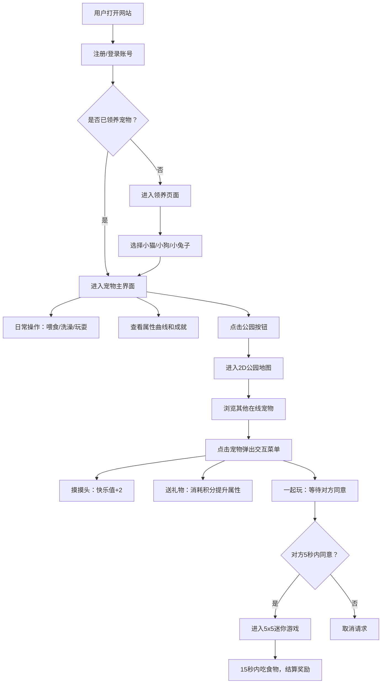

## 1. 产品概述

在线协作的虚拟宠物养成社区，用户可注册账号领养虚拟宠物（小猫、小狗、小兔子），通过日常互动提升宠物属性，并在公共公园与其他用户的宠物社交互动。

- 主要目的：打造一个有趣的虚拟宠物养成+社交平台，让用户体验养成乐趣并结识同好
- 目标用户：喜欢虚拟宠物、休闲社交类游戏的互联网用户
- 产品价值：结合养成系统与社交互动，创造持续粘性的线上社区

## 2. 核心功能

### 2.1 用户角色

| 角色 | 注册方式 | 核心权限 |
|------|---------|---------|
| 普通用户 | 用户名密码注册 | 领养宠物、日常互动、公园社交、迷你游戏、查看成就 |

### 2.2 功能模块

1. **注册登录页**：用户账号注册与登录
2. **领养页面**：从三种宠物（小猫、小狗、小兔子）中选择领养
3. **宠物主界面**：属性显示、日常操作（喂食/洗澡/玩耍）、宠物信息面板、成就墙
4. **公园场景**：2D横版地图、在线宠物展示、宠物交互菜单、迷你游戏
5. **迷你游戏**：5x5方格吃食物对战小游戏

### 2.3 页面详情

| 页面名称 | 模块名称 | 功能描述 |
|---------|---------|---------|
| 注册登录页 | 表单模块 | 用户名密码输入、注册/登录切换、表单验证 |
| 领养页面 | 宠物选择模块 | 三种宠物卡片展示、点击选择、确认领养 |
| 宠物主界面 | 属性进度条 | 饱腹度、清洁度、快乐值显示，渐变颜色动画 |
| 宠物主界面 | 操作按钮区 | 喂食、洗澡、玩耍三个按钮，每日操作次数限制（10次） |
| 宠物主界面 | 宠物展示区 | 2D像素风格宠物（120x120px），情绪动画、呼吸效果、状态反馈 |
| 宠物主界面 | 信息面板 | 详细属性折线图（过去7天四项属性变化）、智力值显示 |
| 宠物主界面 | 成就墙 | 右上角徽章展示（忠实铲屎官、勤劳主人、社交达人） |
| 宠物主界面 | 公园入口按钮 | 底部按钮切换到公园场景 |
| 公园场景 | 2D地图 | 草地渐变、小池塘闪烁、树木装饰，可左右拖拽滚动（宽度2倍视口） |
| 公园场景 | 在线宠物展示 | 随机分布其他用户宠物（每种最多20个），头顶显示昵称和快乐值 |
| 公园场景 | 交互菜单 | 点击宠物弹出摸摸头、送礼物、一起玩三个选项 |
| 公园场景 | 迷你游戏入口 | 一起玩同意后进入5x5方格小游戏空间 |
| 迷你游戏 | 游戏空间 | 方向键控制移动、15秒倒计时、食物随机出现、计分与奖励结算 |

## 3. 核心流程

用户注册登录 → 选择领养宠物 → 进入主界面进行日常操作提升属性 → 点击公园按钮进入公共场景 → 与其他用户宠物互动（摸摸头/送礼物/一起玩） → 达成条件解锁成就徽章

## 4. 用户界面设计

### 4.1 设计风格

- **主色调**：#FFD166（暖黄色），#06D6A0（薄荷绿），#118AB2（湖蓝色）
- **背景色**：#F0F7F4（淡青白色）
- **按钮风格**：圆角矩形（8px），0.3秒缓入缓出过渡，悬停上浮4px并加深阴影
- **字体**：采用圆润可爱的无衬线字体，标题加粗，正文清晰易读
- **布局风格**：卡片式布局，柔和阴影，充足留白
- **动画效果**：
  - 呼吸效果：缩放从1.0到1.03循环，周期2秒
  - 属性低于30：悲伤表情+抖动动画（持续3秒）
  - 属性为零：倒下+受伤动画（4帧循环）
  - 摸摸头：开心跳跃（向上弹跳20px后落回）
  - 卡片悬停：上浮4px，阴影从 0 2px 8px 变为 0 6px 16px

### 4.2 页面设计概述

| 页面名称 | 模块名称 | UI元素 |
|---------|---------|--------|
| 注册登录页 | 表单模块 | 居中卡片布局、渐变背景、圆润输入框、暖色调按钮 |
| 领养页面 | 宠物选择模块 | 三张宠物卡片横向排列、像素宠物预览、选中高亮动画 |
| 宠物主界面 | 属性进度条 | 三条渐变进度条（左列）、数值标签、动态填充动画 |
| 宠物主界面 | 操作按钮区 | 三个彩色圆角按钮（右列）、每日次数指示器 |
| 宠物主界面 | 宠物展示区 | 中央120x120px像素宠物、呼吸动画、情绪状态叠加 |
| 宠物主界面 | 信息面板 | 折线图Canvas、悬停提示、智力值徽章 |
| 宠物主界面 | 成就墙 | 右上角三枚徽章、锁定状态灰度、解锁动画 |
| 公园场景 | 2D地图 | Canvas渲染、草地渐变、池塘闪烁动画、树木装饰 |
| 公园场景 | 在线宠物展示 | 像素宠物精灵、头顶昵称气泡、快乐值小图标 |
| 公园场景 | 交互菜单 | 弹出式圆形菜单、三个交互选项按钮 |
| 迷你游戏 | 游戏空间 | Canvas 5x5网格、宠物精灵、食物图标、倒计时、计分板 |

### 4.3 响应式

- **桌面端优先设计**，在宽度低于768px时自动切换为移动端布局
- **移动端调整**：
  - 主界面改为单列纵向布局
  - 按钮最小尺寸48x48px，确保触摸友好
  - 属性进度条改为垂直线性排列
  - 公园场景支持触摸拖拽滚动
  - 迷你游戏支持虚拟方向键

### 4.4 性能要求

- 主界面运行帧率 ≥ 50 FPS
- 公园场景在线用户超过30人时帧率 ≥ 40 FPS
- 所有交互响应延迟 ≤ 200 毫秒
