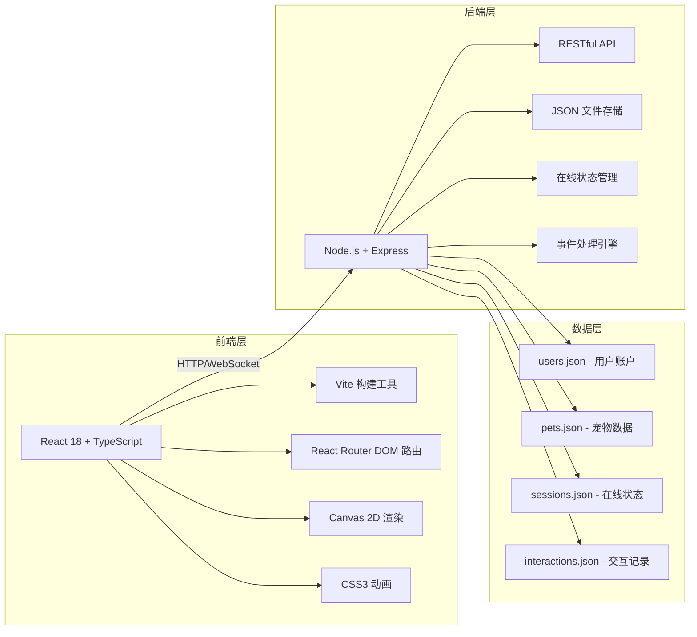
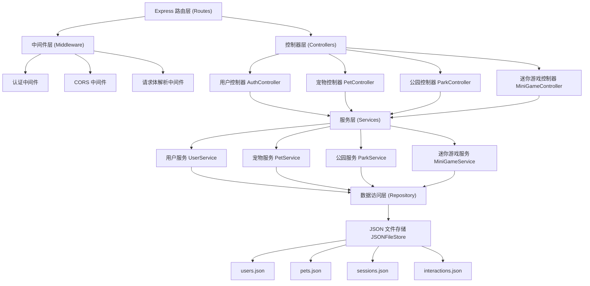
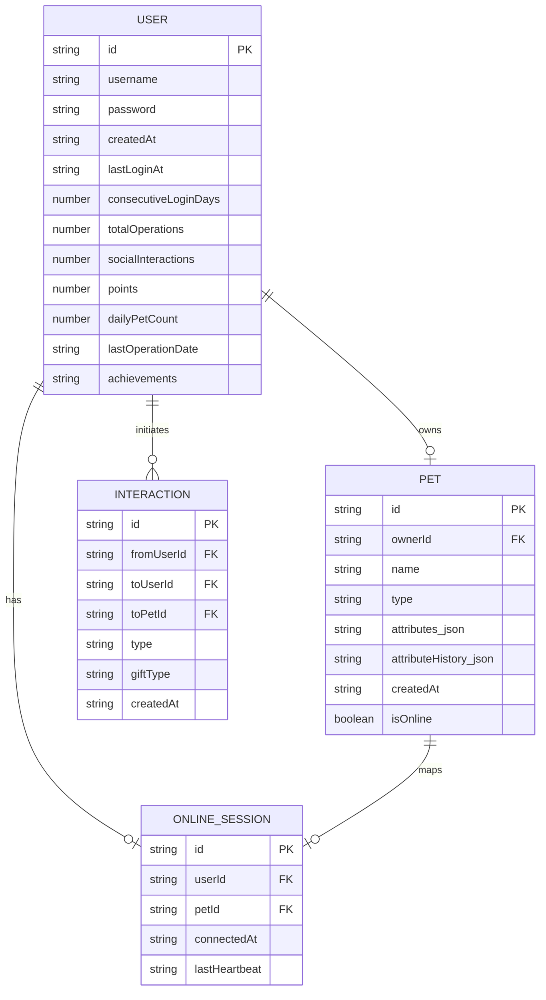

## 1. 架构设计



## 2. 技术描述

- **前端**：React 18 + TypeScript + Vite
- **后端**：Express 4 + TypeScript
- **数据存储**：JSON 文件（无需数据库，数据持久化到本地文件）
- **路由管理**：React Router DOM v6
- **构建工具**：Vite（支持 HMR 热更新）
- **动画实现**：CSS3 动画 + Canvas 2D + requestAnimationFrame
- **HTTP 通信**：Fetch API + CORS 跨域支持

## 3. 路由定义

| 路由路径 | 页面组件 | 用途 |
|---------|---------|------|
| `/` | LoginPage | 注册登录页面（默认页） |
| `/adopt` | AdoptPage | 宠物领养选择页 |
| `/pet` | PetMain | 宠物主界面（养成核心页） |
| `/park` | Park | 公共公园场景页 |
| `/minigame` | MiniGame | 迷你游戏页面 |

## 4. API 定义

### 4.1 类型定义

```typescript
// 用户类型
interface User {
  id: string;
  username: string;
  password: string;
  createdAt: string;
  lastLoginAt: string;
  consecutiveLoginDays: number;
  totalOperations: number;
  socialInteractions: number;
  points: number;
  dailyPetCount: number;
  lastOperationDate: string;
  achievements: string[];
}

// 宠物类型
type PetType = 'cat' | 'dog' | 'rabbit';

interface PetAttributes {
  hunger: number;      // 饱腹度 0-100
  cleanliness: number; // 清洁度 0-100
  happiness: number;   // 快乐值 0-100
  intelligence: number;// 智力值 0-100
}

interface Pet {
  id: string;
  ownerId: string;
  name: string;
  type: PetType;
  attributes: PetAttributes;
  attributeHistory: AttributeSnapshot[];
  createdAt: string;
  isOnline: boolean;
}

interface AttributeSnapshot {
  timestamp: string;
  hunger: number;
  cleanliness: number;
  happiness: number;
  intelligence: number;
}

// 在线宠物（公园场景）
interface OnlinePet {
  petId: string;
  ownerId: string;
  ownerName: string;
  type: PetType;
  attributes: PetAttributes;
  position: { x: number; y: number };
  isPlaying: boolean;
}

// 礼物类型
type GiftType = 'fish' | 'ball' | 'bell';

// 迷你游戏状态
interface MiniGameState {
  id: string;
  player1Id: string;
  player2Id: string;
  player1PetId: string;
  player2PetId: string;
  player1Score: number;
  player2Score: number;
  player1Position: { x: number; y: number };
  player2Position: { x: number; y: number };
  foods: FoodItem[];
  startTime: number;
  duration: number; // 15000ms
  status: 'waiting' | 'playing' | 'finished';
}

interface FoodItem {
  id: string;
  x: number;
  y: number;
  type: 'normal' | 'bonus';
}

// 成就类型
type AchievementType = 'loyal_owner' | 'diligent_owner' | 'social_expert';
```

### 4.2 API 端点

| 方法 | 路径 | 请求体 | 响应 | 描述 |
|-----|-----|-------|-----|------|
| POST | `/api/auth/register` | `{ username, password }` | `{ userId, token }` | 用户注册 |
| POST | `/api/auth/login` | `{ username, password }` | `{ userId, token, hasPet }` | 用户登录 |
| POST | `/api/pets/adopt` | `{ userId, petType, petName }` | `{ pet }` | 领养宠物 |
| GET | `/api/pets/:userId` | - | `{ pet }` | 获取用户宠物信息 |
| POST | `/api/pets/:petId/action` | `{ action: 'feed' \| 'bath' \| 'play' }` | `{ pet, remainingActions, pointsEarned }` | 执行日常操作 |
| GET | `/api/park/online-pets` | - | `{ pets: OnlinePet[] }` | 获取在线宠物列表 |
| POST | `/api/park/pat` | `{ fromUserId, toPetId }` | `{ success, happinessAdded }` | 摸摸头交互 |
| POST | `/api/park/gift` | `{ fromUserId, toPetId, giftType }` | `{ success, remainingPoints, attributeGained }` | 送礼物 |
| POST | `/api/park/play-request` | `{ fromUserId, toUserId }` | `{ requestId }` | 发起一起玩请求 |
| GET | `/api/park/play-request/:requestId` | - | `{ status, opponentId }` | 查询一起玩请求状态 |
| POST | `/api/park/play-response` | `{ requestId, accept: boolean }` | `{ miniGameId? }` | 响应一起玩请求 |
| POST | `/api/minigame/:gameId/move` | `{ userId, direction }` | `{ position, score, ateFood }` | 迷你游戏移动 |
| GET | `/api/minigame/:gameId` | - | `{ MiniGameState }` | 获取迷你游戏状态 |
| POST | `/api/minigame/:gameId/finish` | - | `{ player1Reward, player2Reward }` | 结算迷你游戏 |
| GET | `/api/users/:userId/achievements` | - | `{ achievements, progress }` | 获取成就进度 |
| GET | `/api/users/:userId/attribute-history` | - | `{ history: AttributeSnapshot[] }` | 获取属性历史曲线数据 |

## 5. 服务器架构图



## 6. 数据模型

### 6.1 数据模型 ER 图



### 6.2 JSON 文件结构说明

**users.json**
```json
{
  "users": [
    {
      "id": "uuid-xxx",
      "username": "petlover",
      "password": "hashed-password",
      "createdAt": "2026-06-01T10:00:00.000Z",
      "lastLoginAt": "2026-06-09T08:00:00.000Z",
      "consecutiveLoginDays": 7,
      "totalOperations": 150,
      "socialInteractions": 60,
      "points": 120,
      "dailyPetCount": 3,
      "lastOperationDate": "2026-06-09",
      "achievements": ["loyal_owner", "diligent_owner", "social_expert"]
    }
  ]
}
```

**pets.json**
```json
{
  "pets": [
    {
      "id": "uuid-xxx",
      "ownerId": "uuid-xxx",
      "name": "小橘",
      "type": "cat",
      "attributes": {
        "hunger": 85,
        "cleanliness": 90,
        "happiness": 95,
        "intelligence": 40
      },
      "attributeHistory": [
        { "timestamp": "2026-06-09T00:00:00.000Z", "hunger": 100, "cleanliness": 100, "happiness": 100, "intelligence": 40 }
      ],
      "createdAt": "2026-06-01T10:05:00.000Z",
      "isOnline": true
    }
  ]
}
```

**sessions.json**
```json
{
  "sessions": [
    {
      "id": "uuid-xxx",
      "userId": "uuid-xxx",
      "petId": "uuid-xxx",
      "connectedAt": "2026-06-09T08:00:00.000Z",
      "lastHeartbeat": "2026-06-09T08:05:30.000Z"
    }
  ]
}
```

**interactions.json**
```json
{
  "interactions": [
    {
      "id": "uuid-xxx",
      "fromUserId": "uuid-user1",
      "toUserId": "uuid-user2",
      "toPetId": "uuid-pet2",
      "type": "gift",
      "giftType": "fish",
      "createdAt": "2026-06-09T08:10:00.000Z"
    }
  ]
}
```
