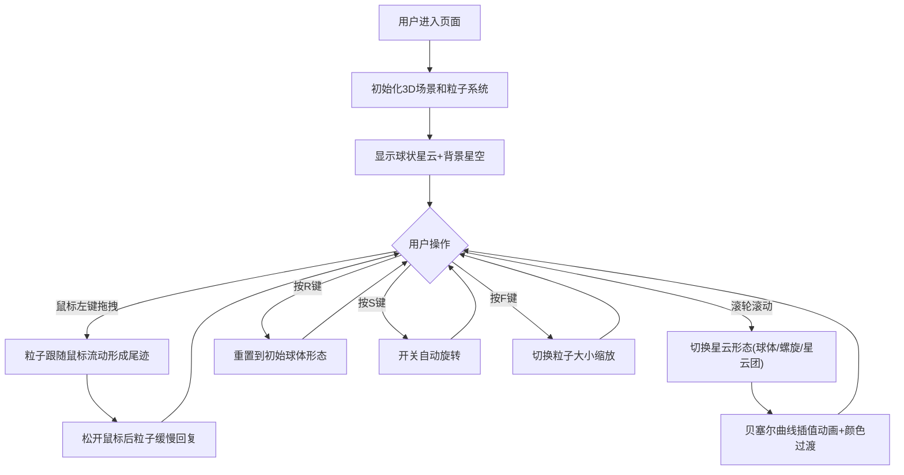

## 1. 产品概述
基于Three.js的3D星云流体交互模拟应用，用户可通过鼠标拖拽、滚轮切换和键盘快捷键实时塑造和操控星云形态，解决传统粒子系统缺乏连续性和流体感的问题。
- 主要用途：提供沉浸式的星云流体交互体验，支持实时塑造、形态切换和多种控制方式
- 目标用户：对视觉艺术、创意交互和3D粒子效果感兴趣的用户
- 市场价值：展示WebGL高性能粒子渲染和流体交互技术的创新应用

## 2. 核心特性

### 2.1 功能模块
1. **3D星云粒子系统**：2000个粒子构成的球状星云，支持流体拖拽、尾迹效果、形态切换
2. **交互控制模块**：鼠标拖拽塑造、滚轮形态切换、键盘快捷键控制
3. **视觉效果模块**：粒子颜色渐变、透明度波动、光点轨迹、背景星空、闪烁效果
4. **性能自适应模块**：帧率监控、动态质量调节、稳定60FPS渲染
5. **控制面板UI**：右上角半透明面板，显示形态名称、粒子数量、FPS

### 2.2 页面详情
| 页面名称 | 模块名称 | 功能描述 |
|-----------|-------------|---------------------|
| 主页面 | 3D星云场景 | 全屏Canvas渲染，球状星云粒子系统，支持实时交互 |
| 主页面 | 背景星空 | 100颗固定星星粒子作为背景点缀 |
| 主页面 | 控制面板 | 右上角显示当前形态、粒子数、FPS，半透明深色主题 |
| 主页面 | 操作提示 | 左下角显示快捷键和操作提示文字 |

## 3. 核心流程

## 4. 用户界面设计

### 4.1 设计风格
- **主色调**：纯黑色背景(#000000)，深紫蓝面板(#1a1a2e)
- **粒子颜色**：初始粉紫渐变(#FF6B9D→#C084FC)，球体蓝(#4A90D9)，螺旋紫红(#9B59B6)，星云团橙黄(#F39C12)
- **文字颜色**：白色(#FFFFFF)，数值绿色(#00FF88)
- **面板样式**：半透明0.8，圆角8px，边框1px solid #333
- **交互反馈**：鼠标悬停显示抓取光标(grab)

### 4.2 页面设计概述
| 页面名称 | 模块名称 | UI元素 |
|-----------|-------------|-------------|
| 主页面 | 3D场景 | 全屏Canvas，纯黑背景，中心星云粒子系统 |
| 主页面 | 控制面板 | 右上角200px宽，显示形态名称(白)、粒子数(绿)、FPS(绿) |
| 主页面 | 操作提示 | 左下角12px白色半透明文字，距边缘20px |
| 主页面 | 光标效果 | 悬停场景时grab光标，拖拽粒子时光点轨迹 |

### 4.3 响应性
- Desktop-first全屏设计，Canvas自适应窗口大小
- 鼠标交互优化，滚轮平滑响应
- 窗口resize时自动调整渲染尺寸和相机比例

### 4.4 3D场景指导
- **环境**：纯黑色背景，无HDRI，深空氛围
- **光照**：粒子自发光，无外部光源，使用PointsMaterial的vertexColors
- **相机设置**：PerspectiveCamera，视野75°，初始距离12，看向原点
- **构图**：星云位于场景中心，背景星星分布在半径8的球面上
- **交互动画**：拖拽流动(0.02单位/帧)、回复(0.005单位/帧)、形态切换(1.5秒贝塞尔插值)、缩放切换(0.3秒)
- **后处理**：粒子透明度波动(±0.1，0.5Hz)，光点轨迹(0.5秒消失)
- **性能**：2000粒子保持60FPS，低于30FPS时自动降低波动幅度至±0.05
