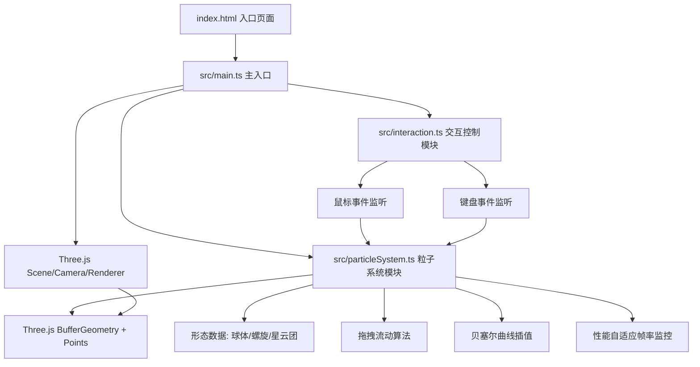

## 1. 架构设计



## 2. 技术说明
- **前端框架**：TypeScript + Three.js (原生，无React/Vue)
- **构建工具**：Vite (启用HMR)
- **渲染引擎**：Three.js r160+
- **粒子系统**：BufferGeometry + Points + PointsMaterial
- **无后端、无数据库**：纯前端WebGL应用

## 3. 项目文件结构
```
auto166/
├── package.json          # 依赖: three, @types/three, typescript, vite
├── vite.config.js        # Vite基础配置
├── tsconfig.json         # TS严格模式，目标ES2020
├── index.html            # 入口HTML，全屏Canvas，UI面板
└── src/
    ├── main.ts           # 主入口，场景初始化，事件绑定，渲染循环
    ├── particleSystem.ts # 粒子系统核心：几何体、位置/颜色数据、流动/切换算法
    └── interaction.ts    # 交互处理：鼠标、滚轮、键盘事件
```

## 4. 核心数据结构

### ParticleState
```typescript
interface ParticleState {
  position: Float32Array;      // 当前位置 x,y,z * N
  originalPosition: Float32Array; // 原始位置(球体)
  targetPosition: Float32Array;   // 目标形态位置
  velocity: Float32Array;      // 速度向量
  color: Float32Array;         // 当前颜色 RGB * N
  originalColor: Float32Array; // 原始颜色
  targetColor: Float32Array;   // 目标颜色
  alpha: Float32Array;         // 当前透明度
  baseAlpha: Float32Array;     // 基础透明度
  size: Float32Array;          // 粒子半径
  twinkleOffset: Float32Array; // 闪烁相位偏移
}
```

### NebulaShape (枚举)
```typescript
enum NebulaShape {
  SPHERE = 'sphere',    // 球体
  SPIRAL = 'spiral',    // 螺旋
  CLOUD = 'cloud'       // 星云团
}
```

### TrailPoint
```typescript
interface TrailPoint {
  position: THREE.Vector3;
  color: THREE.Color;
  birthTime: number;
  life: number; // 0.5秒
}
```

## 5. 核心算法

### 5.1 拖拽流动算法
1. 鼠标位置射线投射到z=0平面获取世界坐标
2. 遍历所有粒子，计算与拖拽点的距离dist
3. 若dist < 影响半径(1.5单位)，按 (1 - dist/radius) 权重施加速度
4. 速度方向 = 鼠标位移方向 * 0.02
5. 尾迹粒子：沿速度方向生成多个TrailPoint，0.5秒渐隐

### 5.2 形态切换贝塞尔插值
1. 记录每个粒子startPos和endPos
2. 生成随机控制点 ctrl = midPoint + randomOffset(0.2)
3. 1.5秒内 t: 0→1, 使用 easeInOutCubic
4. pos(t) = (1-t)²·start + 2(1-t)t·ctrl + t²·end
5. 颜色和透明度同步线性插值

### 5.3 粒子回复算法
每帧对非拖拽粒子：
velocity += (originalPos - currentPos) * 0.005
velocity *= 0.95 (阻尼)
position += velocity

### 5.4 性能自适应
- 使用performance.now()计算FPS(每0.5秒采样)
- FPS < 30时，twinkleAmplitude = 0.05 (默认0.1)
- FPS恢复到≥45时，还原为0.1
