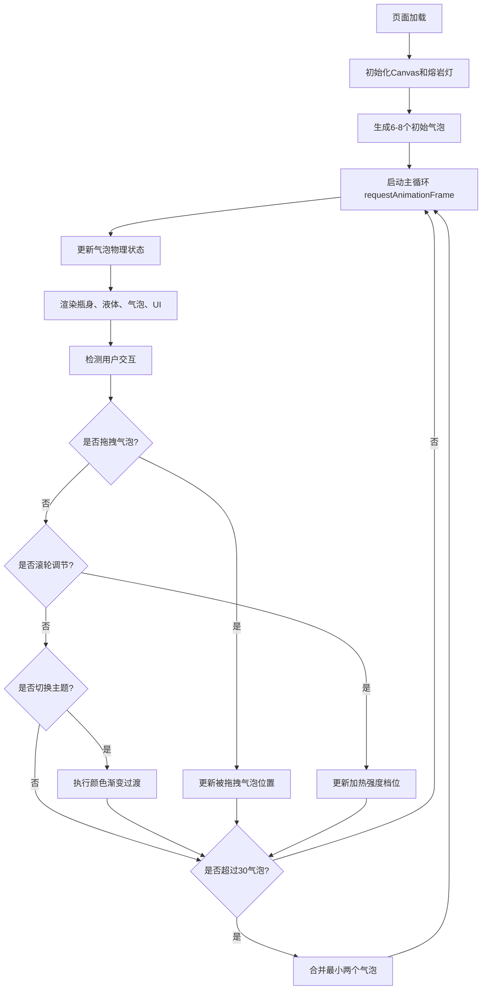

## 1. 产品概述
交互式熔岩灯模拟器是一款基于Canvas的浏览器端流体物理模拟应用，通过鼠标拖拽和键盘操作模拟真实熔岩灯的动态效果，解决传统数字熔岩灯缺乏流体不确定性、分层交互与动态配色反馈的问题。
- 面向对视觉艺术、物理模拟感兴趣的用户，提供沉浸式的动态装饰体验
- 产品价值：高保真流体物理模拟、丰富的交互方式、可定制的视觉主题

## 2. 核心特性

### 2.1 用户角色
| 角色 | 注册方式 | 核心权限 |
|------|----------|----------|
| 普通用户 | 无需注册 | 使用全部交互功能，调节参数，切换主题 |

### 2.2 功能模块
1. **主画布页面**：熔岩灯瓶身渲染、气泡物理模拟、背景星空效果
2. **交互控制模块**：鼠标拖拽气泡、滚轮调节加热强度、键盘切换主题
3. **UI控制面板**：亮度滑块、状态信息显示、参数可视化

### 2.3 页面详情
| 页面名称 | 模块名称 | 功能描述 |
|----------|----------|----------|
| 主画布页面 | 熔岩灯瓶身 | 宽240px高360px，瓶底半圆，瓶颈设计，玻璃质感渐变 |
| 主画布页面 | 气泡物理引擎 | 气泡上升/下沉循环、体积膨胀收缩、自动分裂、碰撞排斥 |
| 主画布页面 | 加热系统 | 5档加热强度，影响气泡速度、分裂概率和色调变化 |
| 主画布页面 | 背景效果 | 深灰色背景，50个闪烁星点 |
| 交互控制 | 鼠标拖拽 | 距离<30px选中气泡，跟随鼠标移动，带微弱浮动偏移 |
| 交互控制 | 滚轮调节 | 每格增减1档加热强度，可视化滑块指示 |
| 交互控制 | 数字键盘 | 1-5键切换配色主题，0.8秒渐变过渡 |
| UI控制面板 | 亮度滑块 | 左下角控制瓶身光晕强度（0.3-1.0） |
| UI控制面板 | 状态显示 | 右下角显示气泡数量和加热档位 |

## 3. 核心流程
用户打开页面后，熔岩灯自动开始运行，气泡循环上升下沉。用户可以通过鼠标拖拽气泡、滚轮调节加热强度、数字键切换配色主题。系统自动维持60FPS帧率，气泡超30个时自动合并最小两个。

## 4. 用户界面设计

### 4.1 设计风格
- 主色调：深灰背景#1A1A2E，瓶身渐变#1A2B34到#0D1B2A
- 强调色：5种主题色（橙红#FF6B35、蓝绿#00B4D8、翠绿#2D6A4F、紫#9B5DE5、粉#FF69B4）
- 按钮/面板风格：圆角8px，半透明深色背景#0F0F23（透明度0.8）
- 字体：浅色#E0E0E0，悬停转主题色，点击1.05倍缩放反馈（0.1秒）
- 布局：居中展示熔岩灯，左下角亮度滑块，右下角状态信息

### 4.2 页面设计概览
| 页面名称 | 模块名称 | UI元素 |
|----------|----------|--------|
| 主画布 | 背景层 | #1A1A2E深灰，50个2px闪烁白点（透明度0.2-0.5） |
| 主画布 | 熔岩灯瓶 | 居中，宽240px高360px，底部半圆，银色边框，玻璃渐变 |
| 主画布 | 加热盘 | 瓶底半透明红橙渐变圆盘，5档强度可视化 |
| 主画布 | 气泡 | 半径12-28px，半透明0.6，渐变填充，上升下沉动画 |
| 左下角 | 亮度滑块 | 圆角半透明面板，水平滑块，范围0.3-1.0 |
| 右下角 | 信息面板 | 圆角半透明面板，显示气泡数和加热档位 |

### 4.3 响应式
- Desktop优先，全屏Canvas适配
- UI控件固定定位于屏幕角落
- 支持鼠标和键盘操作

### 4.4 动画效果
- 气泡上升/下沉：缓动浮动效果
- 主题切换：0.8秒颜色渐变（每帧5%混合）
- 气泡分裂：光晕扩散（半径0-40px，透明度0.6→0，0.3秒）
- 碰撞反馈：10px互斥偏移，0.2扭曲度
- UI交互：悬停变色，点击缩放1.05倍（0.1秒）
