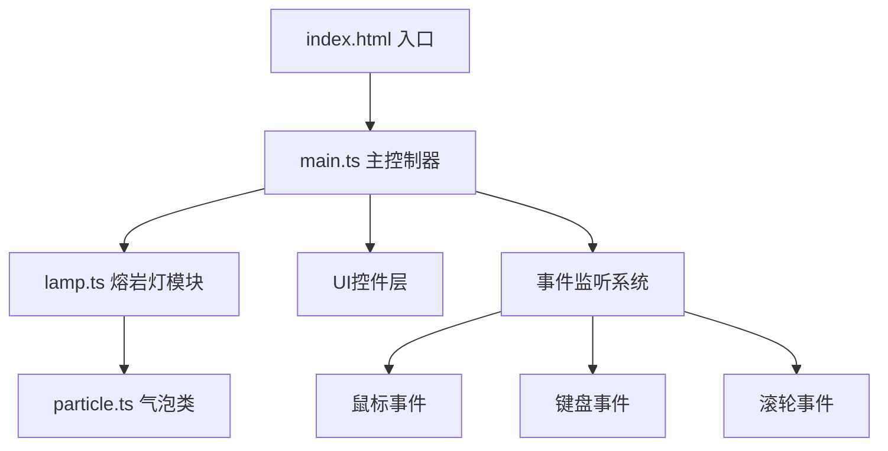

## 1. 架构设计



## 2. 技术说明
- 前端：TypeScript + Vite（纯Canvas 2D渲染，无额外UI框架）
- 构建工具：Vite 5.x
- 目标：ES2020，模块ESNext
- 渲染引擎：原生Canvas 2D API（requestAnimationFrame主循环）

## 3. 文件结构
| 文件路径 | 用途 |
|----------|------|
| package.json | 项目依赖和启动脚本 |
| index.html | 入口页面，全屏Canvas，UI覆盖层 |
| tsconfig.json | TypeScript严格模式配置 |
| vite.config.js | Vite构建配置 |
| src/main.ts | Canvas初始化、主循环、事件绑定、UI控件 |
| src/lamp.ts | 瓶身绘制、气泡生成、流体物理逻辑 |
| src/particle.ts | 气泡类（位置、速度、半径、颜色、渲染） |

## 4. 核心数据结构

### 4.1 气泡粒子 (Particle)
```typescript
interface Particle {
  x: number;              // X坐标
  y: number;              // Y坐标
  vx: number;             // X方向速度
  vy: number;             // Y方向速度
  radius: number;         // 半径
  baseRadius: number;     // 基础半径
  color: { r: number; g: number; b: number }; // 颜色RGB
  alpha: number;          // 透明度
  rising: boolean;        // 是否上升中
  isSelected: boolean;    // 是否被鼠标选中
  wobbleOffset: number;   // 浮动偏移相位
  age: number;            // 存活帧数
  alive: boolean;         // 生命状态
}
```

### 4.2 熔岩灯状态 (LampState)
```typescript
interface LampState {
  liquidColor: { r: number; g: number; b: number };
  targetLiquidColor: { r: number; g: number; b: number };
  bubbleColor: { r: number; g: number; b: number };
  targetBubbleColor: { r: number; g: number; b: number };
  heatLevel: number;       // 加热档位 1-5
  brightness: number;      // 亮度 0.3-1.0
  themeId: number;         // 当前主题ID 1-5
  particles: Particle[];   // 气泡数组
  halos: Halo[];           // 分裂光晕数组
}
```

### 4.3 分裂光晕 (Halo)
```typescript
interface Halo {
  x: number;
  y: number;
  radius: number;
  maxRadius: number;
  alpha: number;
  life: number;            // 0-1
  color: { r: number; g: number; b: number };
}
```

## 5. 主题配色定义
```typescript
const THEMES = [
  { id: 1, liquid: '#FF6B35', bubble: '#FF4500', name: '经典橙红' },
  { id: 2, liquid: '#00B4D8', bubble: '#0077B6', name: '海洋蓝绿' },
  { id: 3, liquid: '#2D6A4F', bubble: '#40916C', name: '丛林翠绿' },
  { id: 4, liquid: '#9B5DE5', bubble: '#7209B7', name: '暗夜紫' },
  { id: 5, liquid: '#FF69B4', bubble: '#FF1493', name: '极光粉' },
];
```

## 6. 物理参数常量
| 参数名 | 值 | 说明 |
|--------|-----|------|
| BOTTLE_WIDTH | 240px | 瓶身宽度 |
| BOTTLE_HEIGHT | 360px | 瓶身高度 |
| BOTTOM_RADIUS | 60px | 瓶底半圆半径 |
| NECK_HEIGHT | 80px | 瓶颈高度 |
| NECK_WIDTH | 140px | 瓶颈宽度 |
| MIN_RADIUS | 12px | 气泡最小半径 |
| MAX_RADIUS | 28px | 气泡初始最大半径 |
| SPLIT_RADIUS | 35px | 触发分裂的半径 |
| BASE_RISE_SPEED | 0.3-0.8 | 基础上升速度 |
| BASE_FALL_SPEED | 0.4-0.9 | 基础下沉速度 |
| MAX_RISE_SPEED | 2.0 | 最高档上升速度 |
| BASE_SPLIT_CHANCE | 0.001 | 基础分裂概率 |
| SPLIT_CHANCE_PER_LEVEL | 0.0015 | 每档增加的分裂概率 |
| COLLISION_REPULSION | 10px | 碰撞互斥偏移 |
| DISTORTION | 0.2 | 碰撞扭曲度 |
| MAX_PARTICLES | 30 | 最大气泡数量 |
| COLOR_BLEND_RATE | 0.05 | 颜色渐变每帧混合率 |
| EXPAND_RATE | 0.005 | 每100帧膨胀率 |
| SHRINK_RATE | 0.01 | 每100帧收缩率 |
