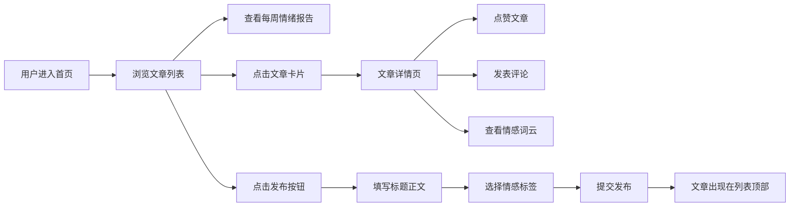

## 1. 产品概述

「文汇小栈」是一家小型独立书店打造的线上「以文会友」阅读社区，读者可以发布书评和短篇故事，通过情感标签系统聚合阅读情绪，促进读者间的深度交流。

- 核心价值：为热爱阅读和写作的用户提供温暖的线上社区空间，通过情感标签可视化呈现阅读情绪脉络
- 目标用户：书店会员、文艺青年、书评爱好者、短篇创作者

## 2. 核心功能

### 2.1 用户角色

| 角色 | 注册方式 | 核心权限 |
|------|---------|---------|
| 读者用户 | 无需注册，直接使用 | 浏览文章、发布文章、点赞、评论、选择情感标签 |

### 2.2 功能模块

1. **文章列表页：每周情绪报告、文章卡片列表、发布入口
2. **文章详情页：文章全文、点赞、评论区、情感词云
3. **发布模块：标题/正文编辑、情感标签选择

### 2.3 页面详情

| 页面名称 | 模块名称 | 功能描述 |
|----------|---------|----------|
| 文章列表页 | 每周情绪报告 | 柱状图展示7种情感标签本周出现频次，可展开/收起 |
| 文章列表页 | 文章卡片列表 | 展示文章标题、作者、摘要、点赞数、评论数、情感标签预览 |
| 文章列表页 | 发布按钮 | 打开发布编辑器弹窗 |
| 文章详情页 | 文章内容区 | 展示标题、作者、发布时间、正文、情感标签 |
| 文章详情页 | 点赞交互 | 爱心图标点击+1，变红不可重复，带缩放动画 |
| 文章详情页 | 评论区 | 展示评论列表，支持提交新评论 |
| 文章详情页 | 情感词云 | 基于所有文章标签频次绘制动态词云 |
| 发布弹窗 | 文章编辑 | 标题（≤50字）、正文（≤2000字）纯文本输入 |
| 发布弹窗 | 标签选择 | 从7种预设情感标签中最多选3个 |

## 3. 核心流程

用户进入首页 → 浏览文章列表与每周情绪报告 → 点击文章查看详情 → 点赞/评论/查看词云 或 点击发布按钮 → 填写标题正文选择标签 → 提交发布 → 返回列表顶部查看新文章

## 4. 用户界面设计

### 4.1 设计风格

- **主色调**：米白色背景 #FFF8F0，深褐色导航 #3E2723
- **情感标签主题色**：
  - 温暖：#FF9F43
  - 悬疑：#6C5CE7
  - 悲伤：#74B9FF
  - 幽默：#FD79A8
  - 治愈：#00B894
  - 热血：#E17055
  - 哲思：#636E72
- **字体**：Logo使用Georgia 24px，标题#3E2723粗体18px，正文#666 14px
- **卡片设计**：白色背景，柔和阴影 0 2px 8px rgba(0,0,0,0.08)，圆角12px
- **按钮风格**：圆角设计，悬停有过渡动画

### 4.2 页面设计概要

| 页面名称 | 模块名称 | UI元素 |
|----------|---------|-------|
| 首页 | 导航栏 | 深褐色背景，左侧Logo，右侧「本周报告」按钮 |
| 首页 | 情绪报告区 | 可展开柱状图，柱子上升动画，悬停显示数值 |
| 首页 | 文章卡片 | 标题、摘要、标签徽章、点赞数、发布时间 |
| 详情页 | 文章内容 | 标题、作者、时间、正文、标签徽章 |
| 详情页 | 点赞区 | 空心/实心爱心，缩放动画 0.9→1.1→1.0 (0.3s) |
| 详情页 | 评论区 | 浅灰背景评论卡，左侧3px彩色引线 |
| 详情页 | 词云区 | 浅灰背景#EAE5DF，标签大小正比频次，渐变色彩，悬停放大1.2倍 |

### 4.3 响应式设计

- 桌面端：最大宽度1000px居中
- 移动端（<600px）：卡片全宽、圆角缩小为8px
- 词云和柱状图自适应缩放
- 触控优化：触摸目标≥44px
