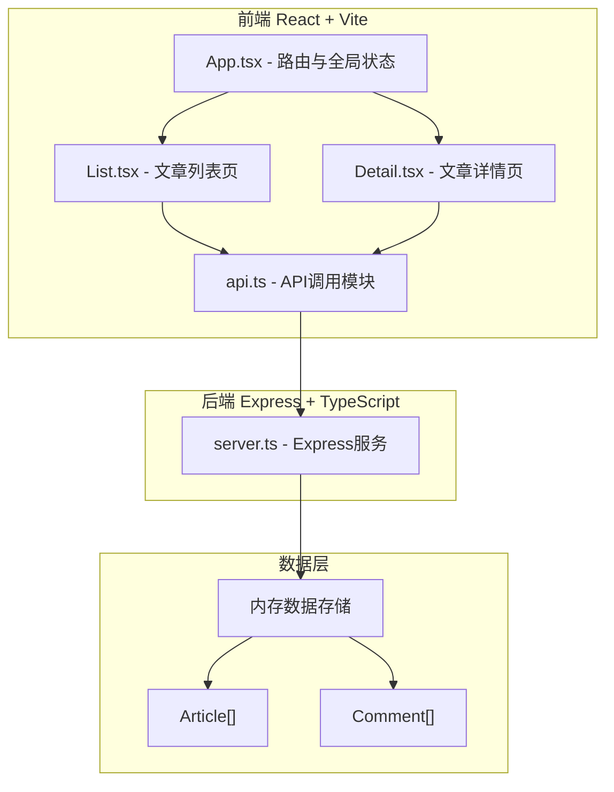
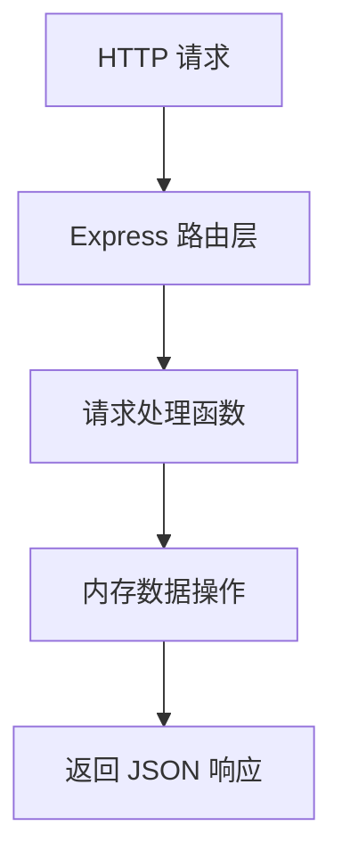
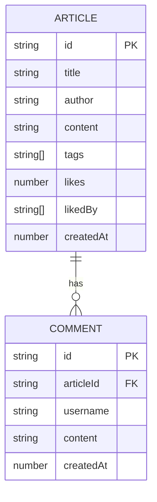

## 1. 架构设计



## 2. 技术描述

- **前端：**
  - React@18 + TypeScript@5 + Vite@5
  - 路由：简单Hash路由（手动实现，无需react-router-dom
  - 状态管理：React useState/useEffect
  - 构建工具：Vite@5
  - 样式：纯CSS（不使用Tailwind
  - 图标：内联SVG
- **后端**
  - Express@4 + TypeScript
  - 端口：3001
  - 内存数据存储
  - CORS跨域支持
- **初始化工具**：vite-init

## 3. 路由定义

| 路由 | 用途 |
|------|------|
| / | 文章列表页（首页） |
| /article/:id | 文章详情页 |

## 4. API 定义

### 4.1 TypeScript 类型定义

```typescript
type EmotionTag = '温暖' | '悬疑' | '悲伤' | '幽默' | '治愈' | '热血' | '哲思';

interface Article {
  id: string;
  title: string;
  author: string;
  content: string;
  tags: EmotionTag[];
  likes: number;
  likedBy: string[];
  createdAt: number;
  comments: Comment[];
}

interface Comment {
  id: string;
  articleId: string;
  username: string;
  content: string;
  createdAt: number;
}

interface TagStats {
  tag: EmotionTag;
  count: number;
}
```

### 4.2 API 接口列表

| 方法 | 路径 | 描述 | 请求体 | 响应 |
|------|------|------|--------|------|
| GET | /api/articles | 获取所有文章 | - | Article[] |
| GET | /api/articles/:id | 获取单篇文章详情 | - | Article |
| POST | /api/articles | 发布新文章 | { title, author, content, tags } | Article |
| POST | /api/articles/:id/like | 点赞文章 | { visitorId } | { likes: number } |
| POST | /api/articles/:id/comments | 发表评论 | { username, content } | Comment |
| GET | /api/tags/stats | 获取所有标签统计 | - | TagStats[] |
| GET | /api/tags/weekly | 获取本周标签统计 | - | TagStats[] |

## 5. 服务器架构



## 6. 数据模型

### 6.1 数据结构



### 6.2 情感标签预设

| 标签 | 颜色代码 |
|------|---------|
| 温暖 | #FF9F43 |
| 悬疑 | #6C5CE7 |
| 悲伤 | #74B9FF |
| 幽默 | #FD79A8 |
| 治愈 | #00B894 |
| 热血 | #E17055 |
| 哲思 | #636E72 |

## 7. 项目文件结构

```
auto171/
├── package.json
├── vite.config.js
├── tsconfig.json
├── index.html
├── server.ts
├── src/
│   ├── App.tsx
│   ├── api.ts
│   ├── main.tsx
│   ├── types.ts
│   ├── pages/
│   │   ├── List.tsx
│   │   └── Detail.tsx
│   └── styles.css
```

## 8. 数据流向说明

1. **前端 → API 层 → 组件通过 api.ts 封装 fetch 请求
2. **api.ts → server.ts**：发送 HTTP 请求到 Express 后端
3. **server.ts → 内存数组**：读写 articles/comments 数组
4. **server.ts → 前端**：返回 JSON 响应
5. **App.tsx → 子组件**：通过 props 传递数据和回调
6. **子组件 → App.tsx**：通过回调更新状态
