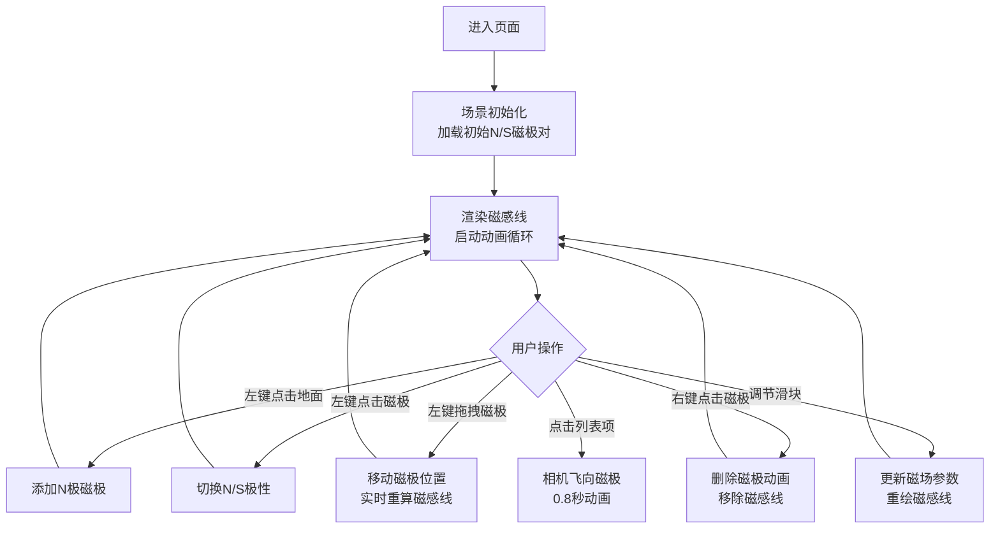

## 1. 产品概述

基于Three.js的3D交互式磁感线流体可视化应用，让用户直观体验电磁场的物理特性。用户可在三维空间中放置、拖动N/S磁极，实时观察彩色磁感线的动态流动效果，并通过参数滑块调节磁场强度与粒子密度。

- 主要目的：以沉浸式3D交互方式可视化抽象的磁场概念，辅助物理教学与科学演示
- 目标用户：物理学习者、教师、科学爱好者、创意交互开发者

## 2. 核心功能

### 2.1 功能模块

1. **3D场景主界面**：全屏Three.js画布，深色太空背景，半透明网格地面
2. **磁极管理系统**：N/S极的添加、删除、极性切换、拖拽移动、标签显示
3. **磁感线渲染引擎**：CatmullRom曲线生成，渐变着色，动态流动与脉动光效，LOD优化
4. **交互控制面板**：磁场强度滑块、磁感线密度滑块，实时参数调节
5. **磁极列表面板**：所有磁极的实时列表，点击高亮定位

### 2.2 页面详情

| 页面名称 | 模块名称 | 功能描述 |
|---------|---------|---------|
| 主场景 | 3D画布 | 全屏3D渲染，相机轨道控制，鼠标交互 |
| 主场景 | 网格地面 | 灰色半透明网格，提供空间参考坐标系 |
| 主场景 | 磁极对象 | 红蓝金属质感球体，N/S标签，拖拽投影圈 |
| 主场景 | 磁感线系统 | CatmullRom曲线，暖红到冷蓝渐变，动态流动，脉动光效，LOD优化 |
| 右侧面板 | 参数控制 | 磁场强度(0.5-2.0)、磁感线密度(10-50)滑块，毛玻璃效果 |
| 左侧面板 | 磁极列表 | 半透明列表，N/S类型标识，点击飞行动画定位 |
| 左上角 | 操作提示 | 摆放模式与交互操作说明 |

## 3. 核心流程

用户进入页面 → 查看初始N/S磁极对与磁感线 → 点击地面添加新磁极 → 点击磁极切换极性 → 拖拽磁极实时更新磁感线 → 通过滑块调节参数 → 点击列表项定位磁极 → 右键删除磁极

## 4. 用户界面设计

### 4.1 设计风格
- **主色调**：深色太空背景 #0A0A1A，网格线 #444488
- **强调色**：N极暖色 #FF4444（红），S极冷色 #4444FF（蓝）
- **UI文字**：#E0E0FF 淡蓝紫色
- **面板底色**：右侧 #1A1A2E（透明度0.85），左侧 #0F0F23（透明度0.8）
- **字体**：'Segoe UI', sans-serif，统一简洁风格
- **质感**：毛玻璃效果 backdrop-filter: blur(8px)，磁极金属度0.6/粗糙度0.3

### 4.2 页面设计概述

| 页面名称 | 模块名称 | UI元素 |
|---------|---------|--------|
| 主场景 | 3D环境 | 深色渐变背景，雾效，环境光+方向光，金属质感磁极球体 |
| 主场景 | 磁感线 | CatmullRom曲线，#FF4444→#4444FF色带渐变，透明度脉动0.7-0.9（1.5秒周期），流动旋转（8秒周期） |
| 右侧面板 | 控制滑块 | 圆角12px浮动面板，磁场强度滑块色#4488FF，密度滑块色#FF6644 |
| 左侧面板 | 磁极列表 | 圆角8px，N/S彩色图标，悬停高亮，点击选中态 |
| 左上角 | 提示区 | 半透明文字，操作指引 |

### 4.3 响应式
- 桌面优先设计，3D画布自适应窗口大小
- 控制面板与列表面板采用固定定位，避免遮挡主要交互区域
- 支持窗口resize事件，实时调整渲染尺寸

### 4.4 3D场景指导
- **环境**：深色太空 #0A0A1A，添加弱雾效增强深度感
- **光照**：AmbientLight(0xffffff, 0.4) + DirectionalLight(0xffffff, 0.6)，磁极使用MeshStandardMaterial体现金属质感
- **相机**：PerspectiveCamera(fov=60)，初始位置(0, 5, 10)，OrbitControls支持视角变换
- **构图**：初始磁极对位于XY平面原点两侧，网格地面提供空间锚点
- **交互**：鼠标拖拽磁极沿地面移动(y=0)，点击极性切换带颜色过渡动画(0.5s)，删除缩放动画(0.3s)
- **性能**：磁感线>30条时启用LOD（控制点减半，透明度0.4），保证>30FPS
