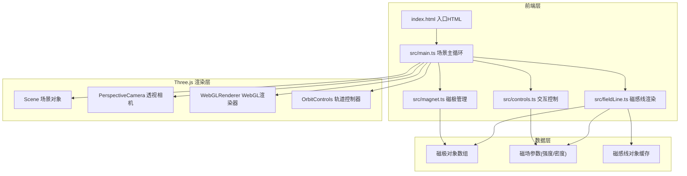

## 1. 架构设计



## 2. 技术描述

- **前端框架**：原生 TypeScript + Three.js，无额外UI框架
- **构建工具**：Vite（ESM HMR热更新）
- **3D引擎**：Three.js r160+
- **类型系统**：TypeScript 5.x，严格模式，目标ES2020，模块ESNext
- **样式方案**：原生CSS内联于index.html的style标签
- **初始化工具**：vite vanilla-ts模板

## 3. 文件结构

```
├── package.json          # 项目依赖与脚本配置
├── index.html          # 入口HTML，包含UI面板DOM结构与CSS样式
├── tsconfig.json      # TypeScript配置
├── vite.config.js     # Vite构建配置
└── src/
    ├── main.ts        # 场景初始化与主循环入口
    ├── magnet.ts      # 磁极管理模块
    ├── fieldLine.ts   # 磁感线生成与渲染
    └── controls.ts  # 交互控制模块
```

## 4. 核心模块设计

### 4.1 magnet.ts - 磁极管理模块

**核心类与接口：

```typescript
interface Magnet {
  id: string;
  type: 'N' | 'S';
  position: THREE.Vector3;
  mesh: THREE.Mesh;
  label: THREE.CSS2DObject | null;
  targetColor: THREE.Color;
  isRemoving: boolean;
  removeProgress: number;
}

class MagnetManager {
  magnets: Magnet[];
  scene: THREE.Scene;
  addMagnet(position: THREE.Vector3, type: 'N' | 'S'): Magnet;
  removeMagnet(magnet: Magnet): void;
  togglePolarity(magnet: Magnet): void;
  updateAnimations(dt: number): void;
  getMagnetByMesh(mesh: THREE.Mesh): Magnet | null;
  onMagnetsChange: () => void;
}
```

功能：创建红蓝金属质感球体、CSS2D字母标签、极性切换颜色过渡动画(0.5s)、删除缩小动画(0.3s)、拖拽投影圈显示

### 4.2 fieldLine.ts - 磁感线模块

```typescript
interface FieldLine {
  curve: THREE.CatmullRomCurve3;
  line: THREE.Line;
  startMagnet: Magnet;
  endMagnet: Magnet;
  controlPoints: THREE.Vector3[];
}

class FieldLineRenderer {
  scene: THREE.Scene;
  fieldLines: FieldLine[];
  fieldStrength: number;
  lineDensity: number;
  rebuildAllLines(magnets: Magnet[]): void;
  updateAnimation(time: number): void;
  setFieldStrength(v: number): void;
  setLineDensity(v: number): void;
}
```

算法要点：
- 每条磁感线使用20个控制点，CatmullRomCurve3生成平滑曲线
- 控制点沿N极球面均匀分布发出，弯曲延伸进入S极
- 动态流动：控制点整体绕磁极连线旋转，周期8秒
- 渐变颜色：使用BufferGeometry + vertexColors 顶点着色，#FF4444→#4444FF
- LOD：线条>30条时远距离线条控制点减半、透明度0.4
- 脉动光效：材质透明度0.7-0.9，周期1.5秒正弦波动

### 4.3 controls.ts - 交互控制模块

```typescript
class InteractionControls {
  camera: THREE.PerspectiveCamera;
  renderer: THREE.WebGLRenderer;
  magnetManager: MagnetManager;
  fieldLineRenderer: FieldLineRenderer;
  orbitControls: OrbitControls;
  raycaster: THREE.Raycaster;
  draggingMagnet: Magnet | null;
  groundPlane: THREE.Plane;
  
  setupEventListeners(): void;
  handleClick(event: MouseEvent): void;
  handleDragStart(event: MouseEvent): void;
  handleDragMove(event: MouseEvent): void;
  handleDragEnd(): void;
  handleRightClick(event: MouseEvent): void;
  handleWheel(event: WheelEvent): void;
  handleSliderChange(): void;
  flyToMagnet(magnet: Magnet): void;
}
```

交互逻辑：
- 左键点击地面→添加磁极
- 左键点击磁极→切换极性
- 左键拖拽磁极→沿y=0平面移动
- 右键点击磁极→删除
- 滚轮→相机缩放
- 滑块→实时更新参数
- 列表点击→相机飞向目标磁极，0.8秒tween动画

## 5. 性能优化策略

| 优化点 | 方案 |
|-------|------|
| 磁感线重算 | 仅当磁极位置/参数变化时触发重建，拖拽节流50ms |
| LOD分级 | >30条时远距离线条控制点减半+透明度降至0.4 |
| 渲染循环 | 非活动状态维持60FPS，高密度降至30FPS下限 |
| 几何体复用 | 磁极高斯几何体复用，仅更新位置/颜色 |
| 材质共享 | 同类材质实例共享，减少GPU状态切换 |
