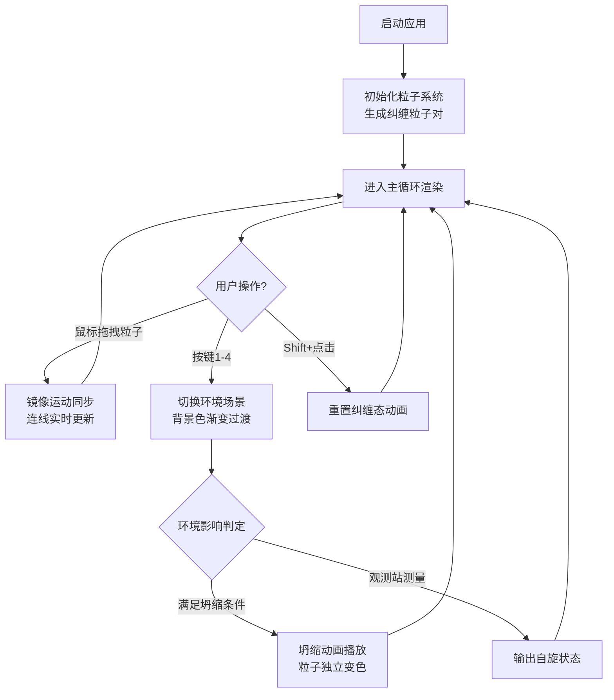

## 1. 产品概述

量子纠缠粒子交互模拟器，通过浏览器中的鼠标拖拽和键盘操作，直观展示量子纠缠粒子对的生成与观测交互过程。解决传统量子物理演示中缺乏实时视觉反馈和动手操作感的问题，帮助用户直观理解纠缠态在不同环境下的变化与坍缩。

- 核心用户：学生、物理爱好者、教育工作者
- 产品价值：将抽象的量子物理概念转化为可交互的可视化体验

## 2. 核心功能

### 2.1 功能模块

1. **主画布界面**：全屏Canvas画布，实时渲染粒子、连线、背景效果
2. **粒子系统**：纠缠粒子对的生成、公转、拖拽镜像运动、状态管理
3. **环境系统**：四种场景切换（真空/强磁场/高温场/观测站），各环境对粒子有不同物理影响
4. **坍缩与重置**：粒子坍缩动画、独立变色、Shift+点击重置纠缠态
5. **UI控制面板**：环境切换按钮、FPS计数器、环境名称与状态统计显示

### 2.2 功能详情

| 功能模块 | 子功能 | 详细描述 |
|----------|--------|----------|
| 粒子系统 | 初始生成 | 画布中心生成一对纠缠粒子，半径12px，颜色#00FFFF和#FF00FF，半透明白色虚线连线200px，围绕中心0.5弧度/秒公转 |
| 粒子系统 | 拖拽镜像 | 按住拖拽一粒子，另一粒子朝相反方向移动相同距离，连线实时更新，松开后恢复公转但轨道半径变为新位置 |
| 环境系统 | 真空(1键) | 默认场景，粒子保持纠缠，颜色稳定，背景#0A0A1A |
| 环境系统 | 强磁场(2键) | 粒子随机闪烁白光，频率5Hz，暴露2秒后30%概率坍缩，背景#330033 |
| 环境系统 | 高温场(3键) | 粒子随机抖动5px，频率10Hz，暴露3秒后50%概率坍缩，背景#330000 |
| 环境系统 | 观测站(4键) | 粒子停止运动，连线变金色#FFD700脉动，持续2秒后自动测量输出自旋状态，背景#1A1A00 |
| 坍缩系统 | 坍缩动画 | 径向爆炸扩散(80px)再收缩，0.4秒，ease-out缓动 |
| 坍缩系统 | 独立变色 | 8种颜色池：红#FF4444、橙#FF8800、黄#FFCC00、绿#44CC66、青#44CCCC、蓝#4488FF、紫#AA66FF、粉#FF66B2 |
| 坍缩系统 | 重置纠缠 | Shift+点击已坍缩粒子，0.3秒脉冲收缩动画后恢复纠缠态 |
| UI控制 | 环境按钮 | 底部居中4个60x30px按钮，圆角8px，悬停亮度+20%弹出动画，间距12px |
| UI控制 | FPS计数 | 左上角白色12px字体实时显示FPS |
| UI控制 | 状态统计 | 右下角显示当前环境名称、纠缠概率百分比、自旋方向箭头 |

## 3. 核心流程

## 4. 用户界面设计

### 4.1 设计风格
- 主色调：深空黑背景 #050510，营造宇宙/量子物理氛围
- 强调色：青色 #00FFFF 与品红 #FF00FF 作为纠缠粒子初始色
- 视觉效果：粒子带软光晕（shadowBlur 8px），环境色渐变过渡0.5秒
- 字体：等宽字体，白色，确保科技感

### 4.2 页面布局

| 区域 | 模块 | UI元素 |
|------|------|--------|
| 全屏 | Canvas画布 | 粒子、连线、背景色、坍缩动画、闪烁抖动效果 |
| 左上角 | FPS计数器 | 白色12px等宽字体，实时帧率显示 |
| 底部居中 | 环境按钮 | 4个圆角按钮，对应4种环境，悬停动画 |
| 右下角 | 状态面板 | 当前环境名、纠缠概率%、自旋箭头指示 |

### 4.3 响应式设计
- 桌面端优先，全屏自适应
- 粒子大小、连线长度按屏幕尺寸比例缩放
- 按钮位置始终底部居中

### 4.4 动画与交互
- 背景色切换：0.5秒渐变过渡
- 坍缩动画：0.4秒径向爆炸扩散收缩，ease-out
- 重置动画：0.3秒脉冲收缩
- 按钮悬停：亮度+20% + 弹出动画
- 观测站连线：金色脉动放大缩小
- 性能要求：所有动画保持55FPS以上
