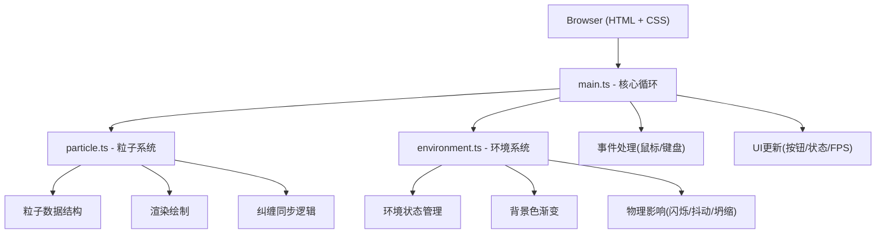

## 1. 架构设计



## 2. 技术描述

- **前端框架**：纯 TypeScript + Vite（无React/Vue，直接操作Canvas 2D API）
- **构建工具**：Vite，支持HMR热更新
- **渲染技术**：HTML5 Canvas 2D Context
- **动画驱动**：requestAnimationFrame 主循环
- **无后端、无数据库、无外部依赖**

## 3. 文件结构

| 文件 | 职责 |
|------|------|
| `package.json` | 项目依赖配置（typescript、vite），启动脚本 |
| `index.html` | 入口页面，全屏Canvas + 4个环境按钮 + 状态显示容器 |
| `vite.config.js` | Vite基础配置，启用HMR |
| `tsconfig.json` | TypeScript严格模式，目标ES2020，模块ESNext |
| `src/particle.ts` | 粒子数据结构、位置更新、渲染绘制、纠缠同步逻辑 |
| `src/environment.ts` | 环境状态切换、背景渐变、粒子物理影响、坍缩判定 |
| `src/main.ts` | 主循环整合、鼠标/键盘事件、渲染驱动、UI更新 |

## 4. 核心数据模型

### 4.1 粒子数据结构

```typescript
interface Particle {
  x: number;           // 粒子当前x坐标
  y: number;           // 粒子当前y坐标
  baseX: number;       // 基础轨道中心偏移x
  baseY: number;       // 基础轨道中心偏移y
  radius: number;      // 粒子半径（默认12px）
  color: string;       // 当前颜色
  entangledColor: string;  // 纠缠态颜色
  isEntangled: boolean;    // 是否处于纠缠态
  spin?: 'up' | 'down';    // 自旋方向（观测后确定）
  orbitAngle: number;  // 当前公转角度
  orbitRadius: number; // 公转轨道半径
  flashTimer: number;  // 闪烁计时器
  isFlashing: boolean; // 是否正在闪烁白光
  jitterOffset: { x: number; y: number };  // 抖动偏移
  collapseAnim: {      // 坍缩动画状态
    active: boolean;
    progress: number;
    direction: 'expand' | 'contract';
  };
  resetAnim: {         // 重置动画状态
    active: boolean;
    progress: number;
  };
}
```

### 4.2 环境类型

```typescript
type EnvironmentId = 1 | 2 | 3 | 4;

interface EnvironmentState {
  id: EnvironmentId;
  name: string;
  bgColor: string;
  exposureTime: number;  // 在该环境下累积暴露时间（秒）
  collapseThreshold: number;  // 坍缩判定阈值时间
  collapseProbability: number;  // 超过阈值后的坍缩概率
  measured: boolean;  // 观测站是否已完成测量
}
```

## 5. 核心算法逻辑

### 5.1 拖拽镜像运动
```
当粒子A被拖拽位移 (dx, dy) 时:
  粒子B的位置更新为 (bx - dx, by - dy)
  两粒子连线根据新位置实时重绘
  松开鼠标时，更新两粒子的 orbitRadius 为当前到中心的距离
```

### 5.2 坍缩判定逻辑
```
每帧更新:
  累计当前环境暴露时间 += deltaTime
  若 暴露时间 >= 坍缩阈值:
    若 Math.random() < 坍缩概率 * deltaTime:
      触发坍缩动画
      两粒子 isEntangled = false
      从8色池中随机选取独立颜色
      连线变灰色虚线
```

### 5.3 主循环时序
```
requestAnimationFrame循环:
  1. 计算 deltaTime (上帧到本帧时间差)
  2. 更新FPS统计
  3. 处理环境影响（闪烁/抖动/坍缩判定）
  4. 更新粒子位置（公转/拖拽/动画）
  5. 渐变过渡背景色
  6. 清空Canvas，绘制背景
  7. 绘制粒子连线
  8. 绘制两个粒子（含光晕效果）
  9. 更新UI状态显示
```
