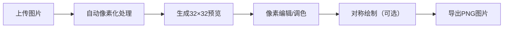

## 1. 产品概述

像素风格头像生成器是一款面向非专业用户的在线像素画创作工具，解决普通用户难以快速制作个性化像素画头像的问题。用户只需上传一张图片，系统即可自动生成32×32像素风格头像，并支持精细化编辑、调色和导出。

- 目标用户：希望拥有个性化像素风格头像的普通用户、像素艺术爱好者
- 产品价值：降低像素画创作门槛，提供直观易用的像素头像快速生成方案

## 2. 核心功能

### 2.1 功能模块

1. **主编辑器页面：图片上传、像素网格渲染、像素编辑、对称绘制、调色板、导出功能

### 2.2 页面详情

| 页面名称 | 模块名称 | 功能描述 |
|-----------|-----------|---------|
| 主编辑器 | 图片上传 | 支持JPG/PNG上传（≤5MB），自动缩放32×32像素化，颜色量化提取16色 |
| 主编辑器 | 像素网格 | 32×32网格渲染，鼠标悬停坐标提示，点击选中高亮，ESC取消选中 |
| 主编辑器 | 像素编辑 | 点击选中像素后从调色板选色替换，对称绘制模式（垂直轴对称镜像） |
| 主编辑器 | 调色板 | 16种提取色+4个空白色槽，支持系统拾色器自定义颜色 |
| 主编辑器 | 导出 | 导出32×32 PNG或4倍放大最近邻插值版本 |

## 3. 核心流程

用户上传图片 → 系统自动像素化生成预览 → 用户在像素网格上编辑调整 → 通过调色板选择/自定义颜色 → 可选开启对称绘制 → 导出最终作品

## 4. 用户界面设计

### 4.1 设计风格

- 主色调：深灰色面板 #1a1a2e，霓虹蓝紫渐变 #6c63ff 和 #9b59b6
- 按钮样式：圆角6px，悬停0.25s平滑过渡，上浮3px阴影效果
- 字体：系统字体栈，最小可读字号12px
- 布局：三栏布局，中央画布占70%宽度，左右各280px固定面板，顶部工具栏50px
- 像素网格线：缩放比例>200%时显示浅灰色#444

### 4.2 页面设计概览

| 页面名称 | 模块名称 | UI元素 |
|-----------|-------------|-------------|
| 主编辑器 | 顶部工具栏 | 应用标题、导出按钮组 |
| 主编辑器 | 左侧面板 | 上传按钮、对称模式开关、工具列表 |
| 主编辑器 | 中央画布 | 32×32像素网格，悬停坐标提示，选中高亮边框 |
| 主编辑器 | 右侧面板 | 16色调色板+4空白槽，拾色器 |

### 4.3 响应式

桌面端优先设计，保证在标准桌面分辨率（≥1280px）下最佳展示。

