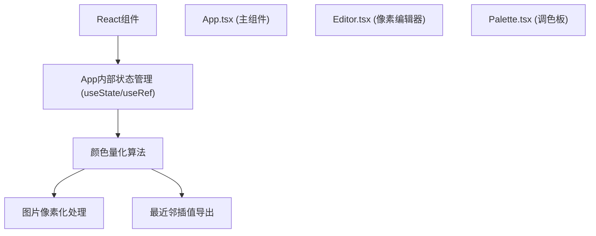

## 1. 架构设计



## 2. 技术描述

- 前端：React@18 + TypeScript + Vite
- 初始化工具：vite-init（react-ts模板）
- 后端：无（纯前端应用
- 状态管理：React useState/useRef（应用规模较小，无需额外状态库）
- 样式：原生CSS（styled-components）

## 3. 路由定义

| 路由 | 用途 |
|-------|------|
| / | 主编辑器页面 |

## 4. 文件结构

```
src/
├── main.tsx          # React入口
├── App.tsx           # 主组件
├── components/
│   ├── Editor.tsx   # 像素编辑器
│   └── Palette.tsx  # 调色板
└── utils/
    ├── pixelate.ts    # 像素化算法
    ├── color.ts       # 颜色处理工具
    └── export.ts    # 导出工具
```

## 5. 核心数据结构

```typescript
// 像素数据: number[][] (32x32二维数组，存储颜色索引
// 调色板数据: string[] (最多20种颜色HEX值
```
