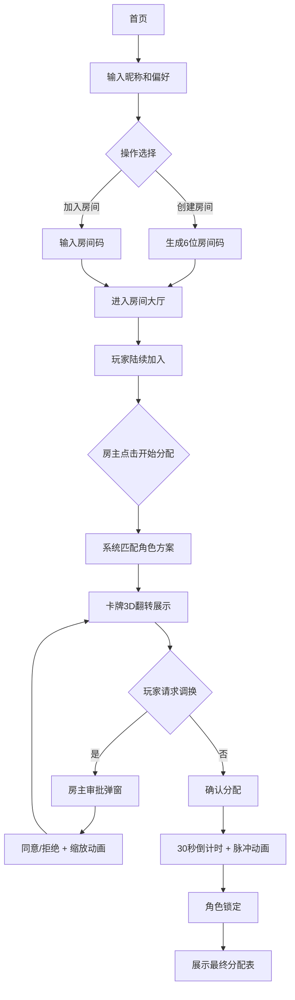

## 1. 产品概述

线上剧本杀组队与角色分配平台，提供浏览器端实时房间管理、智能角色匹配和沉浸式卡牌翻转体验。
- 解决剧本杀开局前角色分配繁琐、体验感弱的问题，面向喜欢线上剧本杀的玩家群体
- 通过智能匹配算法和丰富的视觉动效，提升组队体验和角色分配仪式感

## 2. 核心功能

### 2.1 用户角色
| 角色 | 进入方式 | 核心权限 |
|------|----------|----------|
| 房主 | 创建房间 | 开始分配、同意/拒绝调换、最终确认 |
| 普通玩家 | 加入房间 | 选择偏好、请求调换角色、查看分配结果 |

### 2.2 功能模块
1. **首页**: 昵称输入、偏好标签选择、创建房间、加入房间
2. **房间大厅**: 玩家列表展示、房间码复制、开始分配按钮
3. **角色分配**: 3D卡牌翻转动画、智能角色推荐、调换请求系统
4. **准备阶段**: 圆形倒计时进度条、角色锁定、最终分配表

### 2.3 页面详情
| 页面名称 | 模块名称 | 功能描述 |
|----------|----------|----------|
| 首页 | 输入区域 | 昵称输入框、三个偏好标签（智力型/表演型/推理型）多选 |
| 首页 | 操作区域 | 创建房间按钮（生成6位房间码）、加入房间按钮（输入房间码） |
| 房间大厅 | 顶部栏 | 房间码展示、复制按钮、房间人数 |
| 房间大厅 | 玩家列表 | 半透明卡片展示玩家，背景根据偏好渐变，几何头像 |
| 房间大厅 | 操作区 | 房主显示"开始分配"按钮，玩家显示等待提示 |
| 角色分配 | 卡牌区 | 所有角色卡牌3D翻转展示，0.6秒贝塞尔曲线动画 |
| 角色分配 | 调换系统 | 非房主可请求调换，房主弹窗同意/拒绝，放大镜缩放动画 |
| 准备阶段 | 倒计时 | 30秒圆形进度条，渐变填充，每秒脉冲缩放 |
| 准备阶段 | 分配表 | 角色名、玩家昵称、技能、推荐标签表格展示 |
| 准备阶段 | 邀请复制 | 一键复制完整房间邀请信息 |

## 3. 核心流程

玩家输入昵称和偏好后，可创建或加入房间。房主点击开始分配后，系统根据所有玩家偏好匹配最佳角色方案，卡牌逐一翻转展示。玩家可请求调换角色，房主审批后触发缩放动画。确认后进入30秒倒计时，结束后锁定角色并展示最终分配表。

## 4. 用户界面设计

### 4.1 设计风格
- **主背景**: #0F0C1B（深紫黑），辅助色: #1A1530（深紫灰）
- **强调色**: #C084FC（紫罗兰）、#FF6B9D（粉红）
- **角色渐变**: 智力型#4A90D9→#357ABD，表演型#FF6B6B→#D94A4A，推理型#50C878→#3CB371
- **卡牌背面**: #2D1B4E→#4A2C6D深紫渐变，银色问号图标
- **按钮风格**: 圆角，磨砂玻璃效果（backdrop-filter: blur(10px)），悬停0.2秒发光扩散
- **字体**: 现代无衬线字体，清晰易读
- **布局**: 卡片式flex-wrap布局，响应式适配
- **图标风格**: 简洁几何线条，与主题色调一致

### 4.2 页面设计概览
| 页面名称 | 模块名称 | UI元素 |
|----------|----------|--------|
| 首页 | 输入区域 | 渐变边框输入框、可点击标签胶囊、玻璃拟态按钮 |
| 首页 | 操作区域 | 双按钮并排，创建房间使用强调色，加入房间使用次强调色 |
| 房间大厅 | 顶部栏 | 房间码大号展示、复制图标按钮、人数徽章 |
| 房间大厅 | 玩家列表 | 半透明磨砂卡片、几何头像、昵称、偏好标签 |
| 房间大厅 | 操作区 | 居中大按钮，房主专属操作权限 |
| 角色分配 | 卡牌区 | 3D透视卡牌、翻转透视效果、角色插画、技能标签 |
| 角色分配 | 调换系统 | 半透明毛玻璃弹窗、双按钮操作、放大镜缩放过渡 |
| 准备阶段 | 倒计时 | 圆形SVG进度条、渐变描边、脉冲缩放动画 |
| 准备阶段 | 分配表 | 表格斑马纹、悬停高亮、分类标签 |
| 准备阶段 | 邀请复制 | 左上角浮动按钮、成功提示toast |

### 4.3 响应式
- 桌面优先设计，宽度范围420px-1440px自适应
- 卡片使用flex-wrap自动换行排列
- 按钮文字在小屏幕下响应式缩小
- 玩家列表在移动端单列，桌面端多列网格
- 倒计时组件始终居中展示

## 5. 动效与性能规范

### 5.1 动画列表
| 动画 | 时长 | 曲线 | 说明 |
|------|------|------|------|
| 卡牌翻转 | 0.6s | ease-in-out贝塞尔 | 3D透视翻转，背面→正面 |
| 按钮悬停发光 | 0.2s | ease-out | box-shadow扩散 |
| 调换放大镜 | 0.3s | ease-in-out | scale(1)→scale(1.15)→scale(1) |
| 倒计时脉冲 | 0.5s/次 | ease-in-out | scale(1)→scale(1.05)→scale(1) |
| 弹窗淡入 | 0.2s | ease-out | opacity+translateY |
| 页面切换 | 0.3s | ease-in-out | 整体淡入淡出 |

### 5.2 性能要求
- 角色分配算法主线程阻塞≤100ms
- 翻转动画稳定60fps
- 多玩家调换请求队列化处理，无UI卡顿
