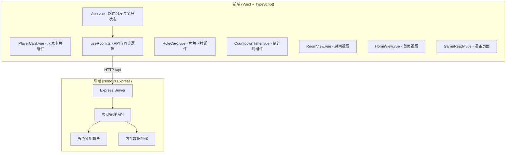
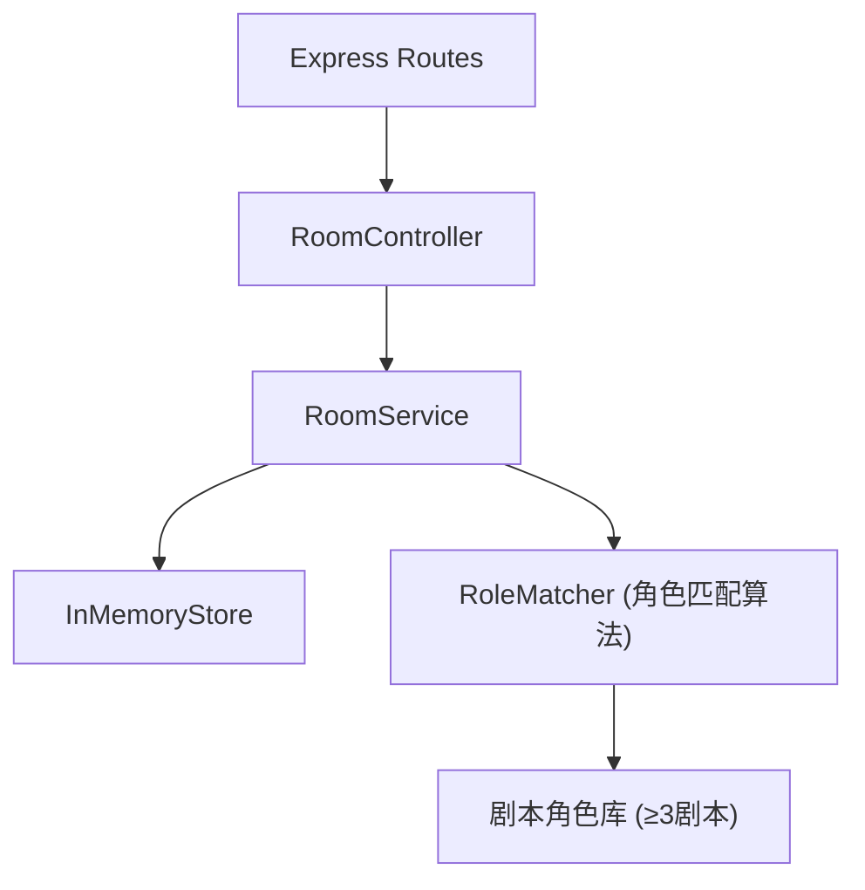
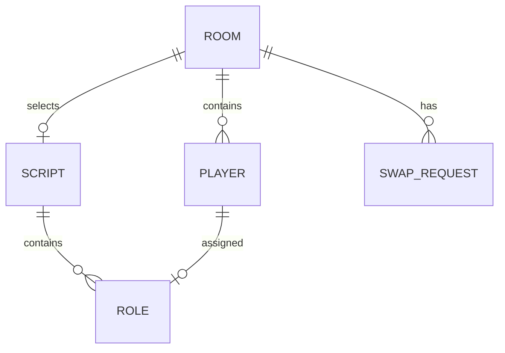

## 1. 架构设计



## 2. 技术说明
- **前端**: Vue@3 + TypeScript + Vite，使用Composition API
- **初始化工具**: Vite
- **后端**: Express@4，内存存储模拟（无数据库持久化）
- **通信方式**: HTTP REST API（短轮询同步房间状态）
- **CSS方案**: 原生CSS + CSS变量，backdrop-filter实现玻璃拟态

## 3. 路由定义
| 路由 | 用途 |
|------|------|
| / | 首页：创建/加入房间 |
| /room/:roomCode | 房间大厅：玩家列表、开始分配 |
| /assign/:roomCode | 角色分配：卡牌翻转、调换系统 |
| /ready/:roomCode | 准备阶段：倒计时、最终分配表 |

## 4. API 定义

### 4.1 类型定义

```typescript
// 玩家偏好类型
type PlayerPreference = 'intellectual' | 'performance' | 'reasoning'

// 玩家信息
interface Player {
  id: string
  nickname: string
  preferences: PlayerPreference[]
  avatarColor: string
  isHost: boolean
  assignedRoleId?: string
}

// 角色信息
interface Role {
  id: string
  name: string
  scriptId: string
  type: PlayerPreference
  avatar: string
  skill: string
  description: string
  tags: string[]
}

// 剧本信息
interface Script {
  id: string
  name: string
  minPlayers: number
  maxPlayers: number
  roles: Role[]
}

// 房间信息
interface Room {
  code: string
  hostId: string
  players: Player[]
  status: 'waiting' | 'assigning' | 'countdown' | 'locked'
  assignedRoles?: Map<string, string> // playerId -> roleId
  selectedScript?: Script
  countdownEndTime?: number
  swapRequests: SwapRequest[]
}

// 调换请求
interface SwapRequest {
  id: string
  fromPlayerId: string
  toPlayerId: string
  fromRoleId: string
  toRoleId: string
  status: 'pending' | 'approved' | 'rejected'
}
```

### 4.2 接口列表

| 方法 | 路径 | 请求体 | 响应 | 描述 |
|------|------|--------|------|------|
| POST | /api/rooms/create | { nickname, preferences } | { roomCode, player } | 创建房间 |
| POST | /api/rooms/join | { roomCode, nickname, preferences } | { player, room } | 加入房间 |
| GET | /api/rooms/:code | - | Room | 获取房间状态 |
| POST | /api/rooms/:code/assign | { hostId } | { assignments, script } | 开始角色分配 |
| POST | /api/rooms/:code/swap | { fromPlayerId, toPlayerId } | { success, newAssignments } | 请求调换角色 |
| POST | /api/rooms/:code/swap/approve | { requestId, approved } | { success } | 房主审批调换 |
| POST | /api/rooms/:code/confirm | { hostId } | { success, countdownEndTime } | 确认分配，开始倒计时 |
| GET | /api/rooms/:code/result | - | { assignments, players, roles } | 获取最终分配结果 |
| GET | /api/rooms/:code/invite | - | { inviteText } | 生成邀请文本 |

## 5. 后端服务架构



### 5.1 角色匹配算法
1. 根据房间人数筛选可用剧本（minPlayers ≤ 人数 ≤ maxPlayers）
2. 为每位玩家计算各角色匹配度（偏好标签交集 + 权重打分）
3. 使用贪心算法求解最大权匹配，确保总匹配度最高
4. 计算复杂度控制在O(n²)，n≤8，确保≤100ms

## 6. 数据模型

### 6.1 实体关系



### 6.2 内置剧本数据（种子数据）
至少3个剧本，每个5-8个角色：
1. 《迷雾山庄》 - 6个角色（推理为主）
2. 《星梦剧院》 - 5个角色（表演为主）
3. 《量子迷宫》 - 7个角色（智力为主）
