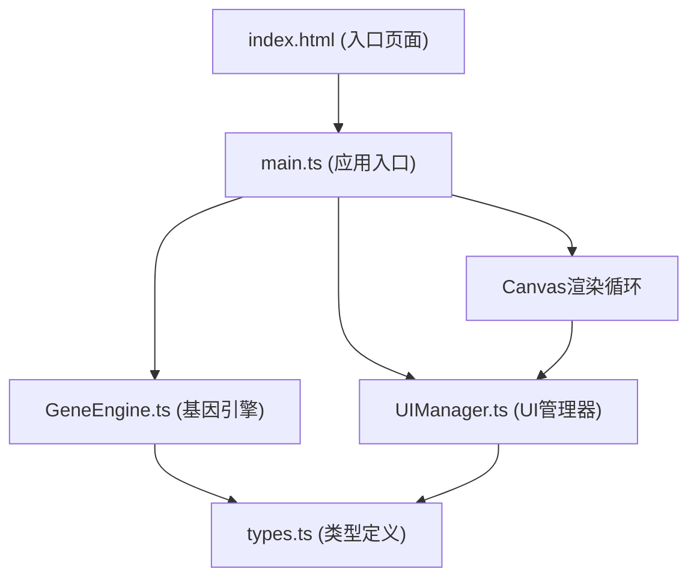
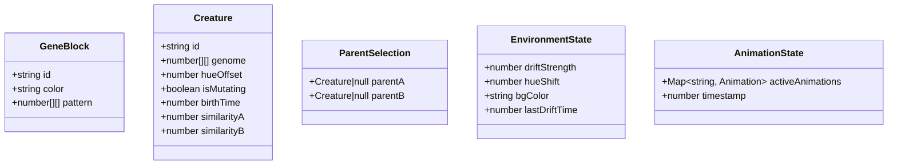

## 1. 架构设计

## 2. 技术描述

- **前端**: TypeScript + HTML5 Canvas + Vite
- **构建工具**: Vite 5.x (支持HMR热更新)
- **TypeScript**: 严格模式，目标ES2020，模块ESNext
- **无后端**: 纯前端应用，所有计算在浏览器端完成
- **无数据库**: 状态保存在内存中

## 3. 文件结构

| 文件路径 | 目的 |
|-------|---------|
| /package.json | 项目依赖和脚本配置 |
| /index.html | 入口HTML页面，包含Canvas、控制栏、属性面板容器 |
| /vite.config.js | Vite构建配置，启用HMR |
| /tsconfig.json | TypeScript编译配置（严格模式、ES2020目标） |
| /src/types.ts | 基因块、生物、亲本选择等数据结构定义 |
| /src/GeneEngine.ts | 基因块定义、杂交算法、突变逻辑、环境漂移处理 |
| /src/UIManager.ts | 培育皿绘制、生物渲染、连接线、属性面板、按钮交互 |
| /src/main.ts | 画布初始化、渲染循环、事件绑定 |

## 4. 数据模型定义

### 4.1 核心类型

### 4.2 数据结构说明

- **GeneBlock**: 8种基础基因块，每种对应一个颜色和4x4像素图案
- **Creature**: 32x32像素生物，由8x8个基因块组成基因组矩阵
- **ParentSelection**: 当前选中的亲本A和亲本B
- **EnvironmentState**: 环境漂移状态，包括强度、色相偏移、背景色
- **AnimationState**: 动画状态管理，包括缩放淡入、脉动、闪烁等

## 5. 核心算法

### 5.1 杂交算法
- 交叉率70%：随机选择基因组交叉点，交换亲本A和亲本B的基因片段
- 突变率5%：随机位置的基因块替换为其他随机基因块

### 5.2 基因相似度计算
- 对比后代与每个亲本基因组中相同位置基因块的匹配比例
- 用相似度百分比从#FF6B6B到#4ECDC4渐变色显示

### 5.3 环境漂移
- 每30秒自动触发：背景色2秒渐变、色相3秒偏移15度
- 强度>70%时：像素随机闪烁白色特效（0.1秒频率，持续1秒）
