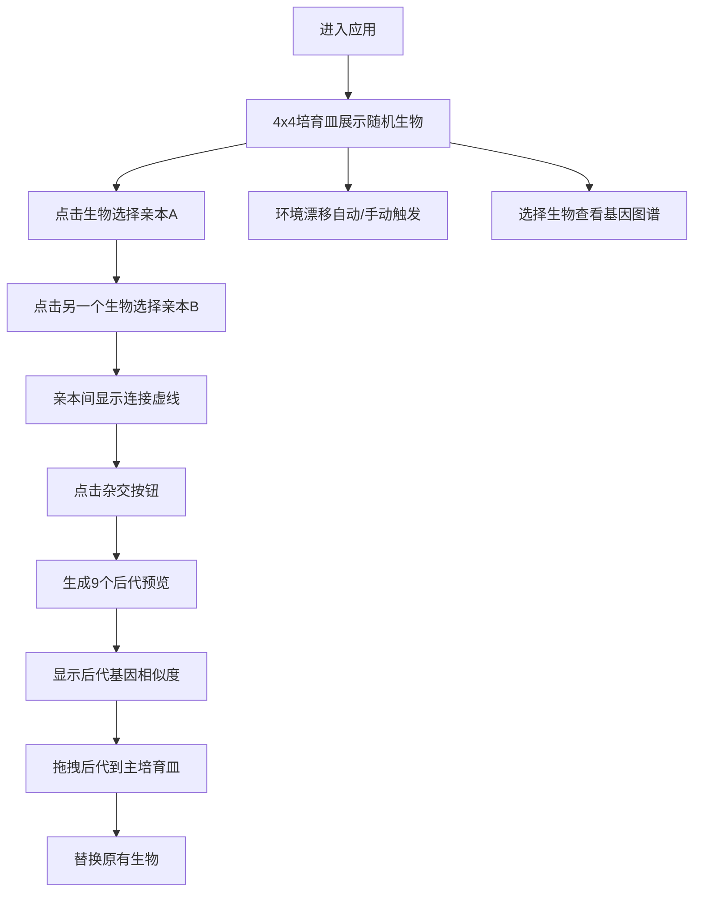

## 1. 产品概述

像素基因演化与杂交实验平台是一个基于Canvas的交互式可视化应用，让用户能够通过直观的鼠标点击和拖拽操作来模拟像素生物的基因演化与杂交过程。解决了传统遗传算法演示缺乏视觉反馈和交互性的问题，使用户可以像培育新物种一样手动选择亲本进行杂交实验。

## 2. 核心功能

### 2.1 功能模块

1. **主培育皿页面**: 4x4网格培育皿、像素生物展示、亲本选择、杂交操作、后代预览、拖拽替换、基因图谱面板、环境漂移控制

### 2.2 页面详情

| 页面名称 | 模块名称 | 功能描述 |
|-----------|-------------|---------------------|
| 主培育皿页面 | 培育皿网格 | 4x4网格展示16个随机生成的32x32像素生物 |
| 主培育皿页面 | 亲本选择 | 点击生物标记为亲本A（金色高亮脉动）或亲本B（银色高亮脉动），亲本间显示渐变虚线连接 |
| 主培育皿页面 | 杂交操作 | 点击杂交按钮，按70%交叉率和5%突变率生成9个后代生物预览 |
| 主培育皿页面 | 后代预览区 | 6x6网格展示后代，带0.3秒缩放淡入动画和基因相似度百分比显示 |
| 主培育皿页面 | 拖拽替换 | 将后代拖拽回主培育皿空格替换原有生物，拖拽带半透明拖影效果 |
| 主培育皿页面 | 基因图谱面板 | 右侧实时显示选中生物的8种基因块比例条形图 |
| 主培育皿页面 | 环境漂移系统 | 每30秒自动触发背景渐变和色相偏移，底部滑块调节强度，高于70%触发突变特效 |
| 主培育皿页面 | 控制栏 | 杂交、重置、保存按钮，带悬停动画效果 |

## 3. 核心流程

用户进入应用后看到4x4培育皿中的随机像素生物。用户点击两个生物分别作为亲本A和亲本B，两者之间出现连接虚线。点击"杂交"按钮后，系统生成9个后代生物预览，每个后代显示与亲本的基因相似度。用户可以将满意的后代拖拽回主培育皿。同时，右侧属性面板实时显示被选中生物的详细基因图谱。系统每30秒自动触发环境漂移，用户也可通过底部滑块手动调节强度。

## 4. 用户界面设计

### 4.1 设计风格

- **主色调**: 深色科幻风格，背景从#0D1117渐变到#1A1B2F（深蓝紫色）
- **基因色板**: #FF6B6B、#4ECDC4、#45B7D1、#96CEB4、#FFEAA7、#DDA0DD、#98D8C8、#F7DC6F
- **高亮色**: 亲本A金色#FFD700，亲本B银色#C0C0C0
- **按钮样式**: 圆角矩形（8px），渐变背景#4A90D9到#357ABD，悬停亮度+15%，投影放大动画
- **字体**: Segoe UI，标题和标签使用不同字号
- **布局**: 左侧主培育皿区（居中16:9比例），右侧属性面板，顶部标题栏，底部控制栏
- **动画效果**: 亲本脉动闪烁、后代缩放淡入、脉冲选择动画、环境漂移渐变、突变闪烁特效

### 4.2 页面设计概述

| 页面名称 | 模块名称 | UI元素 |
|-----------|-------------|-------------|
| 主培育皿页面 | 标题栏 | 顶部居中显示应用名称，Segoe UI字体，浅色文字 |
| 主培育皿页面 | 培育皿 | 半透明灰色背景#2A2D3E（0.9透明度），网格线#3A3D4E，32px间距 |
| 主培育皿页面 | 像素生物 | 32x32像素，由8种基因块随机组成 |
| 主培育皿页面 | 亲本选中效果 | 金色/银色边框，脉动闪烁动画，亲本间半透明虚线 |
| 主培育皿页面 | 后代预览区 | 6x6网格，后代带淡入动画，下方显示相似度百分比 |
| 主培育皿页面 | 基因图谱面板 | 右侧竖向条形图，40px高度，8种颜色对应基因块 |
| 主培育皿页面 | 底部控制栏 | 圆角按钮、滑块控件、状态提示文字 |
| 主培育皿页面 | 杂交提示 | 画布中央"基因重组"文字淡入淡出动画 |

### 4.3 响应式设计

- Desktop-first设计，768px以上屏幕正常显示
- 培育皿网格自动居中并保持16:9比例
- 属性面板在窄屏可折叠
- 触控设备支持点击和拖拽操作

### 4.4 性能要求

- 维持60FPS帧率
- 杂交计算和动画渲染总耗时不超过50ms
- Canvas优化渲染，避免不必要的重绘
