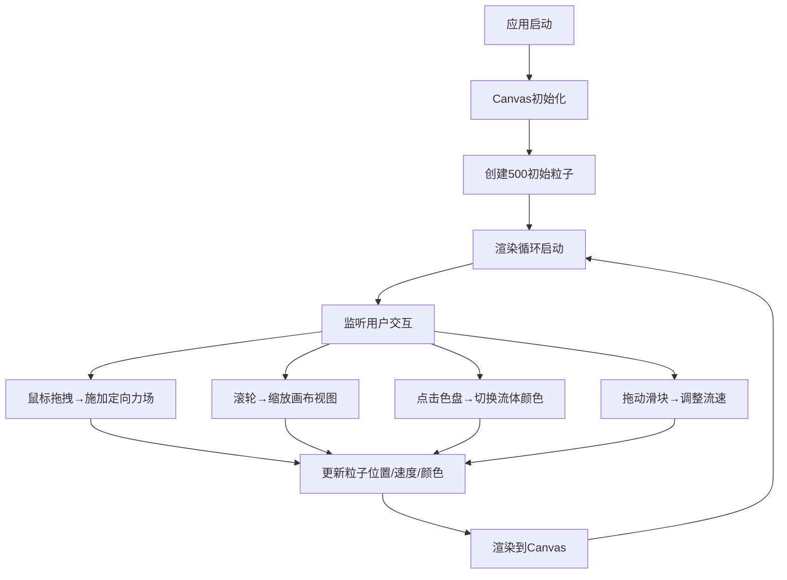

## 1. 产品概述
光影流体画布是一款面向数字艺术家的交互式绘画应用，通过鼠标拖拽和滚轮操作实时调制彩色光流，模拟油画颜料在水中扩散和混合的视觉效果。用户可以通过直观的交互方式创造出具有艺术感的流体画作。

## 2. 核心特性

### 2.1 功能模块
1. **流体画布**：基于Canvas的实时流体模拟与粒子渲染
2. **交互控制**：鼠标拖拽产生定向力、滚轮缩放视图
3. **颜色面板**：6种预设颜色切换，带有点击反馈动画
4. **参数调节**：流速滑块控制粒子运动速度
5. **状态显示**：实时帧率、缩放百分比显示

### 2.2 页面详情
| 页面名称 | 模块名称 | 功能描述 |
|-----------|-------------|---------------------|
| 主画布页 | 流体模拟区 | 600x800绘制区域，500粒子实时模拟，支持鼠标拖拽力场、HSL色相渐变、尾迹粒子 |
| 主画布页 | 颜色选择盘 | 左上角直径30px圆形色盘，6种预设色，点击切换主色，外圈闪烁反馈 |
| 主画布页 | 流速滑块 | 右上角0.5-3.0范围滑块，步长0.1，实时调节粒子运动速度 |
| 主画布页 | 状态显示区 | 帧率计数（白色12px半透明）、缩放百分比（画布边缘） |

## 3. 核心流程
用户打开应用 → 画布初始化500粒子随机漂移 → 鼠标拖拽产生力场推动粒子 → 滚轮缩放视图 → 点击颜色盘切换主色 → 拖动滑块调节流速 → 持续创作艺术流体效果

## 4. 用户界面设计

### 4.1 设计风格
- **主色调**：深色背景 #0A0A1A（整体）、#1A1A2E（画布）
- **预设色板**：#FF6B6B（珊瑚红）、#4ECDC4（青绿）、#45B7D1（天蓝）、#F39C12（橙黄）、#9B59B6（紫罗兰）
- **UI面板**：半透明黑色 rgba(0,0,0,0.6)，圆角12px，内阴影
- **字体**：12px白色半透明（状态显示），无衬线字体
- **交互反馈**：所有操作0.2-0.3秒 ease-out 过渡动画

### 4.2 页面设计概述
| 页面名称 | 模块名称 | UI元素 |
|-----------|-------------|-------------|
| 主画布页 | 画布区域 | 居中600x800区域，深灰背景，边缘显示缩放百分比 |
| 主画布页 | 颜色面板 | 左上角，6个圆形色盘，点击外圈闪烁0.2秒 |
| 主画布页 | 流速控制 | 右上角，滑块控件，悬停高亮 |
| 主画布页 | 状态显示 | 帧率（画布左下角）、缩放比例（画布边缘） |

### 4.3 响应性
桌面端优先，画布固定600x800居中显示，UI控件固定定位。
