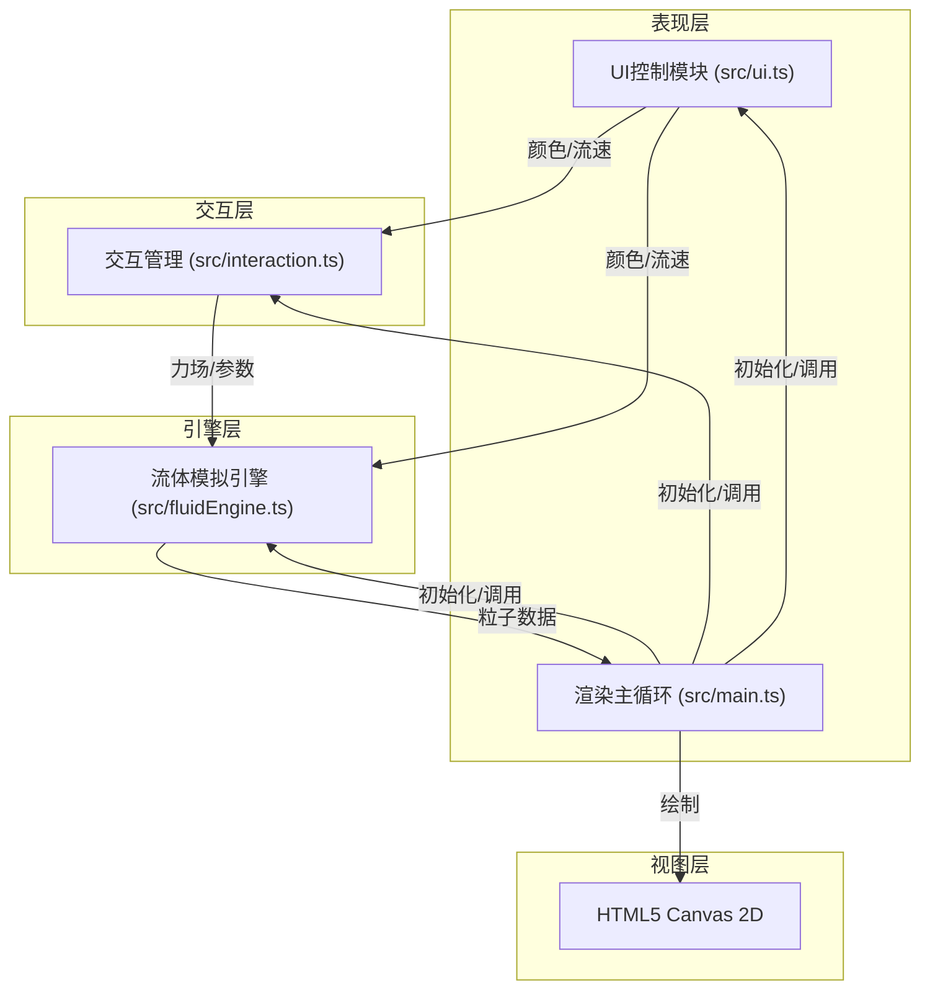

## 1. 架构设计



**模块职责与数据流向：**
- `main.ts`：应用入口，初始化Canvas、事件绑定、渲染循环。数据流向：接收用户输入→传递给流体引擎→更新画面→输出
- `fluidEngine.ts`：流体模拟引擎，基于NS方程简化实现。数据流向：接收粒子数组和力场→计算速度与位置更新→输出新粒子状态
- `interaction.ts`：交互事件处理。数据流向：接收DOM事件→解析为物理力或参数变化→传递给流体引擎
- `ui.ts`：UI控制面板。数据流向：用户操作→更新交互参数→通知流体引擎

## 2. 技术描述
- **前端框架**：原生 TypeScript + HTML5 Canvas 2D（无框架依赖，用户明确要求）
- **构建工具**：Vite 5.x（支持HMR热更新）
- **类型系统**：TypeScript 5.x（严格模式，目标ES2020，模块ESNext）
- **运行环境**：浏览器端，普通笔记本WebGL2环境下≥55fps
- **内存约束**：500粒子时≤150MB

## 3. 文件结构
```
project/
├── package.json          # 依赖配置与脚本
├── vite.config.js        # Vite构建配置
├── tsconfig.json         # TypeScript配置
├── index.html            # 入口HTML
└── src/
    ├── main.ts           # 应用入口
    ├── fluidEngine.ts    # 流体模拟引擎
    ├── interaction.ts    # 交互事件处理
    └── ui.ts             # UI控制面板
```

## 4. 核心数据模型

### 4.1 粒子数据结构
```typescript
interface Particle {
  x: number;           // X坐标
  y: number;           // Y坐标
  vx: number;          // X速度
  vy: number;          // Y速度
  radius: number;      // 半径 (2-5px随机)
  color: HSLColor;     // HSL颜色
  alpha: number;       // 透明度
  isTrail: boolean;    // 是否尾迹粒子
  trailLife: number;   // 尾迹剩余生命(帧)
}
```

### 4.2 力场数据结构
```typescript
interface ForceField {
  x: number;           // 力场中心X
  y: number;           // 力场中心Y
  fx: number;          // X方向力
  fy: number;          // Y方向力
  strength: number;    // 强度 (0.5-2.0)
  radius: number;      // 影响半径
  life: number;        // 衰减系数 (0.95)
}
```

### 4.3 全局状态
```typescript
interface AppState {
  currentColor: string;        // 当前主色(hex)
  flowSpeed: number;           // 流速系数 (0.5-3.0)
  zoom: number;                // 缩放比例 (0.5-3.0)
  targetZoom: number;          // 目标缩放比例
  zoomCenter: { x: number; y: number }; // 缩放中心
  isDragging: boolean;         // 是否拖拽中
  lastMousePos: { x: number; y: number };
  fps: number;                 // 当前帧率
}
```

## 5. 关键算法

### 5.1 流体模拟（简化NS方程）
```
每帧更新：
1. 力场衰减：force *= 0.95
2. 计算粒子受到的合力：∑(forceField影响)
3. 速度更新：v += a * dt * flowSpeed
4. 位置更新：p += v * dt
5. 边界反弹：触碰画布边缘反向速度
6. 颜色渐变：HSL色相每帧+3度（拖拽中）
7. 尾迹生成：拖拽路径上以0.6透明度创建尾迹粒子，15帧衰减至0
```

### 5.2 缩放动画
- 平滑过渡0.3秒，缓动函数 ease-out: `f(t) = 1 - (1-t)^3`
- 每帧插值：`currentZoom += (targetZoom - currentZoom) * easeFactor`
- 粒子位置：以缩放中心为原点等比缩放
