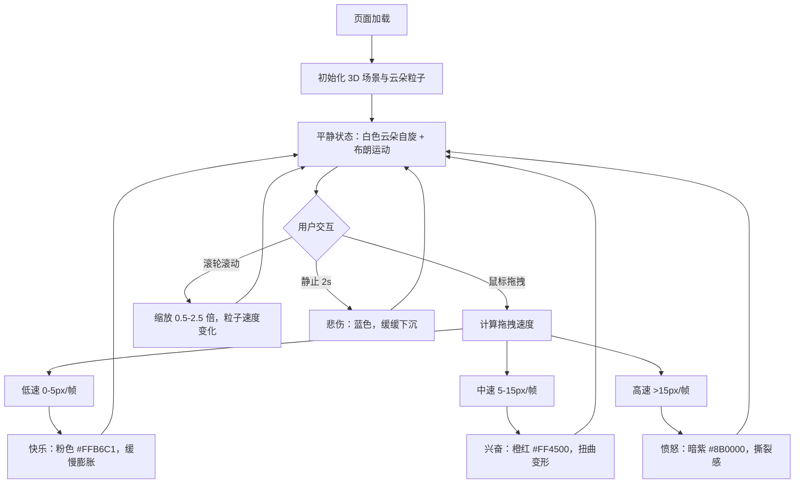

## 1. 产品概述

基于 Three.js 的 3D 交互式「情绪云朵」可视化项目，通过鼠标拖拽和滚轮操作实时操控粒子云朵的形态、颜色与运动节奏，以动态视觉效果模拟人类情绪变化（快乐、愤怒、悲伤、平静）。面向艺术创作、交互体验展示和情绪可视化场景。

## 2. 核心特性

### 2.1 功能模块

1. **3D 粒子云朵系统**：3000 个半透明发光粒子组成的动态云朵，支持自旋与布朗运动
2. **情绪交互系统**：通过鼠标拖拽速度和方向实时切换云朵情绪状态与视觉表现
3. **缩放控制系统**：滚轮控制云朵整体缩放，同步调整粒子运动速度与透明度脉动
4. **HUD 信息展示**：左上角实时显示当前情绪状态和粒子总数

### 2.2 页面详情

| 页面名称 | 模块名称 | 功能描述 |
|---------|---------|---------|
| 主页 | 3D 场景渲染 | 全屏 Three.js 画布，深蓝渐变背景，粒子云朵居中展示 |
| 主页 | 情绪云朵粒子系统 | 3000 粒子组成云朵，自旋 + 布朗运动，响应鼠标和滚轮交互 |
| 主页 | HUD 状态面板 | 左上角显示当前情绪（快乐/愤怒/悲伤/平静）和粒子总数 |
| 主页 | Bloom 后期处理 | 粒子光晕发光效果，梦幻流体视觉风格 |

## 3. 核心流程

用户进入页面 → 看到白色半透明云朵缓慢自旋（平静状态）
→ 鼠标左键拖拽：
  - 低速拖拽 → 云朵变粉色 #FFB6C1，粒子沿方向流动（快乐）
  - 中速拖拽 → 云朵变橙红色 #FF4500，扭曲变形（兴奋）
  - 高速拖拽 → 云朵变暗紫色 #8B0000，撕裂感（愤怒）
→ 静止 2 秒 → 云朵渐变蓝色，缓缓下沉（悲伤）
→ 滚轮滚动 → 云朵缩放 0.5-2.5 倍，粒子速度同步变化，边缘烟雾消散凝聚效果

## 4. 用户界面设计

### 4.1 设计风格

- **主色调**：深蓝渐变背景 `#0B0C10` → `#1F2833`
- **情绪色板**：
  - 平静/初始：白色 `#FFFFFF`
  - 快乐：浅粉色 `#FFB6C1`
  - 兴奋：橙红色 `#FF4500`
  - 愤怒：暗紫色 `#8B0000`
  - 悲伤：蓝色系
- **视觉效果**：粒子半透明发光（emissive）、Bloom 光晕、烟雾边缘消散效果
- **整体风格**：梦幻流体感，科幻艺术化

### 4.2 页面设计概览

| 页面名称 | 模块名称 | UI 元素 |
|---------|---------|---------|
| 主页 | 3D 场景 | 全屏画布，深蓝径向渐变背景 |
| 主页 | 云朵粒子 | 3000 粒子球，半径 3 单位，粒子大小随机 0.05-0.15，透明度 0.4-0.7 |
| 主页 | HUD 面板 | 左上角白色文字，显示当前情绪状态和粒子数 |
| 主页 | 后处理 | UnrealBloomPass 实现柔和光晕 |

### 4.3 响应式

全屏 Canvas 自适应窗口尺寸，HUD 使用固定像素定位，不随缩放变化。

### 4.4 3D 场景指导

- **环境/氛围**：深蓝渐变雾效背景，营造深邃宇宙/梦境感
- **光照设置**：AmbientLight 基础环境光 + PointLight 跟随云朵中心的点光源（颜色随情绪变化）
- **相机设置**：PerspectiveCamera，fov 60，初始位置 z=8，启用 OrbitControls（禁用旋转，仅用于参考）
- **构图与焦点**：云朵位于场景正中心，占据画面主要视觉区域
- **交互与动画**：鼠标拖拽产生粒子流动和尾迹，滚轮缩放带烟雾边缘效果，颜色平滑过渡插值
- **后处理效果**：EffectComposer + UnrealBloomPass，强度 0.8-1.2 随情绪调整
- **性能预算**：粒子数 ≤ 4000，目标 60FPS，使用 Points + BufferGeometry 硬件加速渲染
