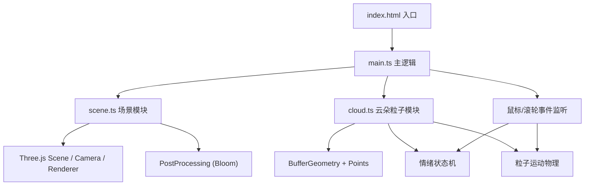
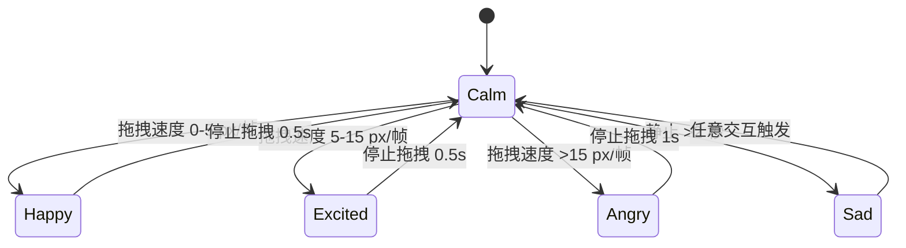

## 1. 架构设计



## 2. 技术说明

- **前端**：TypeScript + Three.js + Vite
- **初始化工具**：Vite vanilla-ts 模板
- **后端**：无（纯前端项目）
- **关键依赖**：
  - `three` — 3D 渲染引擎
  - `@types/three` — Three.js TypeScript 类型定义
  - `typescript` — 类型系统
  - `vite` — 构建工具与开发服务器

## 3. 项目文件结构

| 文件 | 用途 |
|------|------|
| `package.json` | 项目依赖与脚本（`npm run dev` 启动） |
| `index.html` | 入口页面，全屏 Canvas 容器 |
| `tsconfig.json` | TS 配置（严格模式、ES2020、ESNext 模块） |
| `vite.config.js` | Vite 构建配置，启用 HMR |
| `src/scene.ts` | Three.js 场景初始化：Scene、Camera、Renderer、OrbitControls、Bloom 后处理 |
| `src/cloud.ts` | 云朵粒子系统：粒子生成、情绪状态机、颜色/运动/缩放控制 |
| `src/main.ts` | 入口逻辑：串联 scene 与 cloud，处理鼠标拖拽和滚轮事件，渲染循环 |

## 4. 模块 API 定义

### scene.ts 导出

```typescript
export interface SceneContext {
  scene: THREE.Scene;
  camera: THREE.PerspectiveCamera;
  renderer: THREE.WebGLRenderer;
  composer: EffectComposer;
  controls: OrbitControls;
  onResize: () => void;
}
export function initScene(container: HTMLElement): SceneContext;
```

### cloud.ts 导出

```typescript
export type Emotion = 'calm' | 'happy' | 'excited' | 'angry' | 'sad';
export interface CloudSystem {
  points: THREE.Points;
  getParticleCount(): number;
  getEmotion(): Emotion;
  setEmotion(emotion: Emotion): void;
  updateDrag(deltaX: number, deltaY: number, speed: number): void;
  updateScale(direction: number): void;
  update(deltaTime: number): void;
}
export function createCloud(): CloudSystem;
```

### main.ts

入口文件，负责：
- 初始化场景与云朵
- 监听 mousedown/mousemove/mouseup 计算拖拽速度
- 监听 wheel 事件处理缩放
- 启动 requestAnimationFrame 渲染循环
- 更新 HUD 文本

## 5. 情绪状态机



## 6. 性能优化策略

- 使用 `BufferGeometry` + 单 `Points` 对象批量渲染，而非数千个 Mesh
- 所有粒子数据存储在 TypedArray（Float32Array）中，每帧仅更新 position/color attribute
- 使用 `lerp` 线性插值平滑颜色与缩放过渡，避免突变
- 粒子运动采用预计算的速度向量，每帧更新使用简单加法
- 限制最大粒子数 4000，控制 GPU 顶点处理负载
