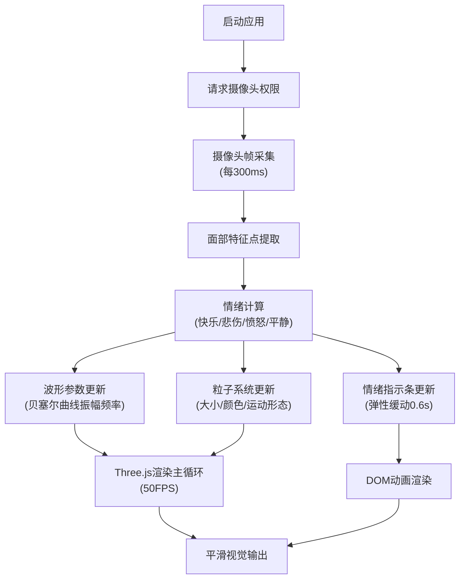

## 1. 产品概述

基于情绪识别的音乐可视化交互游戏，通过摄像头实时捕捉玩家面部表情，识别快乐、悲伤、愤怒、平静四种情绪，并动态生成与之匹配的音乐波形和粒子特效，提供沉浸式的情绪表达与视觉反馈体验。

## 2. 核心功能

### 2.1 功能模块
1. **情绪识别模块**：摄像头实时采集、面部特征点提取、情绪状态判定
2. **波形可视化模块**：贝塞尔曲线动态绘制、振幅频率随情绪变化
3. **粒子特效模块**：500+彩色粒子系统、情绪驱动的粒子形态变换
4. **UI交互模块**：情绪强度指示条、摄像头预览、状态反馈动画

### 2.2 页面详情
| 页面名称 | 模块名称 | 功能描述 |
|---------|---------|---------|
| 主页面 | 摄像头预览区 | 200px宽圆角矩形摄像头画面，半透明磨砂边框 |
| 主页面 | 波形画布区 | Three.js渲染的动态贝塞尔曲线波形 |
| 主页面 | 粒子系统层 | 围绕波形运动的彩色粒子特效 |
| 主页面 | 情绪指示条 | 四段渐变色条实时显示情绪强度百分比，弹性缓动动画 |
| 主页面 | 背景层 | 深灰到黑色渐变，主色调随情绪微调 |

## 3. 核心流程

玩家启动应用 → 授权摄像头访问 → 系统每300ms采集面部表情 → 提取眉毛间距、嘴角弧度等特征点 → 计算情绪类型与强度值 → 波形曲线平滑过渡（0.5秒内）→ 粒子系统形态变换 → 情绪指示条弹性动画更新 → 主循环保持50FPS稳定运行

## 4. 用户界面设计

### 4.1 设计风格
- **主色调**：深灰到黑色渐变背景，情绪色动态叠加（快乐-金黄、悲伤-蓝紫、愤怒-暗红、平静-翠绿）
- **按钮/控件**：柔和圆角设计，hover时0.2秒缩放和颜色渐变反馈
- **字体**：无衬线字体Inter，所有控件和文字统一使用
- **分隔线**：摄像头与画布间1px半透明白色发光分隔线
- **视觉特效**：磨砂玻璃质感边框、粒子运动拖尾、波形辉光

### 4.2 页面设计概览
| 页面名称 | 模块名称 | UI元素 |
|---------|---------|-------|
| 主页面 | 摄像头预览 | 200px宽、圆角矩形、半透明磨砂边框、位于左侧 |
| 主页面 | 波形画布 | 全屏右侧区域、贝塞尔曲线动态波形、粒子环绕 |
| 主页面 | 情绪指示条 | 底部四段渐变条（金黄/深蓝/暗红/翠绿）、高度弹性浮动、强度百分比标签 |
| 主页面 | 分隔线 | 1px半透明白色发光竖线，分隔摄像头与主画布 |

### 4.3 响应式
桌面端优先设计，自适应窗口大小。主画布区域跟随窗口尺寸自动调整，摄像头预览区保持200px固定宽度。

### 4.4 3D场景指导
- **环境**：深色渐变背景，雾效营造空间感
- **光照**：环境光+点光源，光源颜色随情绪变化
- **相机**：正交相机，固定视角聚焦波形区域
- **粒子系统**：500+粒子使用BufferGeometry优化，支持星爆/旋涡两种形态切换
- **后处理**：辉光效果增强波形和粒子的视觉冲击力
