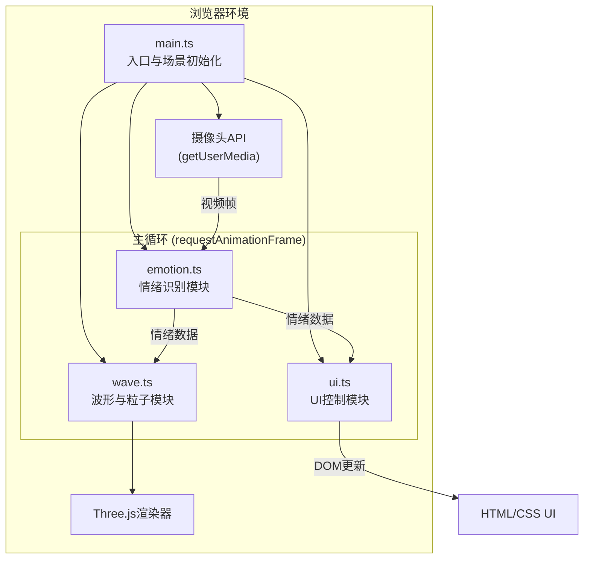

## 1. 架构设计



## 2. 技术说明

- **前端框架**：TypeScript + Vite
- **3D渲染**：Three.js
- **视频采集**：MediaDevices.getUserMedia API
- **情绪识别**：基于面部几何特征的启发式算法（无外部AI依赖）
- **动画库**：原生requestAnimationFrame + CSS transitions
- **构建工具**：Vite（server.host: true）

## 3. 文件结构

| 文件路径 | 职责说明 |
|---------|---------|
| `package.json` | 项目依赖：three、@types/three、vite、typescript |
| `index.html` | 入口页面：摄像头容器、画布容器、UI元素 |
| `tsconfig.json` | TS配置：严格模式、目标ES2020、模块ESNext |
| `vite.config.js` | Vite配置：基础构建、server.host: true |
| `src/main.ts` | 入口：初始化场景、摄像头、页面元素，启动主循环 |
| `src/emotion.ts` | 情绪识别：面部特征提取、情绪判定算法 |
| `src/wave.ts` | 波形生成：贝塞尔曲线绘制、粒子系统管理 |
| `src/ui.ts` | UI控制：情绪指示条、预览框、动画反馈 |

## 4. 核心数据模型

```typescript
// 情绪类型
type EmotionType = 'happy' | 'sad' | 'angry' | 'calm';

// 情绪状态数据
interface EmotionState {
  type: EmotionType;
  intensity: number; // 0-100
  values: {
    happy: number;  // 0-100
    sad: number;    // 0-100
    angry: number;  // 0-100
    calm: number;   // 0-100
  };
}

// 面部特征点
interface FacialFeatures {
  eyebrowDistance: number;      // 眉毛间距
  mouthCurve: number;           // 嘴角弧度
  eyeOpenness: number;          // 眼睛开合度
  foreheadTension: number;      // 额头紧张度
}

// 波形参数
interface WaveParams {
  amplitude: number;   // 振幅
  frequency: number;   // 频率
  color: THREE.Color;  // 主色调
  smoothness: number;  // 平滑度
}

// 粒子参数
interface ParticleParams {
  count: number;           // 粒子数量
  sizeRange: [number, number];  // 大小范围
  colorPalette: THREE.Color[];  // 颜色调色板
  motionType: 'burst' | 'vortex';  // 运动形态
  speed: number;           // 运动速度
}
```

## 5. 性能优化策略

1. **情绪识别节流**：面部特征检测每300ms执行一次，避免阻塞主循环
2. **粒子系统优化**：使用BufferGeometry + PointsMaterial，500粒子单DrawCall
3. **平滑插值**：情绪切换时波形和颜色使用线性插值0.5秒过渡
4. **画布分层**：Three.js渲染层与DOM UI层分离，减少重绘
5. **帧率控制**：主循环使用requestAnimationFrame，目标50FPS
6. **内存管理**：及时释放不再使用的Geometry和Material
