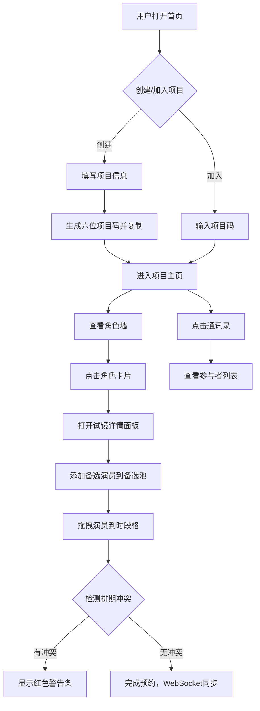

## 1. 产品概述

剧组协作管理平台，专为小型剧组（校园话剧社、微电影团队）设计，解决纸质试镜表易丢失、排期冲突频发、角色分配后沟通混乱的问题。提供在线角色试镜管理、智能排期冲突检测、剧组通讯录三大核心功能。

## 2. 核心功能

### 2.1 用户角色

| 角色 | 注册方式 | 核心权限 |
|------|---------|----------|
| 项目方成员 | 通过项目码加入 | 创建/管理角色、添加备选演员、预约试镜时段、查看通讯录 |

### 2.2 功能模块

1. **首页（项目入口）**：项目创建表单、项目加入入口、六位项目码生成与复制
2. **项目主页**：角色墙展示、角色试镜详情面板、备选演员池、周视图排期日历、拖拽预约、冲突检测
3. **通讯录模态框**：参与者列表、手机号脱敏显示、悬停查看完整号码、分页展示

### 2.3 页面详情

| 页面名称 | 模块名称 | 功能描述 |
|---------|---------|----------|
| 首页 | 项目创建区 | 输入项目名称、剧名、预计演出日期（日期选择器），生成六位项目码并自动复制到剪贴板 |
| 首页 | 项目加入区 | 输入项目码快速加入已有项目 |
| 项目主页 | 顶部导航栏 | 固定显示项目名称、六位项目码（带复制按钮）、通讯录入口按钮 |
| 项目主页 | 角色墙 | 横向滚动展示所有角色卡片（160px×200px），含角色头像、饰演者、角色标签，悬停上浮动画 |
| 项目主页 | 试镜详情面板 | 从右侧滑入，遮罩背景#000000CC，展示周视图排期日历（上午/下午/晚上三个时段） |
| 项目主页 | 备选演员池 | 手动添加演员（姓名、联系方式、可用时段），支持拖拽至时段格完成预约 |
| 项目主页 | 冲突警告条 | 同一演员同时段重复预约时弹出红色警告，拒绝放置 |
| 通讯录 | 参与者列表 | 显示姓名、角色、手机号（脱敏，悬停显全）、备注，左侧随机渐变色头像 |

## 3. 核心流程

## 4. 用户界面设计

### 4.1 设计风格
- **主背景**：#1A1A2E（深夜蓝紫色）
- **卡片背景**：#16213E（深蓝灰）
- **强调色**：#E94560（玫红）
- **角色标签色**：主角#FF6B6B / 配角#4ECDC4 / 群演#95E1D3
- **时段预约背景**：#E3F2FD（淡蓝色）
- **冲突警告**：背景#FFCDD2，文字#C62828
- **按钮风格**：圆角8px，强调色填充，悬停亮度提升
- **字体**：无衬线现代字体，清晰易读
- **布局风格**：卡片式布局，顶部固定导航，角色墙横向滚动
- **图标风格**：简约线性图标

### 4.2 页面设计概述

| 页面名称 | 模块名称 | UI元素 |
|---------|---------|--------|
| 首页 | 项目创建/加入 | 大标题、表单输入框、日期选择器、主按钮、强调色点缀 |
| 项目主页 | 顶部导航栏 | 固定定位、项目名称左对齐、项目码中间（带复制图标）、通讯录按钮右对齐 |
| 项目主页 | 角色墙 | 横向滚动容器、卡片网格布局、卡片悬停translateY(-4px) 0.3s ease-out |
| 项目主页 | 试镜面板 | 右侧滑入动画、半透明遮罩、周视图表格、备选演员可拖拽卡片 |
| 通讯录 | 模态框 | 宽600px高400px圆角16px、scale(0.95→1) + opacity渐入、列表滚动、分页控件 |

### 4.3 响应式设计
- **桌面端（≥768px）**：角色墙多列横向滚动，模态框600×400px
- **移动端（<768px）**：角色墙单列布局，模态框宽度100%高度70%，触控优化拖拽

## 4.4 性能要求
- WebSocket消息延迟 ≤ 200ms
- 拖拽操作FPS ≥ 50
- 列表超过20条时启用分页或虚拟滚动
