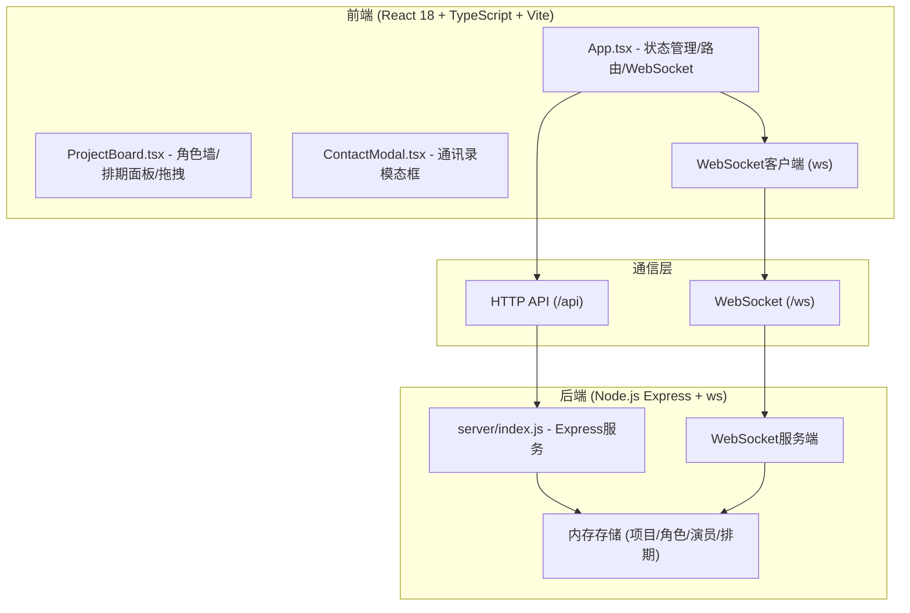
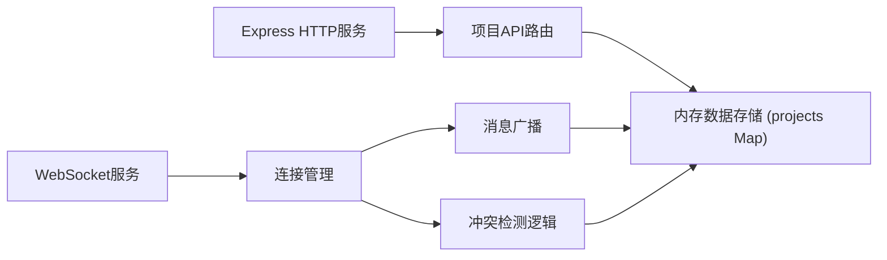
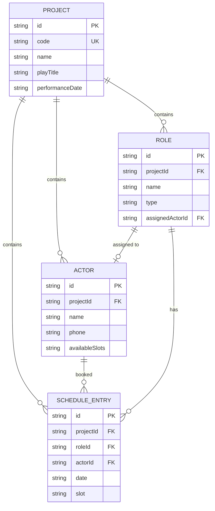

## 1. 架构设计



## 2. 技术描述

- **前端**：React 18 + TypeScript + Vite
- **后端**：Node.js Express 4 + ws（WebSocket库）
- **状态管理**：React useState/useReducer + WebSocket实时同步
- **数据存储**：内存存储（使用Map对象，服务端维护全局状态）
- **构建工具**：Vite，代理/api和/ws至localhost:3001
- **依赖库**：react、react-dom、express、ws、uuid、vite、concurrently

## 3. 路由定义

| 路由 | 用途 |
|------|------|
| / | 首页 - 项目创建与加入入口 |
| /project/:code | 项目主页 - 角色墙、排期管理 |

## 4. API定义

### HTTP API

```typescript
// 创建项目
POST /api/projects
Request: { name: string; playTitle: string; performanceDate: string }
Response: { code: string; projectId: string }

// 加入项目
GET /api/projects/:code
Response: {
  id: string;
  code: string;
  name: string;
  playTitle: string;
  performanceDate: string;
  roles: Role[];
  actors: Actor[];
  schedule: ScheduleEntry[];
}
```

### WebSocket消息协议

```typescript
// 客户端发送
type ClientMessage =
  | { type: 'JOIN_PROJECT'; projectCode: string }
  | { type: 'ADD_ROLE'; projectCode: string; role: Omit<Role, 'id'> }
  | { type: 'ADD_ACTOR'; projectCode: string; actor: Omit<Actor, 'id'> }
  | { type: 'SCHEDULE'; projectCode: string; entry: Omit<ScheduleEntry, 'id'> }
  | { type: 'UNSCHEDULE'; projectCode: string; entryId: string }
  | { type: 'ASSIGN_ROLE'; projectCode: string; roleId: string; actorId: string | null };

// 服务端广播
type ServerMessage =
  | { type: 'PROJECT_STATE'; state: ProjectState }
  | { type: 'ROLE_ADDED'; role: Role }
  | { type: 'ACTOR_ADDED'; actor: Actor }
  | { type: 'SCHEDULED'; entry: ScheduleEntry }
  | { type: 'UNSCHEDULED'; entryId: string }
  | { type: 'ROLE_ASSIGNED'; roleId: string; actorId: string | null }
  | { type: 'CONFLICT'; message: string };
```

## 5. 服务端架构



## 6. 数据模型

### 6.1 数据模型定义



### 6.2 TypeScript 类型定义

```typescript
type RoleType = '主角' | '配角' | '群演';
type TimeSlot = '上午' | '下午' | '晚上';

interface Role {
  id: string;
  name: string;
  type: RoleType;
  assignedActorId: string | null;
}

interface Actor {
  id: string;
  name: string;
  phone: string;
  availableSlots: string[];
}

interface ScheduleEntry {
  id: string;
  roleId: string;
  actorId: string;
  date: string;
  slot: TimeSlot;
}

interface Project {
  id: string;
  code: string;
  name: string;
  playTitle: string;
  performanceDate: string;
  roles: Role[];
  actors: Actor[];
  schedule: ScheduleEntry[];
}
```
