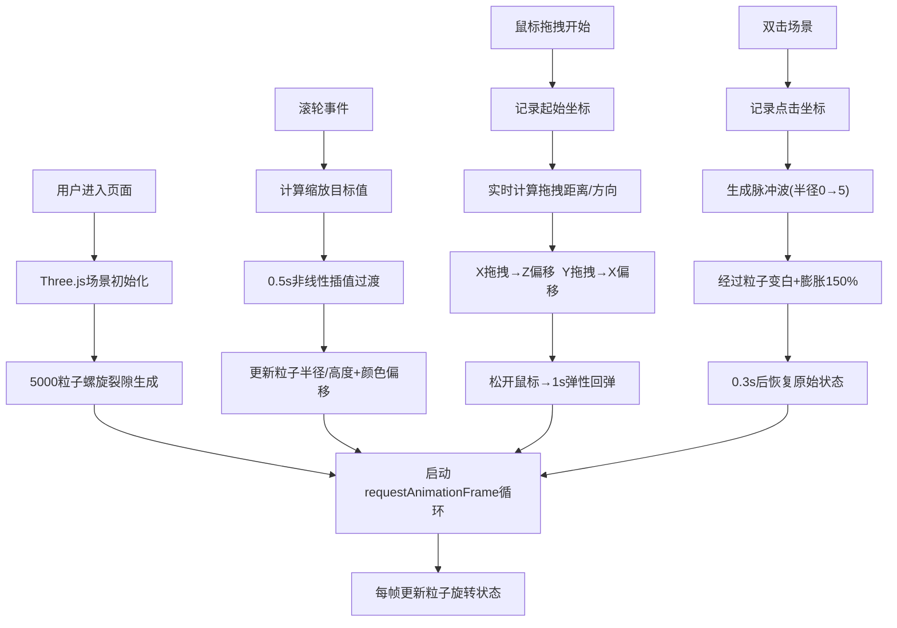

## 1. 产品概述

时空裂隙3D可视化应用 —— 一款面向科幻爱好者的浏览器实时交互模拟器，通过Three.js构建动态虫洞结构，支持鼠标拖拽、滚轮缩放、双击脉冲等多维交互，让用户沉浸式探索不同时空维度下颜色与粒子流的变化。

- 核心价值：将抽象的时空物理概念转化为可视化、可交互的艺术体验
- 目标用户：科幻爱好者、视觉艺术爱好者、3D交互体验探索者

## 2. 核心特性

### 2.1 功能模块

1. **主场景页**：环形裂隙粒子系统、HUD信息面板、交互控制按钮
2. **粒子系统**：5000粒子螺旋分布、三色渐变、Y轴旋转动画
3. **交互系统**：滚轮缩放扭曲、鼠标拖拽形变、双击脉冲波动
4. **视觉反馈系统**：缩放图标、拖拽光标、双击光晕、按钮霓虹效果

### 2.2 页面详情

| 页面名称 | 模块名称 | 功能描述 |
|---------|---------|----------|
| 主场景页 | 环形裂隙粒子系统 | 5000粒子螺旋分布(半径1→5,高度±3)，靛蓝/品红/青色渐变，透明度0.5-1.0，Y轴0.002rad/帧旋转 |
| 主场景页 | 滚轮缩放交互 | 前滚半径+20%高度+15%，后滚收缩，0.5s非线性插值，颜色向橙色#FF4500偏移 |
| 主场景页 | 鼠标拖拽交互 | X轴拖拽→Z轴偏移(距离*0.3)弯曲效果，Y轴拖拽→X轴偏移剪切效果，松开1s弹性回弹 |
| 主场景页 | 双击脉冲波动 | 从点击点扩散脉冲波(半径0→5,0.8s)，粒子瞬时变白膨胀150%，0.3s恢复 |
| 主场景页 | HUD信息面板 | 左上角磨砂玻璃效果，显示帧率和粒子数 |
| 主场景页 | 控制按钮 | 重置视角、切换色彩模式，霓虹渐变风格，悬停发光阴影 |

## 3. 核心流程

用户进入页面 → Three.js场景初始化 → 5000粒子螺旋裂隙渲染启动 → 动画循环持续更新粒子状态
- 滚轮事件 → 调整裂隙半径/高度比例 → 平滑插值动画 → 颜色向暖色偏移
- 鼠标拖拽 → 计算拖拽方向/距离 → 粒子位置偏移 → 松开后弹性回弹
- 双击事件 → 生成脉冲波 → 扩散动画 → 经过粒子瞬时高亮 → 恢复原始状态

## 4. 用户界面设计

### 4.1 设计风格

- **主色调**：深空紫黑渐变背景(#0B001A → #1A0033)
- **粒子色**：靛蓝#4B0082、品红#FF00FF、青色#00FFFF渐变，缩放时向橙色#FF4500偏移
- **按钮风格**：霓虹线性渐变(#8A2BE2 → #FF00FF)，悬停box-shadow 0 0 12px rgba(138,43,226,0.6)，点击缩放0.1s
- **HUD面板**：半透明磨砂玻璃(rgba(0,0,0,0.4))，1px边框rgba(255,255,255,0.2)，圆角12px，内边距16px
- **字体**：等宽科幻风格字体，营造未来时空氛围

### 4.2 页面设计概览

| 页面名称 | 模块名称 | UI元素 |
|---------|---------|--------|
| 主场景页 | 深空背景 | 径向渐变#0B001A到#1A0033，全屏铺满 |
| 主场景页 | 环形粒子裂隙 | 5000粒子螺旋分布，发光效果，Y轴旋转动画 |
| 主场景页 | HUD面板 | 左上角磨砂玻璃卡片，FPS和粒子数两行信息 |
| 主场景页 | 控制按钮组 | 右上角/底部，两个霓虹渐变按钮 |
| 主场景页 | 缩放反馈图标 | 中央放大/缩小图标，0.2s淡入淡出 |
| 主场景页 | 双击光晕 | 点击位置白色30px半径光晕，0.3s消失 |

### 4.3 响应式

- 桌面端(≥768px)：HUD面板位于左上角，默认字体大小
- 移动端(<768px)：HUD面板移至顶部居中，字体缩小0.8倍，按钮尺寸适配触摸操作
- 全屏画布自适应窗口尺寸，Three.js渲染器随窗口resize自动调整

### 4.4 3D场景指引

- **环境**：纯深空背景，无HDRI，营造纯粹粒子发光氛围
- **光照**：无额外光源，依赖粒子材质自发光(Additive Blending)
- **相机**：PerspectiveCamera，初始位置(0, 0, 12)，看向原点
- **构图**：居中对称构图，环形裂隙为视觉焦点
- **交互**：滚轮缩放相机视角+粒子形变，拖拽粒子扭曲形变，双击脉冲波动
- **后处理**：粒子使用AdditiveBlending产生自然发光叠加效果
- **性能**：5000粒子使用BufferGeometry批量渲染，禁用物理引擎，目标≥55FPS
