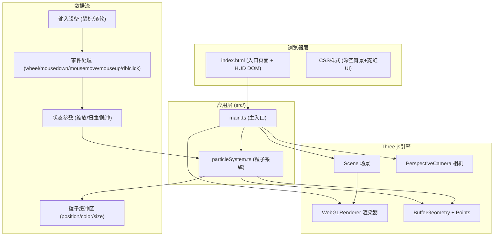

## 1. 架构设计



## 2. 技术说明

- **前端框架**: 原生TypeScript + Vite (无UI框架，纯Three.js + DOM)
- **3D引擎**: three@^0.160.0 + @types/three
- **开发工具**: typescript@^5.3.0 + vite@^5.0.0
- **构建方式**: Vite HMR热更新，ESNext模块，目标ES2020
- **后端**: 无后端，纯前端单页应用

## 3. 文件结构与调用关系

| 文件路径 | 职责 | 调用方 | 被调用方 |
|---------|------|--------|----------|
| package.json | 依赖配置+启动脚本 | npm | - |
| tsconfig.json | TypeScript严格模式配置 | tsc/vite | - |
| vite.config.js | Vite构建配置 | vite | - |
| index.html | 入口页面，含canvas和HUD面板DOM | 浏览器 | main.ts |
| src/main.ts | 主入口：初始化Scene/Camera/Renderer，事件绑定，动画循环，HUD更新 | 浏览器入口 | particleSystem.ts |
| src/particleSystem.ts | 粒子系统：5000粒子位置/颜色计算，螺旋分布生成，形变插值，脉冲波动效果 | main.ts | Three.js API |

**数据流向**:
```
设备输入(wheel/mouse/dblclick)
  → main.ts事件处理器
  → 更新状态参数(scaleTarget/warpOffset/pulseWave)
  → 每帧requestAnimationFrame
  → particleSystem.update(delta, params)
  → 写入Float32Array缓冲区
  → BufferGeometry.attributes.needsUpdate = true
  → renderer.render(scene, camera)
  → HUD DOM更新FPS/粒子数
```

## 4. 核心数据结构

### 4.1 粒子系统参数 (ParticleParams)

```typescript
interface ParticleParams {
  particleCount: number;      // 5000
  baseRadius: number;         // 基础半径1~5
  baseHeight: number;         // 基础高度±3
  rotationSpeed: number;      // 0.002 rad/frame
  colorWarmShift: number;     // 0~1 暖色偏移量
  scaleMultiplier: number;    // 当前缩放倍率
  warpOffsetX: number;        // X轴拖拽偏移 → Z方向
  warpOffsetY: number;        // Y轴拖拽偏移 → X方向
  pulseWaves: PulseWave[];    // 活动中的脉冲波
}

interface PulseWave {
  centerX: number;
  centerY: number;
  centerZ: number;
  currentRadius: number;
  maxRadius: number;          // 5
  startTime: number;
  duration: number;           // 0.8s
}
```

### 4.2 粒子缓冲区布局

```
position: Float32Array(5000 * 3)  // x, y, z
color:    Float32Array(5000 * 3)  // r, g, b
size:     Float32Array(5000)      // 粒子大小
originalPos: Float32Array(5000 * 3) // 原始位置备份(用于回弹)
baseColor: Float32Array(5000 * 3)   // 基础颜色备份
```

## 5. 性能优化策略

1. **BufferGeometry批量渲染**：5000粒子使用单个Points对象，避免draw call开销
2. **TypedArray直接操作**：使用Float32Array直接操作缓冲区，不创建Vector3对象
3. **无GC分配**：update循环内不创建新对象，所有计算复用临时变量
4. **AdditiveBlending**：粒子使用加法混合，无需深度排序，天然发光效果
5. **插值节流**：缩放/回弹使用缓动函数(easeOutCubic)，非线性插值节省帧数
6. **requestAnimationFrame**：与浏览器刷新同步，避免无效渲染
