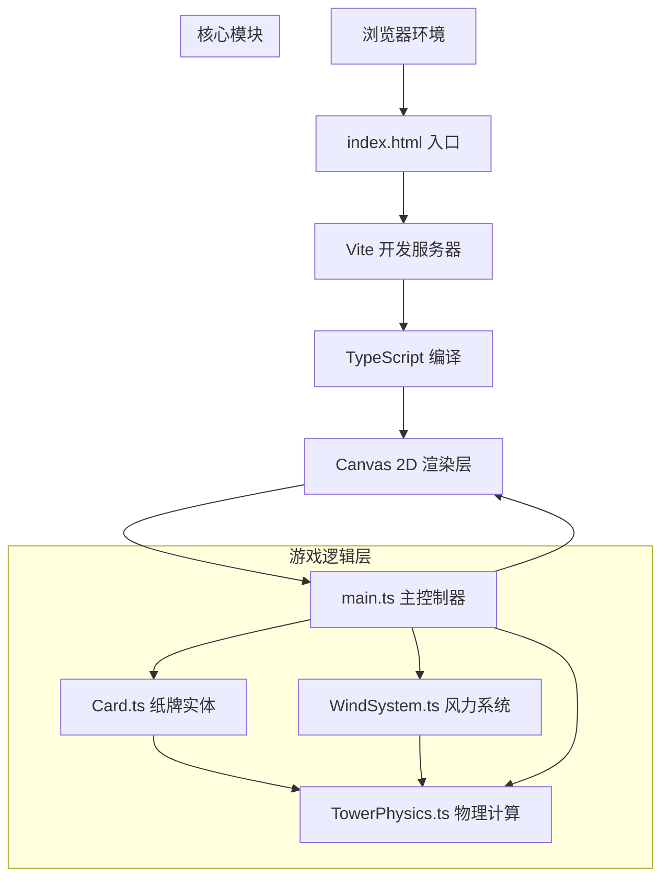

## 1. 架构设计



## 2. 技术选型
- **前端框架**：纯TypeScript + Canvas 2D (无UI框架)
- **构建工具**：Vite 5.x (支持HMR热更新)
- **类型系统**：TypeScript 5.x (严格模式)
- **目标环境**：ES2020，ESNext模块

## 3. 项目结构
```
auto193/
├── index.html              # 入口页面，全屏Canvas
├── package.json            # 依赖与脚本配置
├── tsconfig.json           # TypeScript配置(严格模式)
├── vite.config.js          # Vite构建配置
└── src/
    ├── main.ts             # 游戏入口：初始化、循环、事件
    ├── Card.ts             # 纸牌类：花色、位置、碰撞、渲染
    ├── TowerPhysics.ts     # 物理系统：重力、支撑、崩塌检测
    └── WindSystem.ts       # 风力系统：风速、方向、可视化
```

## 4. 核心类与方法定义

### 4.1 Card 类
```typescript
class Card {
    suit: '♠' | '♥' | '♦' | '♣';
    rank: string;              // A,2-10,J,Q,K
    x: number;                 // 中心x坐标
    y: number;                 // 中心y坐标
    rotation: number;          // 旋转角度(弧度)
    width: number = 60;
    height: number = 85;
    isDragging: boolean;
    isPlaced: boolean;
    towerLayer: number;        // 所属塔层，0表示未在塔上
    animationState: AnimationState;
    
    constructor(suit, rank, x, y);
    update(dt: number): void;  // 动画帧更新
    render(ctx: CanvasRenderingContext2D): void;
    getBounds(): {x,y,w,h};    // 轴对齐碰撞箱
    overlaps(other: Card): number; // 重叠面积百分比
}
```

### 4.2 TowerPhysics 类
```typescript
class TowerPhysics {
    cards: Card[];
    towerLayers: Card[][];     // 每层的牌数组
    collapseCount: number;
    stabilityScore: number;
    
    addCardToTower(card: Card, supportingCards: Card[]): boolean;
    checkPlacementValidity(card: Card): {valid, supportingCards};
    applyWindEffect(windSpeed: number, windDirection: number, dt: number);
    detectCollapse(): Card[];  // 返回需要崩塌的牌
    recalculateTowerLayers(): void;
    getTopLayerCount(): number;
}
```

### 4.3 WindSystem 类
```typescript
class WindSystem {
    currentSpeed: number;
    currentDirection: number;  // -1左, 1右
    cycleTime: number = 15;    // 一轮15秒
    elapsedTime: number;
    
    update(dt: number): void;
    getWindForce(): {x: number, y: number};
    renderWindLines(ctx: CanvasRenderingContext2D, canvasW: number, canvasH: number): void;
    renderGauge(ctx: CanvasRenderingContext2D, cx: number, cy: number): void;
}
```

### 4.4 main.ts 主控制器
```typescript
class Game {
    canvas: HTMLCanvasElement;
    ctx: CanvasRenderingContext2D;
    cards: Card[];
    deck: Card[];              // 牌堆中剩余的牌
    physics: TowerPhysics;
    wind: WindSystem;
    timeLeft: number = 90;
    gameOver: boolean;
    quadtree: Quadtree;        // 碰撞加速
    
    init(): void;
    createDeck(): void;
    shuffleDeck(): void;
    startGameLoop(): void;
    update(dt: number): void;
    render(): void;
    handleMouseDown(e): void;
    handleMouseMove(e): void;
    handleMouseUp(e): void;
    handleKeyDown(e): void;
    resetGame(animate: boolean): void;
    showEndPanel(): void;
}
```

## 5. 物理与碰撞算法

### 5.1 四叉树空间划分
```
区域范围: 整个Canvas
最大深度: 4
单节点最大牌数: 4
用于: 重叠检测、最近邻查找
```

### 5.2 放置判定算法
```
1. 获取被拖拽牌的AABB碰撞箱
2. 四叉树查询候选牌(桌面已放置的牌)
3. 对每张候选牌计算重叠面积百分比:
   overlapArea = intersection(AABB1, AABB2) / min(area1, area2)
4. 若 overlapArea > 40%: 吸附至上方(y减1像素)
5. 塔身结构判定:
   - 倒V形: 两张牌成60度±5度夹角，底部间距在合理范围
   - 横梁: 单张牌中心距离下方两张牌上边缘中点 < 8px
```

### 5.3 崩塌检测算法
```
对塔顶层4层逐张检查:
1. 计算摇摆后重心位置
2. 获取下方支撑区域(下方牌的上边缘线段)
3. 若重心水平投影超出支撑边缘10%以上: 触发崩塌
4. 崩塌从摇摆最剧烈的牌开始，带动上方关联牌连锁崩塌
```

## 6. 动画系统

所有动画统一由 requestAnimationFrame 驱动，使用dt(帧间隔秒数)进行时间步长计算。

| 动画类型 | 时长 | 插值函数 |
|---------|------|---------|
| 悬停抬升 | 0.15s | easeOutCubic |
| 缩放入场 | 0.2s | elasticOut |
| 弹性回弹 | 0.3s | elasticOut |
| 庆祝浮动 | 0.5s | sinWave |
| 崩塌飞离 | 0.5s | parabolic |
| 结束面板 | 0.4s | easeOutBack |
| 重置飞牌 | 0.6s | arcPath |
| 指针摇摆 | 实时 | proportional to wind |

## 7. 性能优化策略
1. **脏矩形渲染**: 仅重绘UI变化区域
2. **四叉树加速**: 碰撞检测从O(n²)降至O(n log n)
3. **分层精细度**: 风力仅模拟顶层4层，下层简化处理
4. **预渲染牌面**: 52张牌面渲染到离屏Canvas缓存
5. **对象池**: 风纹线对象复用，避免频繁GC
