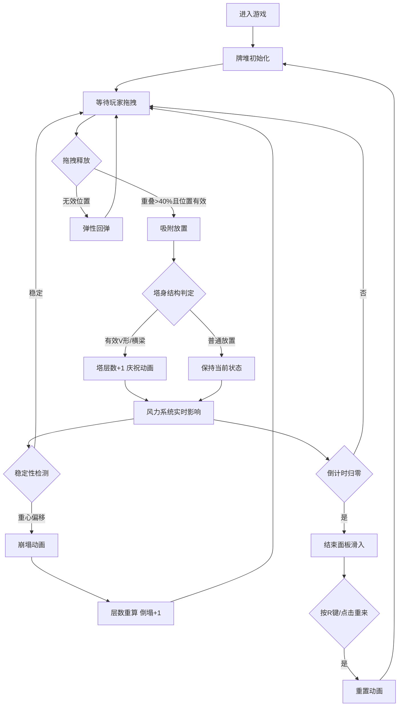

## 1. 产品概述
2D纸牌塔搭建模拟游戏，玩家通过鼠标拖拽扑克牌在桌面上堆叠成塔，挑战在90秒内搭出最高且不倒的纸牌塔。塔身稳定性受风力影响，需要玩家掌握平衡策略。

- **目标用户**：休闲游戏爱好者、物理模拟游戏玩家
- **市场价值**：结合物理模拟和策略挑战的轻量级休闲游戏，适合碎片时间游玩

## 2. 核心功能

### 2.1 功能模块
1. **主游戏界面**：画布渲染、牌堆交互、塔身搭建
2. **拖拽系统**：纸牌拾取、跟随移动、吸附/回弹判定
3. **物理引擎**：重力模拟、支撑面积判定、稳定性评分、崩塌检测
4. **风力系统**：风速方向随机波动、塔体摇摆、风纹可视化
5. **游戏状态管理**：倒计时、塔层数统计、倒塌次数、游戏结束面板
6. **动画系统**：入场动画、庆祝动画、崩塌动画、重置动画

### 2.2 功能详情
| 模块名称 | 功能描述 |
|---------|---------|
| 牌堆交互 | 鼠标悬停时顶牌抬高30px并微旋5度，拖拽时跟随鼠标 |
| 放置判定 | 重叠面积>40%吸附到上层，否则飘回原位带弹性回弹 |
| 塔身搭建 | 倒V形支撑结构，上层牌横跨下层两牌顶端，误差<8px有效放置 |
| 风力模拟 | 15秒一轮循环：0-5s平稳(0-2)，5-10s渐强(8-12)，10-15s回落 |
| 摇摆崩塌 | 风速>6时3层以上牌摇摆，重心偏移超支撑边缘触发崩塌 |
| 倒计时 | 90秒限时，15s时0.5s闪烁，5s时0.2s闪烁变红 |
| 结束面板 | 显示最终层数与倒塌次数，300x200px底部滑入动画 |
| 重置功能 | R键或结束后重置，0.6秒内所有牌沿弧形飞回牌堆 |

## 3. 核心流程
玩家进入游戏 → 从左侧牌堆拖拽扑克牌 → 放置到桌面/塔身 → 系统判定有效放置或回弹 → 风力系统影响塔身稳定性 → 倒计时内尽可能搭建高塔 → 时间结束显示成绩 → 可选择重新开始

## 4. 用户界面设计

### 4.1 设计风格
- **主色调**：深木色背景(#5D4037)，牌堆区域(#6D4C41)，牌背深蓝(#1A237E)
- **强调色**：金色边框(#FFD740)，红色指针/警告(#FF5252)，白色文字(#FFFFFF)
- **整体风格**：复古木质桌面质感，真实纸牌纹理，流畅物理动画
- **字体**：大号无衬线数字字体，响应式缩放(14px-24px)

### 4.2 界面布局
| 区域 | 位置 | 内容 |
|------|------|------|
| 牌堆区 | 左侧200px | 52张堆叠扑克牌，稍亮背景带阴影渐变 |
| 状态面板 | 右上角 | 倒计时、塔层数、倒塌次数，半透明黑底圆角 |
| 风力仪表盘 | 底部中央 | 半圆形仪表盘(半径80px)，红色三角指针，风速刻度0-12 |
| 游戏桌面 | 中央区域 | 深木色背景，20x20px半透明木质纹理 |
| 结束面板 | 中央 | 300x200px，#212121背景，#FFD740边框 |

### 4.3 响应式
- 画布尺寸=窗口大小，UI元素按百分比定位
- 字体大小随画布宽度等比缩放(最小14px，最大24px)
- 所有交互区域适配不同宽高比

## 5. 性能指标
- 帧率稳定≥55FPS，每帧计算耗时≤10ms
- 碰撞检测采用四叉树加速(最多52张牌)
- 风力模拟仅对顶层4层进行精细计算
- 动画使用requestAnimationFrame驱动
