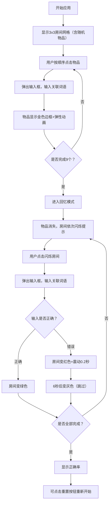

## 1. 产品概述

记忆宫殿（Method of Loci）是一种古老而高效的记忆术，通过将需要记忆的信息与熟悉的空间位置关联来强化记忆。本应用在浏览器中构建虚拟3x3房间网格，帮助用户以直观的可视化交互方式进行记忆训练。

- 解决传统记忆法中抽象位置联想缺乏直观3D空间感和交互反馈的问题
- 帮助用户在脑海中构建清晰路径来记忆随机信息
- 面向希望提升记忆力、学习记忆法的普通用户

## 2. 核心功能

### 2.1 功能模块
1. **主训练页面**：房间网格展示、物品关联输入、回忆模式、结果统计、重置功能

### 2.2 页面详情
| 页面名称 | 模块名称 | 功能描述 |
|---------|---------|---------|
| 主训练页面 | 房间网格 | 3x3网格布局，9个半透明墙壁的虚拟房间，支持点击检测 |
| 主训练页面 | 物品展示 | 每个房间随机放置9种物品之一（苹果、书本、烛台、钥匙、信封、沙漏、羽毛笔、怀表、铃铛），带呼吸光晕动画 |
| 主训练页面 | 关联输入 | 点击物品后弹出输入框，输入与物品关联的词语，完成后物品显示金色边框和弹性缩放动画 |
| 主训练页面 | 回忆模式 | 完成9个关联后自动进入，物品消失，房间按顺序闪烁提示，用户点击房间并输入关联词语 |
| 主训练页面 | 结果反馈 | 输入正确变绿，错误变红并震动，超时跳过变灰，最终显示正确率 |
| 主训练页面 | 重置按钮 | 右上角圆形红色按钮，清空所有状态并重新随机生成布局 |

## 3. 核心流程

用户打开应用 → 看到3x3房间网格，每个房间有随机物品 → 按顺序点击物品 → 输入关联词语（共9次）→ 自动进入回忆模式 → 房间按原顺序闪烁 → 用户点击对应房间并输入词语 → 系统反馈对错 → 最终显示正确率 → 用户可点击重置重新开始

## 4. 用户界面设计

### 4.1 设计风格
- **主背景色**：羊皮纸色调 #F5E6CA
- **房间墙壁**：半透明 #E8E0D0，边框深棕色 #8B4513
- **正确反馈**：绿色 #90EE90
- **错误反馈**：红色 #FF6B6B
- **金色强调**：#FFD700（物品完成边框、回忆闪烁）
- **重置按钮**：红色 #E74C3C，悬停 #C0392B
- **输入框**：白色背景 #FFFFFF，边框 #D4C5A9，圆角 8px
- **整体风格**：复古羊皮纸质感，优雅温暖

### 4.2 页面设计概述
| 页面名称 | 模块名称 | UI元素 |
|---------|---------|-------|
| 主训练页面 | 顶部状态栏 | 正确率显示、模式指示（学习/回忆） |
| 主训练页面 | 房间网格 | 3x3布局，每个房间30x30单位，响应式间距 |
| 主训练页面 | 物品图标 | 64x64 SVG，居中，呼吸光晕动画（半径20px，透明度0.3-0.6，周期1.8秒） |
| 主训练页面 | 输入框 | 底部平滑滑入（0.3秒 ease-out），白色背景 |
| 主训练页面 | 重置按钮 | 右上角圆形，点击缩放0.9 |
| 主训练页面 | 底部提示区 | 当前操作指引文字 |

### 4.3 响应式设计
- **桌面端**：3x3网格，房间间距10-20px
- **移动端**：每行2个房间排列，自动缩小尺寸
- **触控优化**：点击区域充足，确保移动端操作流畅

### 4.4 动画与性能
- **所有动画60FPS**，使用 requestAnimationFrame 驱动
- **呼吸光晕**：CSS keyframes，周期1.8秒
- **弹性缩放**：从1.0→1.3→1.0，0.5秒
- **闪烁边框**：0.4秒淡入淡出，CSS关键帧
- **震动效果**：0.2秒抖动动画
- **输入框滑入**：0.3秒 ease-out
- **单次点击到视觉反馈延迟**：≤50ms
