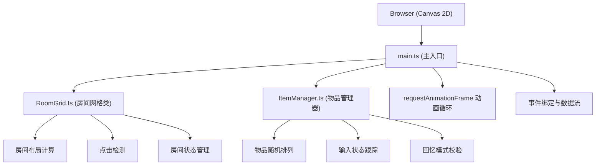

## 1. 架构设计



## 2. 技术描述

- **前端框架**：原生 TypeScript + Vite（无React/Vue，按用户要求使用Canvas渲染）
- **渲染方式**：HTML5 Canvas 2D API
- **初始化工具**：Vite vanilla-ts 模板
- **后端**：无（纯前端应用）
- **数据库**：无（内存状态管理）

## 3. 文件结构

```
/
├── package.json          # 依赖：typescript、vite，启动脚本 npm run dev
├── index.html            # 入口页面：全屏画布、顶部状态栏、底部提示区
├── tsconfig.json         # 严格模式，target ES2020，module ESNext
├── vite.config.js        # Vite配置，支持HMR和TS
└── src/
    ├── main.ts           # 主入口：初始化画布、动画循环、事件绑定、数据流控制
    ├── RoomGrid.ts       # 房间网格类：3x3房间绘制、布局计算、点击检测、状态管理
    └── ItemManager.ts    # 物品管理器：9种物品随机排列、输入状态跟踪、回忆模式校验
```

## 4. 数据模型

### 4.1 核心类型定义

```typescript
// 物品类型
type ItemType = 'apple' | 'book' | 'candle' | 'key' | 'envelope' | 'hourglass' | 'quill' | 'watch' | 'bell';

// 房间状态
type RoomStatus = 'empty' | 'associated' | 'correct' | 'wrong' | 'skipped';

// 应用模式
type AppMode = 'learning' | 'recalling' | 'finished';

// 房间数据
interface Room {
  id: number;
  x: number;          // 网格x坐标 0-2
  y: number;          // 网格y坐标 0-2
  item: ItemType;
  associatedWord: string | null;
  status: RoomStatus;
  isFlashing: boolean;
  isShaking: boolean;
  scaleAnimation: number;  // 0-1 弹性动画进度
}

// 应用状态
interface AppState {
  mode: AppMode;
  rooms: Room[];
  currentStep: number;       // 当前步骤 0-8
  recallOrder: number[];     // 回忆顺序（房间ID顺序）
  correctCount: number;
  totalCount: number;
  inputVisible: boolean;
  activeRoomId: number | null;
}
```

## 5. 动画实现策略

### 5.1 动画循环
- 使用单一 `requestAnimationFrame` 循环驱动所有动画
- 避免 `setTimeout` 导致的累积误差
- 动画状态统一管理，每帧批量渲染

### 5.2 各类动画
| 动画名称 | 实现方式 | 参数 |
|---------|---------|------|
| 物品呼吸光晕 | Canvas径向渐变 + requestAnimationFrame | 半径20px，透明度0.3-0.6，周期1.8秒 |
| 弹性缩放动画 | 贝塞尔缓动函数计算scale值 | 0.5秒，1.0→1.3→1.0 |
| 房间闪烁边框 | Canvas alpha值渐变 | 0.4秒淡入淡出，金色#FFD700 |
| 错误震动 | Canvas translate偏移正弦波 | 0.2秒，幅度±3px |
| 输入框滑入 | CSS transform + transition | 0.3秒 ease-out |

## 6. 性能优化

- **Canvas分层渲染**：静态房间网格缓存到离屏Canvas，仅重绘变化部分
- **最小化重绘区域**：使用 dirty rect 技术仅更新变化的房间
- **对象池复用**：避免动画过程中频繁创建对象
- **节流事件**：鼠标移动等高频事件适当节流
- **输入框延迟**：CSS动画确保点击反馈≤50ms
