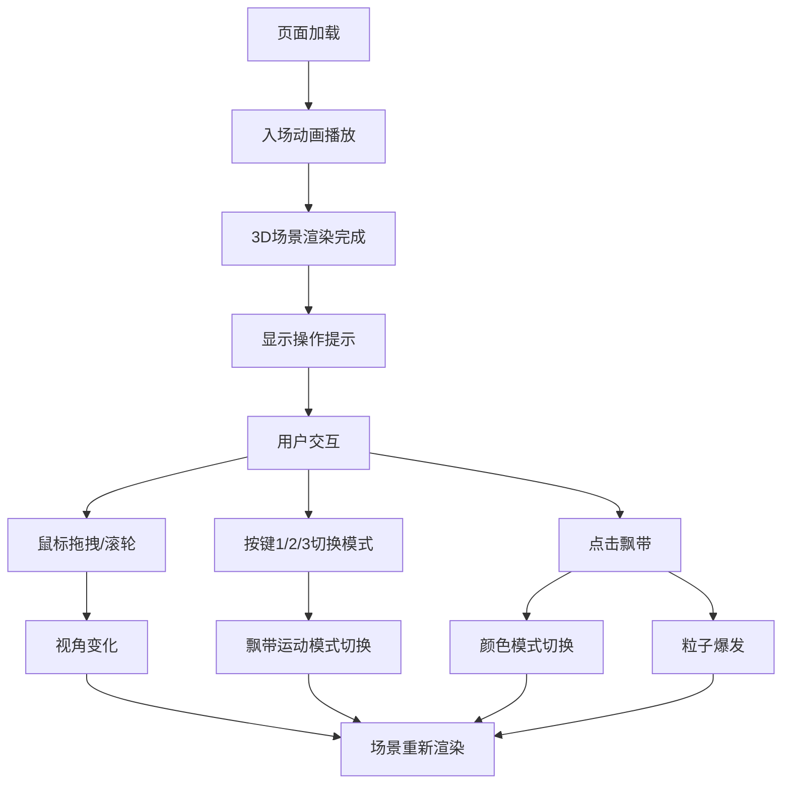

## 1. 产品概述

3D极光飘带模拟器是一款面向数据艺术家的交互式浏览器艺术装置，用户可在3D空间中实时操控多条彩色半透明极光飘带，模拟极光在磁场中的流动与扭曲效果。通过鼠标、键盘与飘带的直接交互，创造不断变化的抽象艺术作品。

## 2. 核心功能

### 2.1 用户角色

| 角色 | 使用方式 | 核心能力 |
|------|----------|----------|
| 数据艺术家 | 浏览器直接访问 | 实时操控3D极光飘带，切换运动模式，变换颜色效果，创作抽象艺术 |

### 2.2 功能模块

1. **3D场景渲染模块**：深空背景、星空粒子、3条极光飘带、菲涅尔边缘光
2. **飘带动画模块**：正弦波动、螺旋扭曲、随机扰动三种运动模式
3. **颜色交互模块**：随机色、渐变光晕、单色脉冲三种颜色模式，点击切换
4. **交互控制模块**：鼠标拖拽旋转视角、滚轮缩放、键盘切换模式、点击拾取飘带
5. **粒子效果模块**：点击飘带触发粒子爆发、屏幕边缘泛光
6. **入场动画模块**：飘带展开动画、背景渐变、操作提示淡入淡出

### 2.3 页面详情

| 页面名称 | 模块名称 | 功能描述 |
|----------|----------|----------|
| 主页 | 全屏3D画布 | 渲染3D场景与所有视觉元素 |
| 主页 | 操作提示面板 | 左下角半透明面板，展示操作说明，悬停高亮 |
| 主页 | 极光飘带 | 3条彩色半透明飘带，支持三种运动模式和三种颜色模式 |
| 主页 | 星空背景 | 1000个随机分布的星空粒子缓慢旋转 |
| 主页 | 粒子爆发 | 点击飘带时50个粒子沿法线飞散 |

## 3. 核心流程

用户打开页面 → 入场动画播放（飘带从中心展开、背景渐变）→ 显示操作提示 → 用户通过鼠标拖拽旋转视角/滚轮缩放 → 用户按数字键1/2/3切换飘带运动模式 → 用户点击飘带切换颜色模式并触发粒子爆发 → 持续交互创作艺术作品

## 4. 用户界面设计

### 4.1 设计风格
- **主色调**：深空蓝紫色 `#0A0A2E` 作为背景
- **点缀色**：青色 `#00FFFF`、洋红 `#FF00FF`、白色 `#FFFFFF` 作为飘带初始颜色
- **对比色**：橙黄色用于粒子爆发效果增强视觉对比
- **视觉风格**：绚丽、流畅、梦幻的极光美学
- **字体**：`'Segoe UI', sans-serif` 白色细体

### 4.2 页面设计概述

| 页面名称 | 模块名称 | UI元素 |
|----------|----------|--------|
| 主页 | 全屏3D画布 | Three.js渲染器，占满整个视口 |
| 主页 | 操作提示面板 | 左下角`#1A1A2E`半透明背景（透明度0.6），圆角8px，14px白色细体文字，2秒后淡入至opacity:0.2，悬停高亮 |
| 主页 | 极光飘带 | 3条TubeGeometry，半透明（0.5-0.8），宽度0.1-0.3，菲涅尔边缘发光 |
| 主页 | 星空背景 | 1000个Points粒子，大小0.01-0.03，半径50单位随机分布 |
| 主页 | 粒子爆发 | 点击时50个橙黄色粒子，大小0.05，生命周期1秒 |

### 4.3 响应式设计
- 全屏3D画布自适应窗口大小
- 操作提示面板固定左下角，适配各种分辨率

### 4.4 3D场景指引
- **环境**：深空蓝紫色渐变背景 `#0A0A2E`，无HDRI
- **光照**：环境光+方向光，突出飘带半透明质感
- **相机**：PerspectiveCamera，OrbitControls控制拖拽旋转和缩放
- **构图**：3条飘带以半径15单位圆形均匀排布，间隔20单位，整体绕Y轴旋转
- **交互动画**：入场1.5秒弹性展开动画，模式切换1秒平滑过渡，颜色切换0.5秒gsap过渡
- **后处理**：点击时屏幕边缘泛光（bloom强度0.5，持续0.3秒）
- **性能约束**：帧率稳定50FPS+，TubeGeometry分段≤64，粒子总数≤2000
