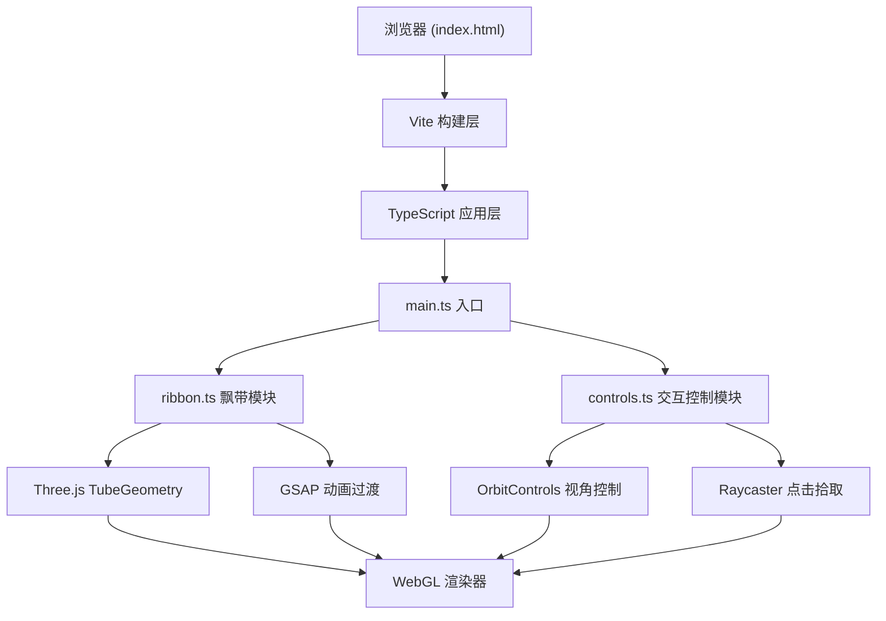

## 1. 架构设计



## 2. 技术说明

- **前端框架**：无框架（原生 TypeScript），Three.js 负责3D渲染
- **构建工具**：Vite 5.x（支持HMR热更新）
- **3D引擎**：Three.js r160+，@types/three 类型定义
- **动画库**：GSAP 3.x 实现平滑过渡动画
- **语言**：TypeScript 5.x（严格模式，目标ES2020，模块ESNext）

## 3. 文件结构与调用关系

```
├── index.html              入口页面，全屏canvas+操作提示DOM
├── package.json            依赖配置
├── vite.config.js          Vite构建配置
├── tsconfig.json           TypeScript配置
└── src/
    ├── main.ts             主入口：场景/相机/渲染器初始化，动画循环
    ├── ribbon.ts           Ribbon类：飘带几何体、运动模式、颜色切换
    └── controls.ts         setupControls函数：鼠标/键盘交互，点击拾取
```

### 数据流向

1. **main.ts → ribbon.ts**：创建 Ribbon 实例，传入起始位置和初始颜色
2. **ribbon.ts → main.ts**：update() 返回更新后的 Mesh 数据；getMeshes() 提供 Mesh 引用用于射线拾取
3. **main.ts → controls.ts**：调用 setupControls(camera, renderer, ribbons) 初始化交互
4. **controls.ts → main.ts**：通过回调返回点击事件和模式切换事件
5. **controls.ts → ribbon.ts**：触发 setColorMode()、setMotionMode() 方法切换飘带状态

## 4. 核心数据模型

### 4.1 Ribbon 类

```typescript
enum MotionMode { SINE = 1, SPIRAL = 2, RANDOM = 3 }
enum ColorMode { RANDOM = 0, GRADIENT = 1, PULSE = 2 }

interface RibbonConfig {
  startPosition: THREE.Vector3;
  initialColor: THREE.Color;
  width: number;
  opacity: number;
}

class Ribbon {
  public meshes: THREE.Mesh[];           // 可拾取的Mesh数组
  public motionMode: MotionMode;         // 当前运动模式
  public colorMode: ColorMode;           // 当前颜色模式
  public baseAngle: number;              // 初始角度（用于圆形排布）
  
  constructor(config: RibbonConfig);
  update(time: number, delta: number): void;  // 每帧更新
  setColorMode(mode: ColorMode): void;         // 切换颜色模式
  setMotionMode(mode: MotionMode): void;       // 切换运动模式
  dispose(): void;                              // 资源释放
}
```

### 4.2 Controls 模块

```typescript
interface ControlState {
  camera: THREE.PerspectiveCamera;
  isInteracting: boolean;
}

function setupControls(
  camera: THREE.PerspectiveCamera,
  renderer: THREE.WebGLRenderer,
  ribbons: Ribbon[],
  onRibbonClick: (ribbon: Ribbon) => void,
  onModeChange: (mode: MotionMode) => void
): ControlState;
```

## 5. 性能优化策略

1. **BufferGeometry复用**：星空粒子使用共享BufferGeometry
2. **对象池管理**：粒子爆发效果使用对象池，避免频繁创建销毁
3. **LOD分段控制**：TubeGeometry管状分段≤64，径向分段≤8
4. **帧率控制**：使用requestAnimationFrame+delta time，避免不必要计算
5. **材质共享**：相同属性的飘带尽可能共享材质实例
