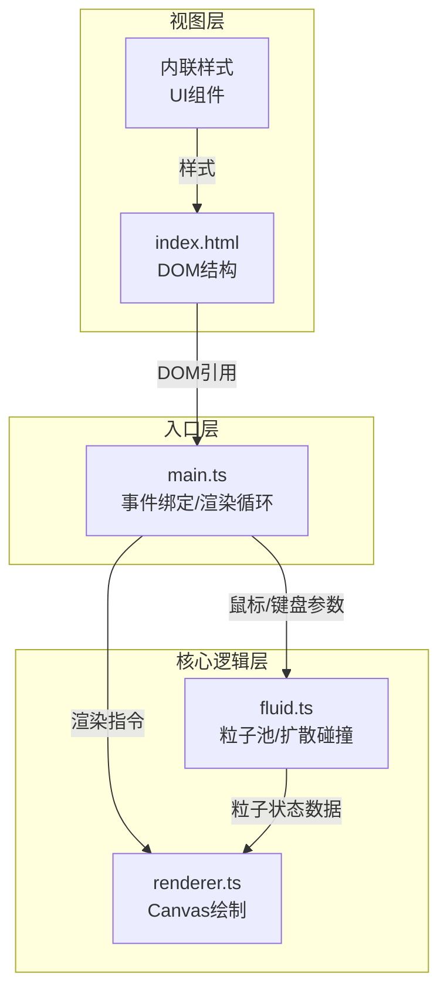

## 1. 架构设计



## 2. 技术描述
- **构建工具**：Vite 5.x (支持HMR)
- **语言**：TypeScript 5.x (严格模式，ES2020目标)
- **渲染**：Canvas 2D API
- **包管理器**：npm
- **无后端**，纯前端应用

## 3. 文件结构与职责

```
├── package.json          # 依赖与脚本配置
├── index.html            # 入口HTML，Canvas/DOM结构/内联样式
├── vite.config.js        # Vite构建配置
├── tsconfig.json         # TypeScript配置
└── src/
    ├── main.ts           # 主入口：初始化、事件、渲染循环
    ├── fluid.ts          # 流体引擎：粒子管理、物理计算
    └── renderer.ts       # 渲染器：宣纸、粒子、水波纹绘制
```

### 3.1 数据流向

```
用户输入
   ↓
main.ts (事件处理)
   ├─→ 工具模式/墨色参数 ──→ fluid.ts (状态更新)
   └─→ 鼠标位置/速度 ──────→ fluid.ts (粒子生成)
                              ↓
                         fluid.ts (粒子计算)
                              ↓ 粒子数组
                         renderer.ts (绘制输出)
                              ↓
                           Canvas 2D
```

### 3.2 调用关系

| 调用方 | 被调用方 | 数据 |
|--------|----------|------|
| main.ts | fluid.ts.addInkParticles() | 鼠标位置、速度、墨色alpha |
| main.ts | fluid.ts.addWaterParticles() | 鼠标位置、速度 |
| main.ts | fluid.ts.attractParticles() | 鼠标位置 |
| main.ts | fluid.ts.update() | deltaTime |
| main.ts | renderer.render() | 粒子数据、背景类型、过渡进度 |
| main.ts | renderer.renderUI() | FPS、粒子数、模式名称 |
| fluid.ts | - | 返回Particle[]给renderer |

## 4. 数据模型

### 4.1 粒子接口
```typescript
interface Particle {
  x: number;           // 位置X
  y: number;           // 位置Y
  vx: number;          // 速度X
  vy: number;          // 速度Y
  radius: number;      // 当前半径
  maxRadius: number;   // 最大扩散半径
  alpha: number;       // 透明度
  initialAlpha: number;// 初始透明度
  life: number;        // 生命周期(ms)
  maxLife: number;     // 最大生命周期
  type: 'ink' | 'water'; // 粒子类型
  size: number;        // 初始墨点大小
}
```

### 4.2 工具模式
```typescript
type ToolMode = 'ink' | 'water' | 'absorb';
```

### 4.3 宣纸类型
```typescript
type PaperType = 'plain' | 'gold' | 'linen';
```

## 5. 性能优化策略
- **对象池**：Particle对象复用，避免频繁GC
- **空间分区**：粒子按网格分桶，碰撞检测只查相邻桶
- **增量渲染**：宣纸纹理预渲染到离屏Canvas，每帧只绘制粒子叠加层
- **帧率控制**：固定时间步长更新物理，插值渲染
- **粒子上限**：总粒子数不超过3000，超出优先回收生命周期最长的

## 6. 开发脚本
| 脚本 | 作用 |
|------|------|
| npm run dev | 启动Vite开发服务器 |
| npm run build | 生产构建 |
