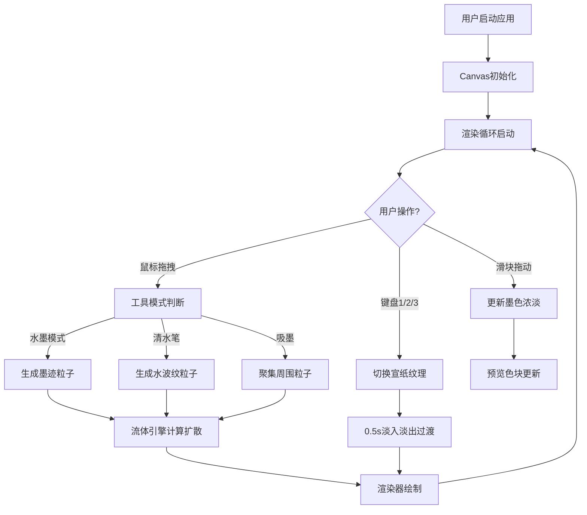

## 1. 产品概述
基于Canvas的交互式水墨流体绘画应用，为数字艺术家提供东方水墨美学创作工具，模拟墨迹在宣纸上的自然扩散、晕染与叠加效果。

### 1.1 核心目标
- 提供高真实度的水墨流体物理模拟
- 支持多种宣纸纹理背景切换
- 提供清水笔、吸墨等多种创作工具
- 保证3000粒子时30FPS以上的流畅渲染性能

## 2. 核心功能

### 2.1 用户角色
| 角色 | 描述 | 核心权限 |
|------|------|----------|
| 数字艺术家 | 主要用户 | 使用全部绘画功能 |

### 2.2 功能模块
1. **画布模块**：全屏Canvas、宣纸纹理、粒子渲染
2. **流体引擎模块**：墨迹粒子管理、扩散碰撞计算
3. **工具面板模块**：清水笔模式、吸墨模式切换
4. **墨色控制模块**：底部墨色滑块、实时预览
5. **背景切换模块**：键盘1/2/3切换宣纸纹理
6. **状态监控模块**：粒子数、工具模式、FPS实时显示

### 2.3 功能详情
| 模块 | 功能点 | 描述 |
|------|--------|------|
| 画布模块 | 鼠标绘画 | 拖拽产生墨迹，速度影响形态（慢=凝聚墨点，快=飞溅墨丝） |
| 画布模块 | 流体扩散 | 松开鼠标后墨迹按流体规则扩散2秒后稳定 |
| 墨色控制 | 浓淡滑块 | 范围0-100，默认50，alpha 0.1-0.9渐变 |
| 工具面板 | 清水笔 | 产生透明水波纹，冲淡并晕开已有墨迹 |
| 工具面板 | 吸墨 | 聚集30px内墨迹粒子，形成更深墨点 |
| 背景切换 | 键盘控制 | 1=素白、2=洒金、3=麻布纹，0.5秒淡入淡出 |
| 状态监控 | 实时信息 | 粒子总数、工具名称、FPS，每0.5秒更新 |

## 3. 核心流程

## 4. 用户界面设计

### 4.1 设计风格
- **主色调**：宣纸米白(#F5F0E8)、墨黑(#000000)、麻布棕(#E8DCC8)
- **材质质感**：磨砂玻璃面板、像素级宣纸纤维噪声
- **动效风格**：弹簧缩放(1.05)、点击回弹、淡入淡出过渡
- **字体**：14px monospace，半透明白色文字

### 4.2 UI布局
| 区域 | 位置 | 元素 |
|------|------|------|
| 工具面板 | 左上角(20px边距) | 清水笔、吸墨模式按钮 |
| 墨色滑块 | 底部居中 | 垂直渐变滑块、圆形色块预览 |
| 状态信息 | 画布左上角 | 粒子数/模式/FPS文本 |
| 主画布 | 全屏 | 宣纸纹理+水墨粒子 |

### 4.3 交互动效
- 悬停：transform: scale(1.05)，弹簧曲线cubic-bezier(0.34, 1.56, 0.64, 1)，0.2s
- 点击：0.1s缩小回弹
- 背景切换：0.5s淡入淡出

### 4.4 响应式
- 桌面端优先，画布自适应视口(100vw x 100vh)
- 移动端支持触摸事件
