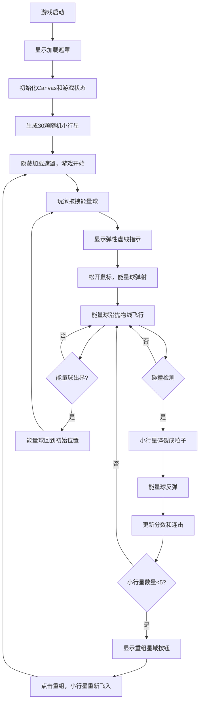

## 1. 产品概述

「星轨弹弓」是一款基于Canvas的物理投射休闲游戏，玩家在深空虚域中通过拖拽弹射能量球来摧毁漂浮的小行星，体验连锁反应与连击机制带来的爽快感。

- 核心玩法：拖拽能量球→松手弹射→撞击小行星→碎裂连锁→连击得分
- 目标用户：喜欢休闲物理游戏、追求高分挑战的玩家
- 产品价值：提供短平快的解压娱乐体验，精美的深空视觉效果和流畅的物理反馈

## 2. 核心功能

### 2.1 用户角色
| 角色 | 注册方式 | 核心权限 |
|------|----------|----------|
| 普通玩家 | 无需注册，直接进入游戏 | 进行游戏、查看分数、重置游戏、重组星域 |

### 2.2 功能模块
1. **游戏主场景**：深空渐变背景、小行星分布、能量球弹射、粒子碎裂特效
2. **物理系统**：拖拽弹弓机制、抛物线飞行、重力模拟、圆形碰撞检测、反弹计算
3. **分数系统**：基础得分、连击倍率、最高分记录、银河连击特效
4. **UI界面**：分数显示、连击计数、重置按钮、重组星域按钮、加载遮罩

### 2.3 页面详情
| 页面名称 | 模块名称 | 功能描述 |
|----------|----------|----------|
| 游戏主页面 | 深空背景 | #0B0C10到#1F2833的垂直渐变背景 |
| 游戏主页面 | 小行星系统 | 30颗随机不规则六边形，随机颜色，自旋动画，半透明光晕 |
| 游戏主页面 | 能量球系统 | 拖拽交互、弹性虚线指示、脉动光晕、抛物线飞行、碰撞反弹 |
| 游戏主页面 | 粒子特效系统 | 小行星碎裂成8-12个光点，散射动画，透明度衰减 |
| 游戏主页面 | 分数显示 | 左上角当前分数（白色48px）、右侧中间最高分（灰色28px带金线分隔） |
| 游戏主页面 | 连击系统 | 右上角连击计数（金色燃烧数字动画、环形波纹特效） |
| 游戏主页面 | 控制按钮 | 右下角重置按钮、底部重组星域按钮（小行星<5时出现） |
| 游戏主页面 | 加载遮罩 | 半透明加载层，游戏就绪后淡出 |

## 3. 核心流程

玩家进入游戏后，看到深空背景下随机分布的小行星群。左下角有一颗脉动的能量球，玩家可以用鼠标拖拽能量球，此时会出现一条金色弹性虚线指示弹射方向和力度。松开鼠标后，能量球按照拖拽向量决定的初速度沿抛物线飞出。能量球碰撞到小行星时，小行星碎裂成多个彩色光点散射消失，能量球反弹继续飞行。连续摧毁小行星（间隔<1.5秒）触发连击倍率，得分倍增。当屏幕上小行星少于5颗时，底部出现「重组星域」按钮，点击后小行星从屏幕外飞入重新生成。右下角的重置按钮可随时重新开始游戏。

## 4. 用户界面设计

### 4.1 设计风格
- **主色调**：深空色系，背景#0B0C10→#1F2833渐变
- **强调色**：能量球#E8491D（橙红）、虚线#FFD700（金色）、小行星#45A29E/#66FCF1/#C5C6C7/#F2A900
- **按钮风格**：圆角矩形，渐变背景，hover上浮效果
- **字体**：sans-serif无衬线，分数使用粗体大字
- **布局风格**：全屏沉浸式，UI元素分布在四角和边缘，不遮挡游戏区域
- **动效风格**：流畅的缓动动画，粒子散射，光晕脉动，环形波纹扩散

### 4.2 页面设计概览
| 页面名称 | 模块名称 | UI元素 |
|----------|----------|--------|
| 游戏主页面 | 背景 | 深空垂直渐变，营造宇宙深邃感 |
| 游戏主页面 | 小行星 | 不规则六边形（顶点随机偏移），4色随机，缓慢自旋，半透明光晕包裹 |
| 游戏主页面 | 能量球 | 圆形#E8491D，脉动光晕（周期0.6s），拖拽时显示金色弹性虚线 |
| 游戏主页面 | 粒子 | 2-5px小圆点，继承小行星颜色，散射运动，1.5秒内淡出 |
| 游戏主页面 | 分数（左上） | 白色48px粗体sans-serif，带轻微投影 |
| 游戏主页面 | 最高分（右中） | 灰色28px，下方1px金线分隔 |
| 游戏主页面 | 连击计数（右上） | 金色24px，激活时周围环形波纹扩散（周期0.5s），数字膨胀动画（0.3s从20px→36px→20px） |
| 游戏主页面 | 能量球指示器（左下） | 10px半透明小号能量球，位置提示 |
| 游戏主页面 | 重置按钮（右下） | 背景#1F2833，白色文字，圆角4px，hover背景变#45A29E，上浮2px，过渡0.2s |
| 游戏主页面 | 重组星域按钮（底部） | 渐变#E8491D→#F2A900，圆角8px，仅小行星<5时显示 |
| 游戏主页面 | 加载遮罩 | 半透明黑色背景，加载提示文字 |

### 4.3 响应式
- 桌面端优先，Canvas自适应100vw×100vh全屏
- 鼠标拖拽优化，支持桌面端精确操作
- 按钮尺寸适合鼠标点击

### 4.4 性能要求
- 使用requestAnimationFrame驱动60FPS游戏循环
- Canvas启用willReadFrequently: false优化
- 帧率低于45FPS时自动降级：粒子数量从12降至6，连击特效粒子数减少
