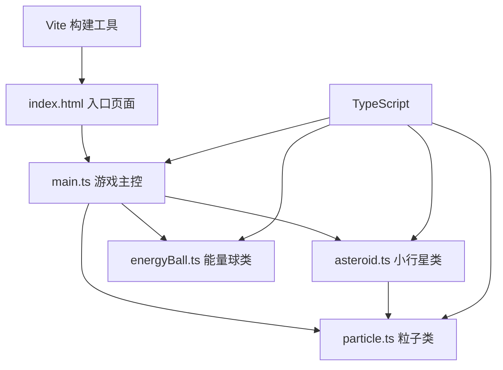

## 1. 架构设计

本项目为纯前端Canvas游戏，无需后端服务，采用分层架构设计：



## 2. 技术描述

- **前端框架**：原生 TypeScript + HTML5 Canvas API（无框架，轻量高性能）
- **构建工具**：Vite（快速HMR，开箱即用TypeScript支持）
- **初始化方式**：手动创建项目结构 + Vite配置
- **后端**：无（纯前端游戏，状态存储在内存和localStorage）
- **数据持久化**：localStorage存储最高分记录

## 3. 目录结构与文件说明

```
auto199/
├── index.html              # 入口HTML页面，包含Canvas和UI元素
├── package.json            # 项目配置与依赖
├── tsconfig.json           # TypeScript配置
├── vite.config.js          # Vite构建配置
└── src/
    ├── main.ts             # 游戏主入口：状态管理、事件监听、游戏循环
    ├── asteroid.ts         # 小行星类：位置、旋转、绘制、碎裂
    ├── energyBall.ts       # 能量球类：拖拽、物理、碰撞检测
    └── particle.ts         # 粒子类：碎裂光点、生命周期
```

### 3.1 文件职责与调用关系

| 文件 | 主要职责 | 被调用方 | 调用方 |
|------|----------|----------|--------|
| `index.html` | 页面结构、DOM元素（Canvas、按钮、分数显示）、样式 | 无 | 浏览器 |
| `main.ts` | 游戏状态管理、requestAnimationFrame循环、事件监听、分数/连击逻辑、小行星与粒子数组管理 | asteroid.ts, energyBall.ts, particle.ts | index.html |
| `asteroid.ts` | 小行星数据模型（位置/半径/颜色/旋转）、不规则六边形绘制、自旋更新、碎裂生成粒子 | particle.ts | main.ts |
| `energyBall.ts` | 能量球数据模型、拖拽状态、脉动光晕绘制、重力物理、圆形碰撞检测、反弹计算 | 无 | main.ts |
| `particle.ts` | 粒子数据模型（位置/速度/透明度/生命周期）、散射更新、淡出绘制 | 无 | main.ts, asteroid.ts |

## 4. 核心数据模型定义

### 4.1 类型定义

```typescript
// 2D向量
interface Vector2 {
  x: number;
  y: number;
}

// 游戏状态
interface GameState {
  score: number;
  highScore: number;
  combo: number;
  lastDestroyTime: number;
  asteroids: Asteroid[];
  particles: Particle[];
  isDragging: boolean;
  dragStart: Vector2;
  dragCurrent: Vector2;
}

// 小行星颜色选项
type AsteroidColor = '#45A29E' | '#66FCF1' | '#C5C6C7' | '#F2A900';
```

### 4.2 物理参数常量

| 参数 | 值 | 说明 |
|------|-----|------|
| 重力系数 | 0.02 px/帧² | Y轴向下加速度 |
| 最大速度 | 8 px/帧 | 能量球初速度上限 |
| 能量球半径 | 12 px | 碰撞检测半径 |
| 粒子生命周期 | 1.5 秒 | 透明度线性衰减时长 |
| 连击时间窗口 | 1.5 秒 | 两次摧毁间隔小于此值触发连击 |
| 帧率目标 | 60 FPS | requestAnimationFrame目标 |
| 性能降级阈值 | 45 FPS | 低于此帧率时减少粒子数量 |

### 4.3 连击倍率映射

| 连击数 | 倍率 |
|--------|------|
| 1 | 1.0x |
| 2 | 1.5x |
| 3 | 2.0x |
| 4 | 3.0x |
| 5+ | 5.0x |

## 5. 关键算法

### 5.1 圆形碰撞检测
```
distance = sqrt((ball.x - asteroid.x)² + (ball.y - asteroid.y)²)
collision = distance < (ball.radius + asteroid.radius)
```

### 5.2 碰撞反弹（简化弹性碰撞）
```
normal = normalize(asteroid.center - ball.position)
dotProduct = dot(ball.velocity, normal)
ball.velocity = ball.velocity - 2 * dotProduct * normal
// 附加能量衰减因子 0.8
ball.velocity *= 0.8
```

### 5.3 弹射初速度计算
```
dragVector = dragStart - dragCurrent  // 反向，像弹弓一样
speed = clamp(length(dragVector) * 0.15, 0, maxSpeed)
direction = normalize(dragVector)
ball.velocity = direction * speed
```

### 5.4 ease-out缓动函数（小行星飞入动画）
```
easeOut(t) = 1 - (1 - t)³
```

## 6. 性能优化策略

1. **requestAnimationFrame**：使用浏览器原生动画API，与刷新同步
2. **Canvas优化**：`getContext('2d', { willReadFrequently: false })`，关闭像素读取优化
3. **帧率监控**：记录每帧耗时，连续3帧低于45FPS时触发降级
4. **降级策略**：
   - 粒子最大数量：12 → 6
   - 连击特效粒子：禁用或减半
   - 光晕渲染：简化渐变计算
5. **对象池**（可选扩展）：粒子对象复用，减少GC压力
