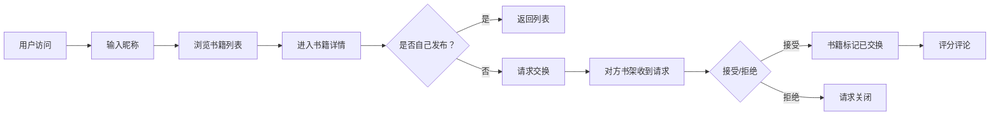

## 1. 产品概述

书途——在线书籍交换与社区评价平台，让用户可以发布闲置书籍、浏览他人书架并交换图书，同时为交换过的书籍留下评分和评论。

- 主要目的：构建一个温暖的书籍共享社区，让闲置书籍流动起来，连接爱书之人。
- 目标用户：所有拥有闲置书籍并希望与他人交换阅读的人群。

## 2. 核心功能

### 2.1 用户角色

| 角色 | 注册方式 | 核心权限 |
|------|----------|----------|
| 普通用户 | 首次访问时输入昵称（存储在localStorage） | 发布书籍、浏览书架、请求交换、接收/拒绝请求、评分评论 |

### 2.2 功能模块

1. **全局书籍列表页**：书籍卡片网格、导航栏、骨架屏、筛选展示
2. **书籍详情页**：完整书籍信息、评论区、交换请求按钮、评分表单
3. **个人书架页**：我的书籍、发布新书表单、收到的交换请求列表

### 2.3 页面详情

| 页面名称 | 模块名称 | 功能描述 |
|----------|----------|----------|
| 全局书籍列表页 | 导航栏 | 应用名称、书架链接、毛玻璃固定导航
| 全局书籍列表页 | 书籍网格 | 卡片展示、悬停动效、状态标签、骨架屏
| 书籍详情页 | 书籍信息展示 | 封面、标题、作者、分类、描述、发布者、状态
| 书籍详情页 | 交换请求 | 请求按钮、请求已发送状态
| 书籍详情页 | 评论区 | 评分星级、评论列表、淡入动画
| 个人书架页 | 我的书籍 | 列表展示、删除操作
| 个人书架页 | 发布新书表单 | 书名、作者、封面URL、描述、分类下拉
| 个人书架页 | 交换请求列表 | 请求者、书籍名、接受/拒绝按钮 |

## 3. 核心流程

用户首次访问时输入昵称并保存到本地 → 浏览全局书籍列表 → 点击书籍卡片进入详情 → 请求交换（非自己的书籍 → 书籍所有者在书架页收到请求 → 接受或拒绝 → 接受后双方书籍标记已交换 → 已交换书籍可被评分评论。

## 4. 用户界面设计

### 4.1 设计风格

- 主色调：米白#F5F0E8背景，白色#FFFFFF卡片，浅灰边框#E0D8C8
- 强调色：深橙色#D6893E
- 按钮：圆角矩形，深橙色填充，hover微交互
- 字体：使用系统优雅衬线字体搭配无衬线正文字体
- 布局：顶部固定导航栏，卡片式网格布局
- 图标：Lucide图标库

### 4.2 页面设计概述

| 页面名称 | 模块名称 | UI元素 |
|----------|----------|---------|
| 书籍列表页 | 导航栏 | 暖色调、毛玻璃、半透明固定、深橙色标题文字
| 书籍列表页 | 卡片网格 | 响应式网格、悬停上移动效、柔和阴影
| 书籍详情页 | 信息展示 | 大封面、标题层级、深橙色强调
| 书籍详情页 | 评论区 | 星级评分、时间倒序、淡入动画
| 个人书架页 | 表单区域 | 简洁输入框、深橙色提交按钮
| 个人书架页 | 请求列表 | 卡片式请求、接受/拒绝按钮

### 4.3 响应式设计

桌面端多列网格布局，移动端（≥320px）自适应单列布局，触控优化按钮尺寸。
