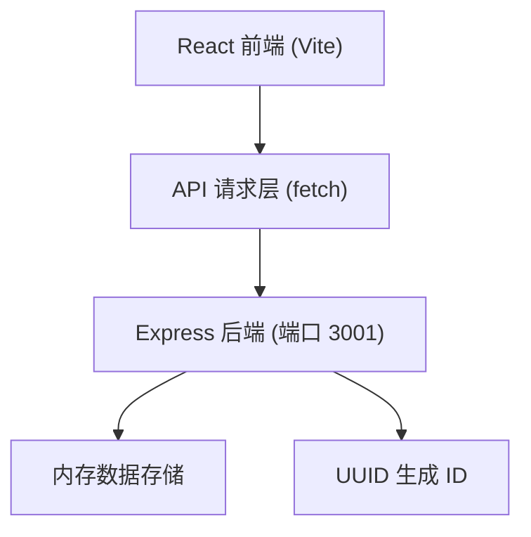
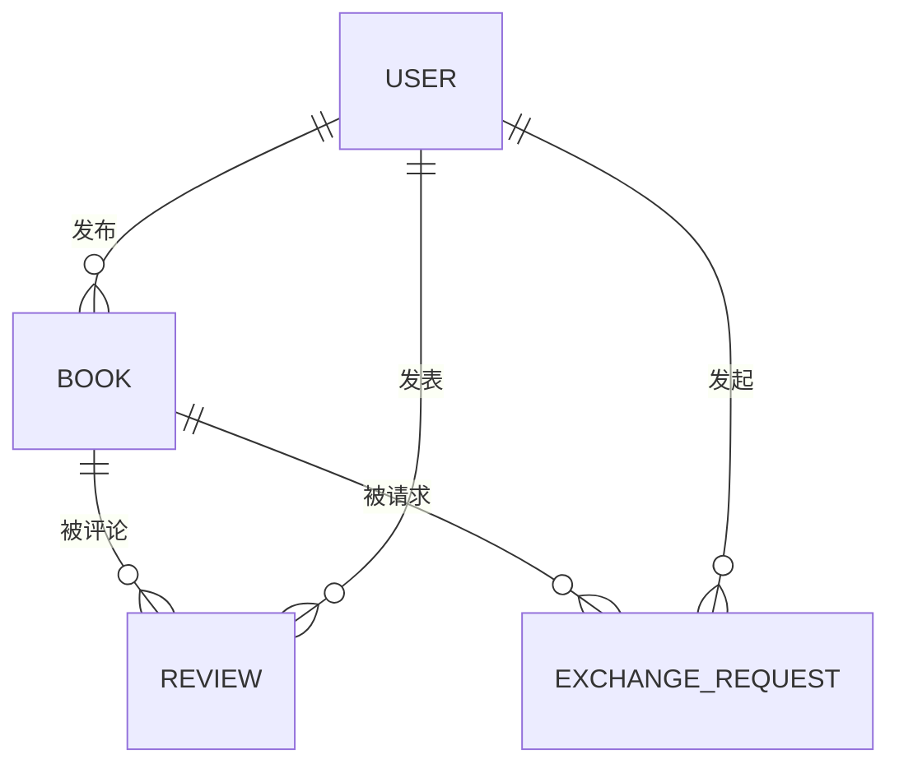

## 1. 架构设计



## 2. 技术说明

- 前端：React@18 + TypeScript + Vite
- 后端：Express@4 + TypeScript
- 路由：react-router-dom
- 状态管理：React useState/useContext
- 数据库：内存存储（开发环境）
- 依赖：react、react-dom、vite、@vitejs/plugin-react、express、uuid、typescript

## 3. 路由定义

| 路由 | 用途 |
|------|------|
| / | 全局书籍列表页 |
| /book/:id | 书籍详情页 |
| /shelf | 个人书架页 |

## 4. API 定义

### 类型定义

```typescript
interface Book {
  id: string;
  title: string;
  author: string;
  cover: string;
  description: string;
  category: '科幻' | '文学' | '技术' | '艺术' | '其他';
  owner: string;
  status: 'available' | 'exchanged';
  createdAt: number;
}

interface ExchangeRequest {
  id: string;
  bookId: string;
  bookTitle: string;
  requester: string;
  owner: string;
  status: 'pending' | 'accepted' | 'rejected';
  createdAt: number;
}

interface Review {
  id: string;
  bookId: string;
  reviewer: string;
  rating: number;
  content: string;
  createdAt: number;
}
```

### 端点

| 方法 | 路径 | 用途 |
|------|------|------|
| GET | /api/books | 获取所有书籍 |
| GET | /api/books/:id | 获取单本书籍详情 |
| POST | /api/books | 发布新书籍 |
| DELETE | /api/books/:id | 删除书籍 |
| PUT | /api/books/:id | 更新书籍状态 |
| GET | /api/requests | 获取交换请求 |
| POST | /api/requests | 创建交换请求 |
| PUT | /api/requests/:id | 处理交换请求（接受/拒绝） |
| GET | /api/books/:id/reviews | 获取书籍评论 |
| POST | /api/reviews | 创建评论 |

## 5. 服务器架构


## 6. 数据模型

### 6.1 ER 图



### 6.2 数据结构说明

内存中维护三个集合：
- books: Book[]
- requests: ExchangeRequest[]
- reviews: Review[]
