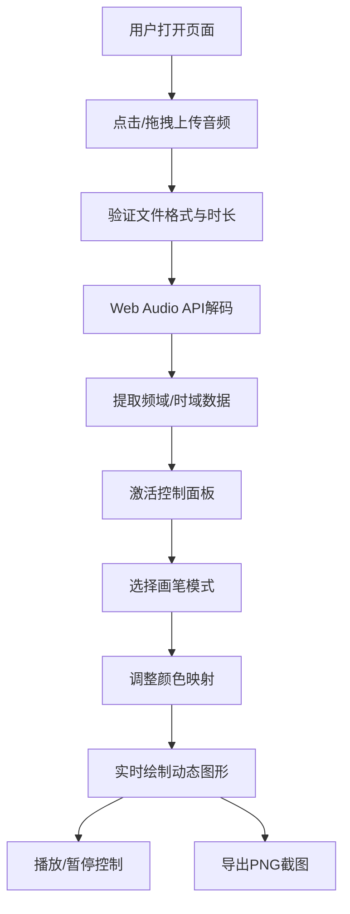

## 1. 产品概述

音波画布是一款基于浏览器的音频可视化艺术创作工具，用户上传短音频后可实时生成动态抽象绘画，并通过自定义色彩映射和画笔风格创造独一无二的声音艺术品。

- 核心价值：将抽象的音频信号转化为可感知、可交互的视觉艺术作品
- 目标用户：音乐爱好者、视觉艺术家、创意工作者、普通用户

## 2. 核心特性

### 2.1 功能模块
1. **主画布区域**：全屏Canvas动态渲染音频可视化效果
2. **控制面板**：播放控制、颜色映射设置、画笔风格切换
3. **波形预览条**：底部显示音频波形预览与播放进度
4. **文件上传模块**：支持拖拽/点击上传WAV/MP3音频

### 2.2 页面详情

| 页面名称 | 模块名称 | 功能描述 |
|-----------|-------------|---------------------|
| 主界面 | 文件上传区 | 点击或拖拽上传60秒内WAV/MP3音频，上传后自动解析 |
| 主界面 | 主Canvas画布 | 占满剩余窗口，深空渐变背景，实时绘制音频驱动动态图形 |
| 主界面 | 左侧控制面板 | 260px固定宽度，包含基础设置、颜色映射、画笔风格三个分组 |
| 主界面 | 底部波形预览条 | 48px高度，#1A1A2E背景，#E94560色动态波形 |
| 控制面板 | 基础设置分组 | 圆形播放/暂停按钮（40px直径）、自定义进度条滑块 |
| 控制面板 | 颜色映射分组 | 4个色块选色器（默认#FF6B6B、#4ECDC4、#45B7D1、#96CEB4） |
| 控制面板 | 画笔风格分组 | 三种模式切换：频率条、波形轨迹、粒子喷射 |
| 控制面板 | 导出功能 | 右下角"导出截图"按钮，下载Canvas内容为PNG |

## 3. 核心流程

用户上传音频文件 → Web Audio API解码分析 → 控制面板激活 → 用户选择画笔模式和颜色方案 → 实时生成动态可视化图形 → 用户可随时调整参数或导出作品

## 4. 用户界面设计

### 4.1 设计风格

- **主色调**：深空暗色主题（#0F0C29 → #302B63 → #24243E 渐变背景）
- **强调色**：渐变高亮色 #667eea → #764ba2
- **波形色**：#E94560
- **默认调色板**：#FF6B6B、#4ECDC4、#45B7D1、#96CEB4
- **字体**：深色沉浸设计，分组标题白色12px
- **按钮风格**：圆角设计，选中状态使用渐变色高亮，悬停有半透明反馈
- **布局**：全屏沉浸布局，左侧控制面板（260px宽，圆角12px，半透明深色rgba(22,22,35,0.85)），底部波形条（48px高），主画布占满剩余空间

### 4.2 页面设计概览

| 页面名称 | 模块名称 | UI元素 |
|-----------|-------------|-------------|
| 主界面 | 主Canvas画布 | 深空三色渐变、全屏自适应、三种绘制模式切换 |
| 主界面 | 控制面板 | 半透明深色圆角面板、可展开分组、间距10px |
| 主界面 | 波形预览条 | 48px高度、深色背景、红色波形动态绘制 |
| 控制面板 | 播放按钮 | 圆形40px、三角形/双竖线图标、悬停半透明效果 |
| 控制面板 | 进度条 | 4px轨道圆角、渐变色已播放部分、14px圆形滑块 |
| 控制面板 | 选色器 | 方形色块、点击弹出颜色选择器 |
| 控制面板 | 模式按钮 | 选中态渐变色高亮、快速缩放动画反馈 |

### 4.3 响应式设计

- 桌面端优先设计
- Canvas自适应窗口resize事件，保持图形比例
- 触摸交互即时反馈：滑块拖动、按钮点击、色块选择均有0.1秒缩放动画或0.05秒颜色变化反馈
