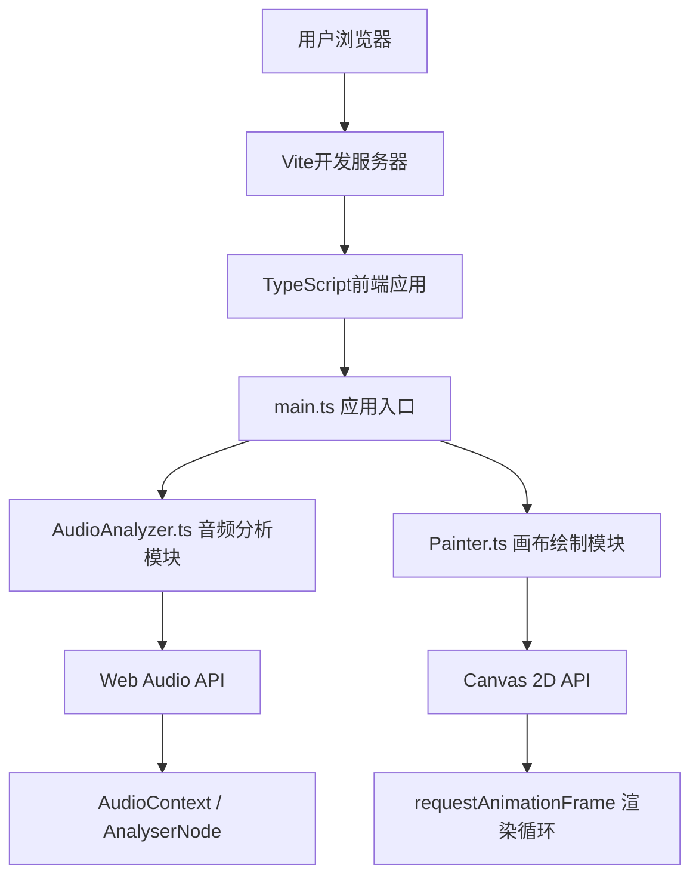

## 1. 架构设计



## 2. 技术选型说明

- **前端框架**: TypeScript + 原生HTML/CSS（无框架）
- **构建工具**: Vite 5.x
- **音频处理**: Web Audio API（AudioContext、AnalyserNode）
- **图形渲染**: Canvas 2D API + requestAnimationFrame
- **类型声明**: @types/web（DOM类型）
- **无后端、无数据库、无外部服务依赖**

## 3. 文件结构

```
/
├── package.json          # 项目依赖与脚本配置
├── index.html            # 入口HTML页面
├── tsconfig.json         # TypeScript配置
├── vite.config.js        # Vite构建配置
└── src/
    ├── main.ts           # 应用初始化与协调模块
    ├── AudioAnalyzer.ts  # 音频解码与频谱分析模块
    └── Painter.ts        # Canvas动态绘制模块
```

## 4. 核心模块设计

### 4.1 AudioAnalyzer 模块

```typescript
class AudioAnalyzer {
  audioContext: AudioContext | null;
  analyser: AnalyserNode | null;
  source: AudioBufferSourceNode | MediaElementAudioSourceNode | null;
  audioBuffer: AudioBuffer | null;
  frequencyData: Uint8Array;
  timeDomainData: Uint8Array;
  
  decodeAudioFile(file: File): Promise<AudioBuffer>;   // 解码上传的音频文件
  connectAnalyser(): void;                              // 连接分析器节点
  update(): { frequency: number[], timeDomain: number[] };  // 每帧更新频谱数据
  getDuration(): number;                                // 获取音频时长
  getWaveformPreview(width: number, height: number): number[]; // 生成预览波形数据
  play(): void;
  pause(): void;
  seek(progress: number): void;
  isPlaying(): boolean;
  destroy(): void;
}
```

### 4.2 Painter 模块

```typescript
type PaintMode = 'bars' | 'waveform' | 'particles';

interface PaintOptions {
  colors: string[];      // 4个颜色映射
  mode: PaintMode;
  canvasWidth: number;
  canvasHeight: number;
}

interface Particle {
  x: number;
  y: number;
  vx: number;
  vy: number;
  radius: number;
  color: string;
  life: number;      // 剩余寿命（秒）
  maxLife: number;
}

class Painter {
  ctx: CanvasRenderingContext2D;
  options: PaintOptions;
  particles: Particle[];
  waveformTrail: { x: number; y: number }[];  // 波形轨迹残影
  barHeights: number[];                       // 频率条高度缓存（平滑动画）
  
  constructor(ctx: CanvasRenderingContext2D, options: PaintOptions);
  setOptions(options: Partial<PaintOptions>): void;
  clear(): void;
  drawBackground(): void;
  drawBars(frequencyData: number[]): void;
  drawWaveform(timeDomainData: number[]): void;
  drawParticles(frequencyData: number[], timeDomainData: number[]): void;
  render(frequencyData: number[], timeDomainData: number[]): void;
  resize(width: number, height: number): void;
  exportPNG(): string;  // 返回dataURL
}
```

## 5. 性能优化策略

- 使用 `requestAnimationFrame` 确保60fps流畅渲染
- 标签页不可见时通过 `visibilitychange` 事件暂停渲染循环
- 频率条高度使用线性插值实现平滑上升/下降动画（0.3秒缓动）
- 波形轨迹限制最大残影数量，使用半透明覆盖实现拖尾效果
- 粒子系统使用对象池模式，限制最大粒子数量避免内存泄漏
- 音频解码异步执行，不阻塞UI线程
- Canvas尺寸变化时仅重新计算布局参数，不重建上下文

## 6. 接口与交互

### 6.1 文件上传
- 支持点击上传和拖拽上传
- 验证文件类型：audio/wav、audio/mpeg、audio/mp3
- 验证时长：≤ 60秒
- 错误提示：文件格式不支持、音频过长

### 6.2 用户交互
- 播放/暂停按钮：点击切换状态
- 进度条滑块：拖拽调整播放位置（0~1范围）
- 颜色选择器：点击色块弹出原生color picker
- 模式切换按钮：三种模式互斥切换
- 导出按钮：触发Canvas.toDataURL()下载PNG
