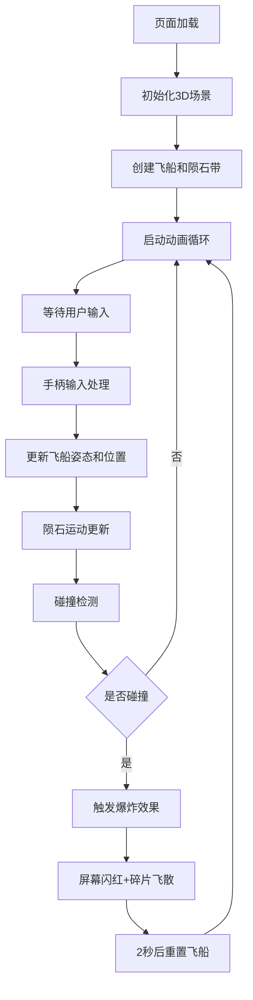

## 1. 产品概述

通过浏览器虚拟手柄模拟器控制3D太空飞行器穿越动态陨石带的交互应用，解决传统键鼠操作难以模拟真实飞行器在三维空间中多轴转向、加减速与姿态调整的沉浸感问题。

- 主要用途：提供沉浸式的3D太空飞行体验，通过虚拟手柄实现精确的六自由度控制
- 目标用户：对太空模拟、3D交互体验感兴趣的用户

## 2. 核心功能

### 2.1 功能模块

1. **3D场景渲染**：深空星空背景、飞船模型、陨石带、粒子特效
2. **虚拟手柄控制**：摇杆、加速/刹车按键、D-Pad方向键
3. **飞行动力学**：偏航/俯仰/横滚控制、加减速、速度衰减
4. **碰撞与爆炸系统**：陨石碰撞检测、爆炸碎片、屏幕闪红、飞行器重置
5. **HUD信息面板**：速度显示、碰撞计数、手柄状态

### 2.2 页面详情

| 页面名称 | 模块名称 | 功能描述 |
|-----------|-------------|---------------------|
| 主页面 | 3D场景 | 渲染深空背景、星空、飞船、陨石带和粒子特效 |
| 主页面 | 虚拟手柄 | 左侧固定手柄面板，包含摇杆、A/B按键、D-Pad |
| 主页面 | HUD面板 | 右上角显示速度、碰撞次数、手柄连接状态 |

## 3. 核心流程

用户打开页面后，3D场景自动加载，飞船位于原点静止。用户通过左侧虚拟手柄进行操控：

- 摇杆左右控制偏航（Y轴旋转），上下控制俯仰（X轴旋转）
- D-Pad左右控制横滚（Z轴旋转），上下控制升降
- A键加速推进，B键减速刹车
- 碰撞陨石后触发爆炸效果，2秒后自动重置

## 4. 用户界面设计

### 4.1 设计风格

- **主色调**：深空渐变背景 (#0B0E1A → #1A2240)，青色主调 (#00D4AA)
- **辅助色**：深蓝半透明 (#1A1A2E)，绿色三角形 (A键)，红色圆形 (B键)
- **字体**：monospace科技感字体
- **按钮风格**：按压下沉2px，松开弹回，带弹性缓动
- **布局风格**：左侧固定手柄面板，右上角HUD面板，中央全屏3D画布

### 4.2 页面设计概述

| 页面名称 | 模块名称 | UI元素 |
|-----------|-------------|-------------|
| 主页面 | 3D场景 | 深空渐变、闪烁星点、蓝色半透明飞船、灰色石质陨石、爆炸粒子、推进尾焰 |
| 主页面 | 虚拟手柄 | 深色半透明背景 (#1A1A2E)、圆形可拖拽摇杆、绿色三角A键、红色圆形B键、四向D-Pad |
| 主页面 | HUD面板 | 半透明深色背景 (#0f0f23)、圆角8px、青色monospace字体、红绿状态指示器 |

### 4.3 响应式

- 桌面端优先设计
- 视窗宽度 < 768px 时：
  - 手柄面板宽度缩为150px（默认240px）
  - 摇杆半径缩为30px（默认40px）
  - HUD字体缩为16px（默认24px）
  - 3D场景比例保持不变

### 4.4 3D场景指导

- **环境**：深空渐变背景，数百颗随机闪烁静态星点
- **光照**：环境光 + 方向光，突出飞船材质和陨石纹理
- **相机**：透视相机，跟随飞船后方，视角可随飞船姿态调整
- **飞船构成**：6x1x2深蓝色半透明机身、2x0.5x3银色三角柱机翼、半径0.5蓝色发光驾驶舱
- **陨石**：200颗半径0.3-1.2的石质球体，Perlin噪声凹凸纹理，#6B7280到#9CA3AF渐变
- **交互**：静止时Y轴微晃（幅度0.1，频率1.2Hz），加速时尾部粒子流
- **特效**：碰撞爆炸碎片（#FF4500→#FFD700渐变）、屏幕闪红、蓝色冲击波重置特效
- **性能**：陨石使用合并BufferGeometry，粒子上限2000，维持30fps以上
