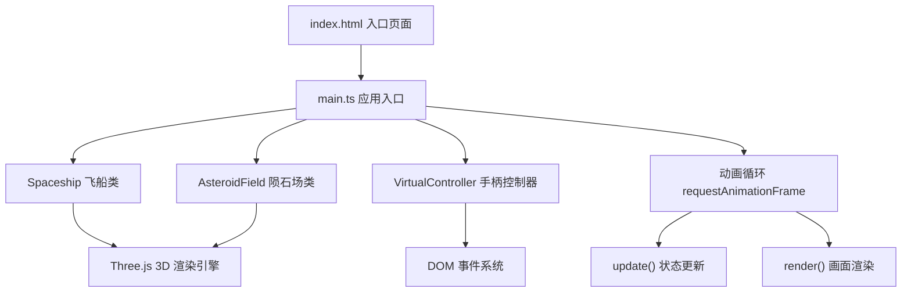

## 1. 架构设计



## 2. 技术描述

- **前端框架**：原生 TypeScript + Three.js（无React/Vue，用户明确要求）
- **构建工具**：Vite，支持HMR热更新
- **包管理**：npm
- **核心依赖**：
  - three：3D渲染引擎
  - @types/three：Three.js类型定义
  - typescript：TypeScript编译器
  - vite：构建开发服务器

## 3. 项目文件结构

| 文件路径 | 用途 |
|-------|---------|
| package.json | 项目依赖与脚本配置 |
| tsconfig.json | TypeScript编译配置（严格模式，ES2020，ESNext模块） |
| vite.config.js | Vite构建配置，别名@指向src |
| index.html | 入口HTML页面，包含手柄面板和HUD结构 |
| src/main.ts | 应用入口，初始化场景/相机/渲染器，启动动画循环 |
| src/spaceship.ts | Spaceship类，飞船构建、运动、粒子、碰撞爆炸逻辑 |
| src/asteroidField.ts | AsteroidField类，200颗陨石生成、运动、碰撞检测 |
| src/controller.ts | VirtualController类，虚拟手柄输入处理 |
| src/perlin.ts | Perlin噪声工具函数（陨石表面纹理） |

## 4. 核心类定义

### 4.1 Spaceship 类

```typescript
class Spaceship {
  mesh: THREE.Group;
  position: THREE.Vector3;
  velocity: THREE.Vector3;
  speed: number;
  collisionCount: number;
  isExploded: boolean;
  
  constructor(scene: THREE.Scene);
  update(
    yaw: number, pitch: number, roll: number, 
    lift: number, thrust: number, brake: number
  ): void;
  emitThrustParticles(): void;
  explode(): void;
  reset(): void;
  getBoundingSphere(): THREE.Sphere;
}
```

### 4.2 AsteroidField 类

```typescript
class AsteroidField {
  mesh: THREE.InstancedMesh;
  asteroids: AsteroidData[];
  
  constructor(scene: THREE.Scene);
  update(): void;
  collisionCheck(spaceship: Spaceship): boolean[];
}

interface AsteroidData {
  position: THREE.Vector3;
  velocity: THREE.Vector3;
  rotation: THREE.Euler;
  rotationSpeed: THREE.Vector3;
  radius: number;
}
```

### 4.3 VirtualController 类

```typescript
class VirtualController {
  joystick: { dx: number; dy: number };
  buttons: { A: boolean; B: boolean };
  dpad: { up: boolean; down: boolean; left: boolean; right: boolean };
  
  constructor(container: HTMLElement);
  onInput(callback: (state: ControllerState) => void): void;
}

interface ControllerState {
  joystickDX: number;
  joystickDY: number;
  buttonA: boolean;
  buttonB: boolean;
  dpadUp: boolean;
  dpadDown: boolean;
  dpadLeft: boolean;
  dpadRight: boolean;
}
```

## 5. 性能优化策略

1. **陨石合并渲染**：使用 `THREE.InstancedMesh` 或合并 `BufferGeometry`，将200颗陨石合并为单次draw call
2. **粒子对象池**：粒子总数上限2000，超出时循环覆盖最旧粒子，避免频繁GC
3. **碰撞检测优化**：使用球-球快速检测，先进行粗略距离判断再精确检测
4. **Perlin噪声预计算**：陨石纹理顶点位移预计算，避免运行时重复计算
5. **requestAnimationFrame**：使用浏览器原生动画循环，与显示器刷新率同步
