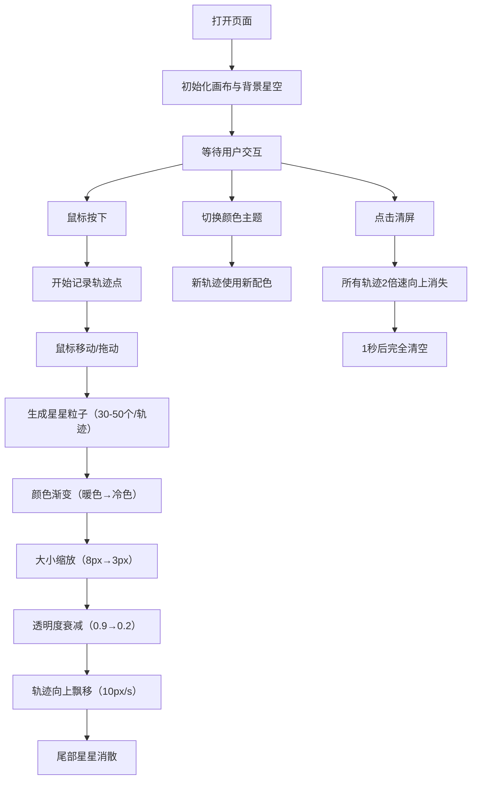

## 1. 产品概述
一个基于 Canvas 的互动星空弹幕涂鸦墙，用户用鼠标在画布上自由绘制，每一笔都会转化为由闪烁星星组成的动态弹幕轨迹，营造出永不停歇的深空星光互动体验。
- 面向所有喜欢视觉艺术和互动体验的用户，提供沉浸式的星空绘画娱乐
- 核心价值：将普通涂鸦转化为具有生命力的动态星光艺术

## 2. 核心特性

### 2.1 功能模块
1. **主画布**：全屏 Canvas 画布，支持鼠标绘制交互
2. **星星粒子系统**：30-50个星星组成流动轨迹，包含颜色渐变、大小缩放、透明度衰减、飘移动画
3. **背景星空**：约200个随机分布白点，周期性呼吸闪烁效果
4. **控制面板**：颜色主题选择器、清屏按钮
5. **实时计数器**：显示当前活跃轨迹数量

### 2.2 页面详情
| 页面名称 | 模块名称 | 功能描述 |
|-----------|-------------|---------------------|
| 主页 | 主画布 | 全屏深空黑背景，鼠标拖动实时生成星星轨迹，轨迹向上缓慢飘移消散 |
| 主页 | 背景星空 | 200个1px白点，透明度0.2，每2秒5%概率闪烁到0.6 |
| 主页 | 控制面板 | 右下角磨砂玻璃效果面板，含颜色主题下拉框（5种主题）和清屏按钮 |
| 主页 | 计数器 | 左上角显示"Star Streams: N"，monospace字体，白色发光效果 |

## 3. 核心流程
用户打开页面 → 看到深空星空背景 → 鼠标按下并拖动 → 实时生成星星轨迹（暖色→冷色渐变，大小8px→3px，透明度0.9→0.2）→ 轨迹生成后向上缓慢飘移（10px/秒）→ 尾部逐渐消散 → 可通过控制面板切换颜色主题或清屏

## 4. 用户界面设计

### 4.1 设计风格
- **主色调**：深空黑 #0B0C10
- **强调色**：科技青 #66FCF1（发光效果）
- **按钮风格**：磨砂玻璃效果（rgba(255,255,255,0.08) 背景，1px rgba(255,255,255,0.15) 边框，10px 圆角，backdrop-filter: blur(4px)）
- **字体**：monospace（计数器），默认 sans-serif（控制面板）
- **动效**：按钮 hover 时 scale(1.05) 过渡 0.2s，背景变为 rgba(255,255,255,0.2)
- **星星颜色主题**：
  - 青蓝：暖色→冷色渐变
  - 粉紫：粉色系→紫色系渐变
  - 夕阳：橙红→深红渐变
  - 霓虹绿：浅绿→深绿渐变
  - 极光彩：多色渐变效果

### 4.2 页面设计概览
| 页面名称 | 模块名称 | UI 元素 |
|-----------|-------------|-------------|
| 主页 | 主画布 | 全屏黑色背景，Canvas 铺满，鼠标绘制交互 |
| 主页 | 控制面板 | 右下角定位，磨砂玻璃容器，下拉选择框 + 按钮垂直排列 |
| 主页 | 计数器 | 左上角定位，monospace 字体，text-shadow 发光效果 |

### 4.3 响应式设计
- 全屏 Canvas 自适应窗口大小
- 控制面板和计数器使用固定定位，不随滚动移动
- 鼠标事件适配桌面端，无需移动端触摸支持

### 4.4 性能要求
- 最大同时活跃轨迹不超过 80 条，超出自动移除最旧轨迹
- 帧率稳定在 55fps 以上
- 使用 requestAnimationFrame 驱动主循环
