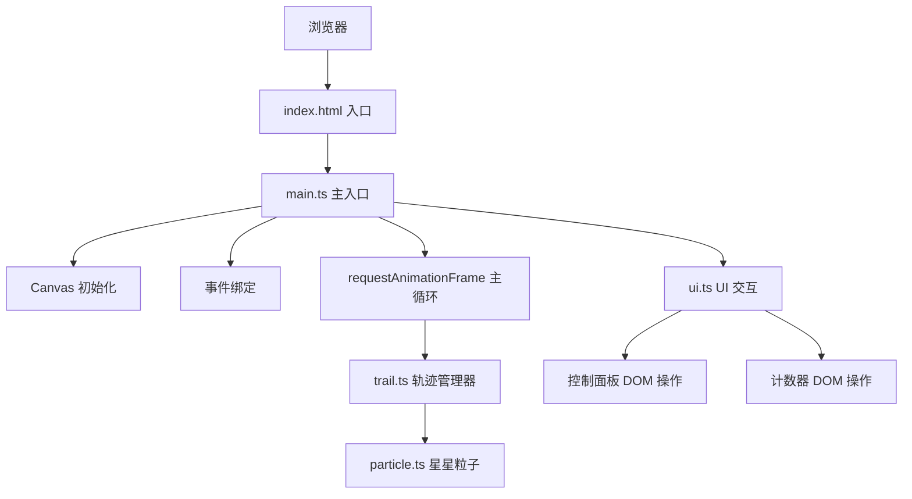

## 1. 架构设计



## 2. 技术说明
- **前端**：原生 TypeScript + Vite + HTML5 Canvas
- **初始化工具**：Vite 脚手架
- **后端**：无（纯前端项目）
- **数据库**：无

## 3. 文件结构
```
auto205/
├── package.json          # 项目依赖配置
├── index.html            # 入口页面（Canvas + 控制面板 + 计数器）
├── tsconfig.json         # TypeScript 配置（严格模式，ES2020）
├── vite.config.js        # Vite 构建配置（HMR 支持）
└── src/
    ├── main.ts           # 主入口：画布初始化、事件绑定、主循环
    ├── particle.ts       # 星星粒子类：位置、大小、颜色、透明度、生命周期
    ├── trail.ts          # 轨迹管理类：星星生成、移动、渐变、淘汰逻辑
    └── ui.ts             # UI 交互：颜色切换、清屏、计数器更新
```

## 4. 核心类与接口定义

### 4.1 Particle（星星粒子）
```typescript
interface ParticleData {
  x: number;              // 当前 x 坐标
  y: number;              // 当前 y 坐标
  size: number;           // 当前大小（8px -> 3px）
  initialSize: number;    // 初始大小
  color: { r: number; g: number; b: number };  // 当前 RGB 颜色
  initialColor: { r: number; g: number; b: number };  // 起始颜色
  endColor: { r: number; g: number; b: number };      // 末尾颜色
  alpha: number;          // 当前透明度（0.9 -> 0.2）
  initialAlpha: number;   // 初始透明度
  velocityY: number;      // 向上飘移速度（负值）
  twinklePhase: number;   // 闪烁相位
  life: number;           // 生命周期进度 0-1
  lifeSpeed: number;      // 生命周期推进速度
  trailProgress: number;  // 在轨迹中的位置 0-1
  driftX: number;         // X 方向轻微漂移
}

class Particle {
  constructor(config: ParticleData);
  update(deltaTime: number, isClearing: boolean): boolean;  // 返回是否已消散
  draw(ctx: CanvasRenderingContext2D): void;
}
```

### 4.2 TrailManager（轨迹管理器）
```typescript
type ColorTheme = 'cyan' | 'pink' | 'sunset' | 'neon' | 'aurora';

interface ColorPalette {
  startColors: string[];   // 起始暖色
  endColors: string[];     // 末尾冷色
}

class TrailManager {
  private trails: Particle[][];      // 活跃轨迹列表
  private maxTrails: number = 80;    // 最大轨迹数
  private currentTheme: ColorTheme;
  private isClearing: boolean;
  private clearTimer: number;

  addTrail(points: { x: number; y: number }[]): void;
  update(deltaTime: number): void;
  draw(ctx: CanvasRenderingContext2D): void;
  getActiveTrailCount(): number;
  setTheme(theme: ColorTheme): void;
  clearAll(): void;
  private generateStarsForSegment(...): Particle[];
  private removeOldestIfNeeded(): void;
  private lerpColor(...): { r: number; g: number; b: number };
}
```

### 4.3 背景星空
```typescript
interface BackgroundStar {
  x: number;
  y: number;
  alpha: number;
  targetAlpha: number;
  twinkleSpeed: number;
}
```

## 5. 颜色主题定义
| 主题名 | 起始颜色（暖色） | 末尾颜色（冷色） |
|--------|------------------|------------------|
| 青蓝 | #FF6B35, #F7C59F, #EFEFD0 | #004E89, #1A659E |
| 粉紫 | #FF6B9D, #FFB4D6, #FFE0F0 | #6B3FA0, #9B59B6 |
| 夕阳 | #FF4500, #FF6347, #FFA07A | #8B0000, #CD5C5C |
| 霓虹绿 | #7CFC00, #ADFF2F, #98FB98 | #006400, #228B22 |
| 极光彩 | #00FFD1, #31C7D7, #00BFFF | #8A2BE2, #FF00FF, #FF1493 |

## 6. 性能优化策略
1. **粒子池化**：复用已消散的粒子对象，减少 GC 压力
2. **离屏绘制**：背景星空可预渲染到离屏 Canvas
3. **帧率控制**：使用 deltaTime 计算，确保不同设备动画速度一致
4. **轨迹限制**：最多 80 条活跃轨迹，超出自动淘汰最旧的
5. **批量绘制**：同色星星批量绘制，减少 Canvas 状态切换
