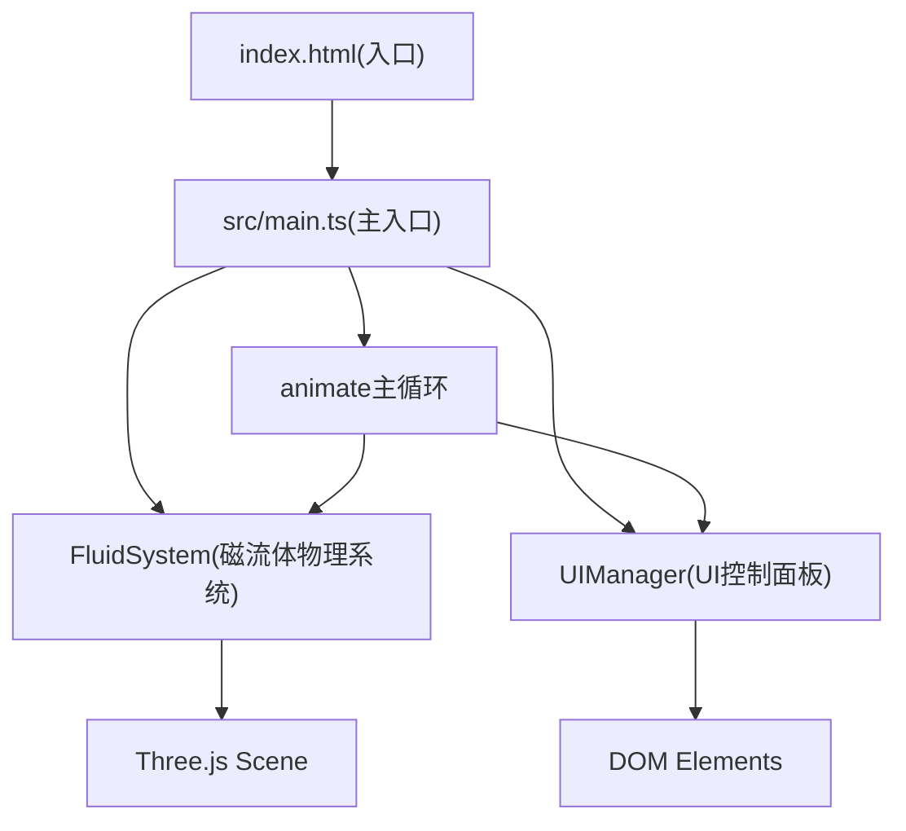

## 1. 架构设计


## 2. 技术描述
- **前端**: TypeScript + Three.js + Vite
- **初始化工具**: Vite vanilla-ts模板
- **无后端**: 纯前端WebGL应用
- **核心依赖**: three@latest, @types/three@latest, typescript, vite

## 3. 项目结构
```
auto209/
├── .trae/documents/        # PRD和架构文档
├── src/
│   ├── main.ts             # 应用入口：场景/相机/渲染器/主循环
│   ├── fluid.ts            # FluidSystem类：磁流体物理模拟
│   └── ui.ts               # UIManager类：控制面板UI
├── index.html              # 入口HTML
├── package.json            # 依赖和脚本
├── tsconfig.json           # TypeScript配置
└── vite.config.js          # Vite配置
```

## 4. 核心类设计

### FluidSystem (src/fluid.ts)
```typescript
class FluidSystem {
  constructor(scene: THREE.Scene)
  update(dt: number, magneticPoint: THREE.Vector3 | null, magneticColor: string, turbulence: boolean): void
  getAttractedCount(): number
  getTotalCount(): number
  reset(): void
  adjustQuality(lowFPS: boolean): void
}
```
- 管理300个球体的位置/速度/颜色
- 实现磁场吸引算法、尖刺回落、湍流涡旋
- 动态金属高光材质

### UIManager (src/ui.ts)
```typescript
class UIManager {
  constructor(
    onReset: () => void,
    onColorChange: (color: string) => void,
    onTurbulenceToggle: () => void
  )
  update(color: string, turbulence: boolean, total: number, attracted: number): void
}
```
- 创建右侧浮动控制面板DOM
- 绑定键盘(1-4, Q)和按钮事件

### main.ts 主循环
```typescript
function animate(): void
```
- 计算delta time
- 调用FluidSystem.update()进行物理更新
- 调用UIManager.update()刷新UI
- 检测FPS并自适应调整质量
- renderer.render()

## 5. 数据模型
### 球体粒子数据
```typescript
interface FluidParticle {
  mesh: THREE.Mesh
  position: THREE.Vector3
  velocity: THREE.Vector3
  initialPosition: THREE.Vector3
  baseRadius: number
  isAttracted: boolean
  highlightIntensity: number
}
```

### 拖尾粒子
```typescript
interface TrailParticle {
  mesh: THREE.Mesh
  position: THREE.Vector3
  life: number
  maxLife: number
}
```

### 涟漪效果
```typescript
interface RippleEffect {
  mesh: THREE.Mesh
  position: THREE.Vector3
  radius: number
  maxRadius: number
  opacity: number
}
```

## 6. 性能策略
- 帧率监控：每500ms计算平均FPS
- 质量降级：FPS < 50时，球体数量从300降至150
- 对象池：拖尾粒子复用，避免频繁GC
- 材质复用：所有球体共享基础材质，仅修改uniforms
