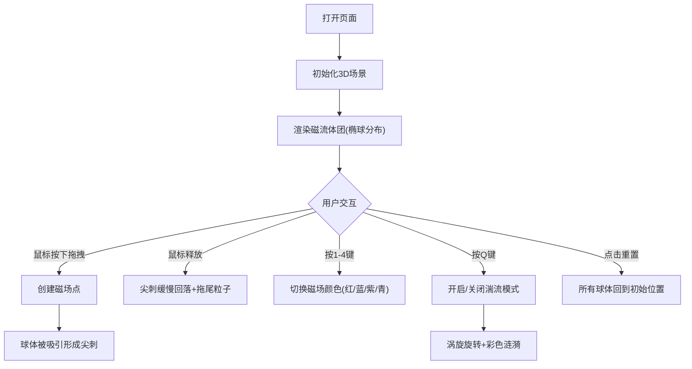

## 1. 产品概述
动态磁流体雕塑是一款基于WebGL的3D交互数字艺术应用，模拟磁流体在磁场作用下的物理特性（磁场引力、黏滞流动、尖刺突涌），为艺术家提供直观的三维流体形态与色彩控制体验。

- 解决传统数字艺术中缺乏磁流体物理特性实时模拟的问题
- 艺术家可通过鼠标与键盘直观控制流体形态，创作出赛博朋克风格的动态艺术作品

## 2. 核心功能

### 2.1 功能模块
1. **3D磁流体场景**: 300个球体组成的磁流体团，实时物理模拟，金属反光材质
2. **磁场交互系统**: 鼠标拖拽产生磁场点，吸引球体形成尖刺突涌结构
3. **色彩与湍流控制**: 键盘快捷键切换磁场颜色、开启/关闭湍流涡旋模式
4. **浮动控制面板**: 实时显示状态信息（颜色、湍流模式、球体计数），重置功能
5. **性能自适应**: 帧率低于50FPS时自动降低粒子渲染质量

### 2.2 页面详情
| 页面名称 | 模块名称 | 功能描述 |
|-----------|-------------|---------------------|
| 主场景页 | 磁流体团渲染 | 300个球体组成椭球形流体团，动态高光，吸引时高亮 |
| 主场景页 | 磁场点交互 | 鼠标拖拽生成半透明彩色球体，吸引球体，拖尾粒子 |
| 主场景页 | 湍流模式 | Q键开关，涡旋旋转+彩色涟漪效果 |
| 主场景页 | 控制面板 | 右侧浮动面板，状态显示+重置按钮 |
| 主场景页 | 星点背景 | 500个随机分布的微弱白色星点 |

## 3. 核心流程
用户打开页面→看到纯黑背景中央悬浮磁流体团→鼠标拖拽施加磁场→流体被吸引形成尖刺→松开鼠标尖刺回落+拖尾残留→按1-4切换磁场颜色→按Q开启湍流模式观察涡旋→点击控制面板重置按钮回到初始状态

## 4. 用户界面设计
### 4.1 设计风格
- **主色调**: 纯黑背景 #000000，控制面板深紫灰 #1A1A2E，文字 #E0E0E0
- **磁场颜色**: 红 #FF3366、蓝 #3366FF、紫 #9933FF、青 #00CCFF
- **球体基础色**: 深金属灰 #2C2C2C，高光动态流动
- **按钮样式**: 圆角，悬停渐变至 #2A2A4E，0.2秒缓动过渡
- **整体风格**: 深色系赛博朋克，科技感、未来感

### 4.2 页面设计概述
| 页面名称 | 模块名称 | UI元素 |
|-----------|-------------|-------------|
| 主场景页 | 3D场景 | 全屏Canvas，纯黑背景，星点，磁流体团 |
| 主场景页 | 磁场点 | 半透明彩色球体(r=2)，拖尾粒子(50个) |
| 主场景页 | 控制面板(右侧固定) | 宽180px，圆角12px，背景#1A1A2E，半透明，含颜色色块、状态文本、计数、重置按钮 |

### 4.3 响应性
- 全屏显示3D场景，桌面端优先
- 不支持滚轮缩放，仅鼠标拖拽旋转视角
- 控制面板固定右侧，不随画面滚动

### 4.4 3D场景指导
- **环境**: 纯黑背景，无HDRI，营造深空感
- **光照**: 多点点光源模拟金属反光效果，动态高光位置随时间变化
- **相机**: PerspectiveCamera，鼠标拖拽OrbitControls旋转视角，禁用缩放
- **交互**: 鼠标拖拽产生磁场点，球体物理模拟吸引/回落
- **后处理**: 球体高亮效果，湍流涟漪透明度渐变
- **性能**: 目标60FPS，低于50FPS时球体数量降至150个
