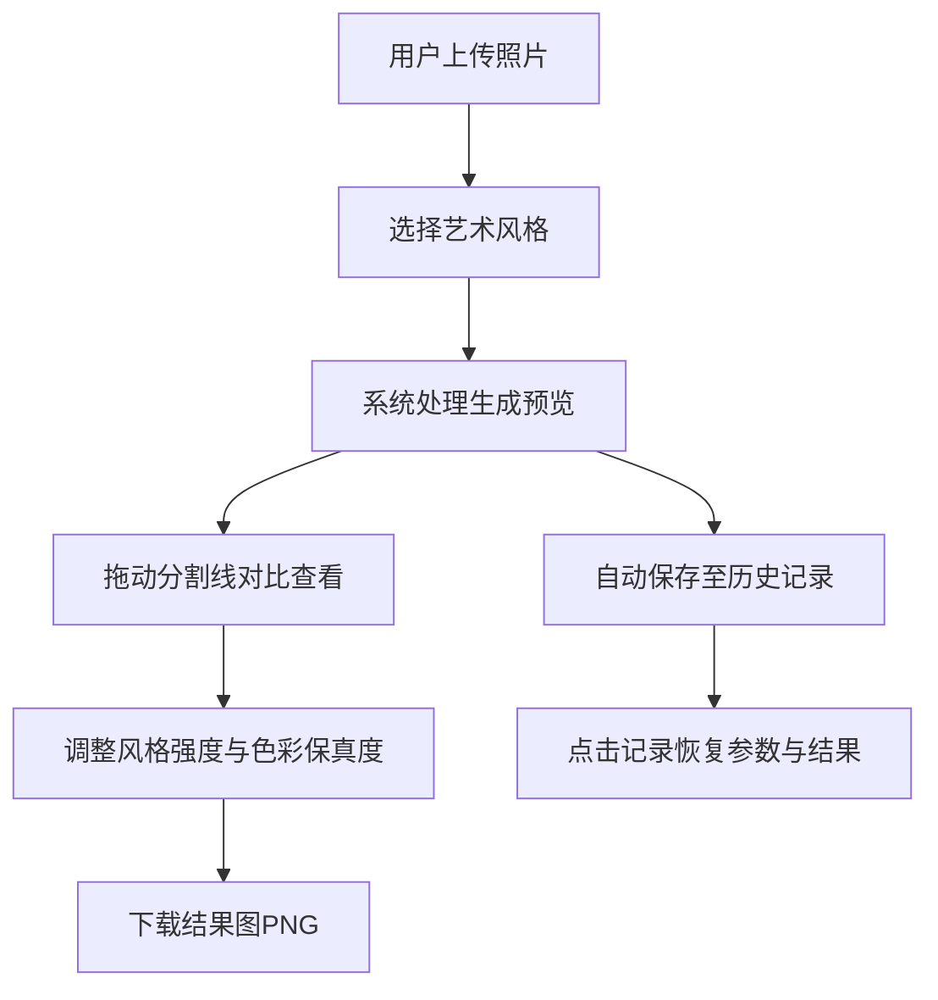

## 1. 产品概述
AI风格迁移绘画Web应用，让普通用户无需掌握复杂AI模型即可快速将照片转换成艺术画作。
- 核心价值：一键将普通照片转换为梵高星空、莫奈睡莲等经典艺术风格
- 目标用户：摄影爱好者、设计师、艺术创作者及普通用户

## 2. 核心功能

### 2.1 功能模块
1. **图片上传模块**：支持拖拽/点击上传，实时预览原图和尺寸信息
2. **风格选择模块**：8种预置艺术风格卡片网格展示
3. **结果生成与展示模块**：风格迁移处理、对比查看、参数微调
4. **结果下载模块**：PNG格式下载，保留原图尺寸
5. **历史记录模块**：最近10条生成记录，支持快速恢复

### 2.3 页面详情
| 页面名称 | 模块名称 | 功能描述 |
|-----------|-------------|---------------------|
| 主页面 | 顶部导航栏 | 品牌标识、可折叠历史记录按钮、固定定位 |
| 主页面 | 左侧历史记录面板 | 竖排展示10条记录，支持折叠、悬停高亮、点击恢复参数 |
| 主页面 | 图片上传区域 | 拖拽上传、文件选择、原图预览、尺寸显示、5MB/jpg/png限制 |
| 主页面 | 风格选择区域 | 3列8张风格卡片网格，点击高亮，显示缩略图和名称 |
| 主页面 | 结果展示区域 | 生成预览、加载动画、对比分割线拖拽、参数微调滑块、下载按钮 |

## 3. 核心流程

用户上传照片 → 选择艺术风格 → 系统处理生成预览 → 拖动分割线对比原图/效果图 → 调整风格强度和色彩保真度 → 下载结果图 → 历史记录自动保存

## 4. 用户界面设计
### 4.1 设计风格
- 主背景色：#1a1a2e（深蓝紫色）
- 卡片背景：#16213e（深海军蓝）
- 强调色：#e94560（珊瑚红）、#0f3460（深海蓝）
- 按钮：圆角设计，点击有微缩放反馈
- 字体：现代无衬线字体，标题粗体、正文常规
- 布局：顶部固定导航 + 左侧可折叠面板 + 中央主内容区
- 图标：lucide-react线性风格图标

### 4.2 页面设计概述
| 页面名称 | 模块名称 | UI元素 |
|-----------|-------------|-------------|
| 主页面 | 导航栏 | 固定顶部、深色背景、品牌Logo、汉堡菜单按钮、0.3s过渡动画 |
| 主页面 | 历史记录面板 | 竖排卡片、缩略图+风格名+时间、悬停浅灰背景(0.3s)、选中蓝边高亮 |
| 主页面 | 上传区 | 虚线边框、拖拽高亮、文件选择按钮、原图预览缩略图、尺寸标签 |
| 主页面 | 风格选择区 | 3列网格卡片、缩略图+名称、选中边框高亮、支持横向滚动 |
| 主页面 | 结果展示区 | 双图对比分割线、2个滑块(带数值标签)、下载按钮(缩放动画)、加载圆环动画 |

### 4.3 响应式设计
- Desktop优先设计
- 宽度<768px时：历史记录面板自动隐藏，功能按钮排成两行
- 触控优化：增大点击区域，支持触摸拖拽分割线

### 4.4 动画与交互
- 所有过渡动画：0.3s ease-in-out
- 下载按钮：0.2s 1.0→0.95→1.0缩放回弹
- 加载动画：旋转彩色圆环+进度百分比
- 滑块响应延迟≤50ms，生成去抖动500ms
- 主界面保持60FPS流畅交互
