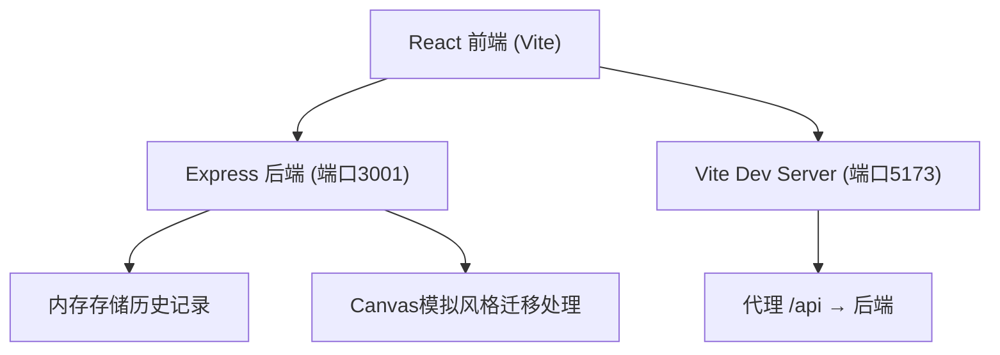
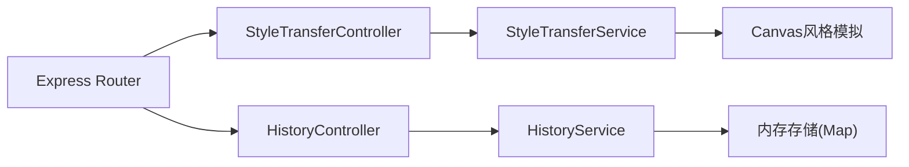
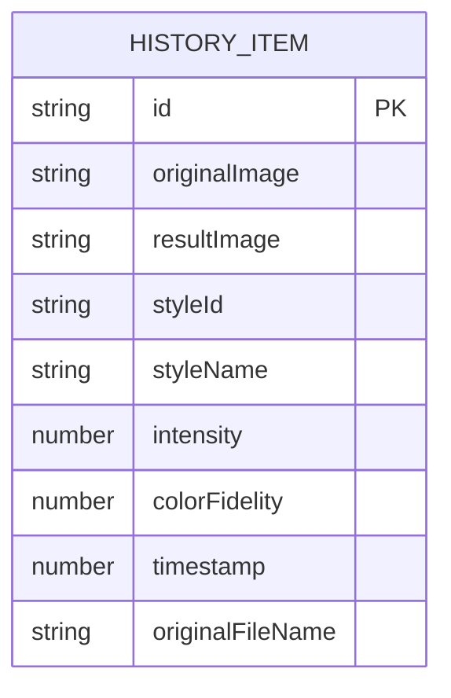

## 1. 架构设计



## 2. 技术说明
- 前端：React 18 + TypeScript + Vite + useReducer状态管理
- 后端：Node.js + Express，使用Canvas API模拟AI风格迁移
- 构建工具：Vite，代理/api请求到后端3001端口
- 图标库：lucide-react

## 3. 路由定义
| 路由 | 用途 |
|-------|---------|
| / | 主应用页面，所有功能集成在单页应用中 |
| POST /api/style-transfer | 上传图片和参数，返回风格迁移结果 |
| GET /api/history | 获取最近10条历史记录 |
| POST /api/history | 保存新的历史记录 |

## 4. API定义

### 4.1 风格迁移接口
```typescript
// 请求
interface StyleTransferRequest {
  image: string;           // base64编码图片
  styleId: string;         // 风格ID
  intensity: number;       // 风格强度 0-100
  colorFidelity: number;   // 色彩保真度 0-100
}

// 响应
interface StyleTransferResponse {
  success: boolean;
  resultImage: string;     // base64编码结果图
  processTime: number;     // 处理时间(ms)
}
```

### 4.2 历史记录接口
```typescript
interface HistoryItem {
  id: string;
  originalImage: string;
  resultImage: string;
  styleId: string;
  styleName: string;
  intensity: number;
  colorFidelity: number;
  timestamp: number;
  originalFileName: string;
}
```

## 5. 服务器架构


## 6. 数据模型


## 7. 项目文件结构
```
auto21/
├── package.json
├── index.html
├── tsconfig.json
├── vite.config.js
├── src/
│   ├── main.tsx
│   ├── App.tsx
│   └── components/
│       ├── ImageUploader.tsx
│       ├── StyleSelector.tsx
│       └── ResultViewer.tsx
└── server/
    └── server.js
```
